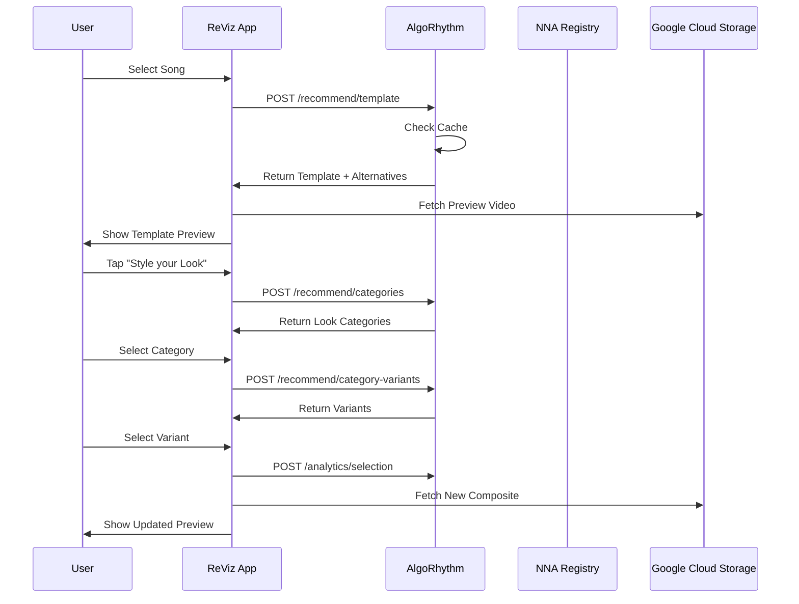

# AlgoRhythm API Specification v1.0 - ReViz Integration
*AI-Powered Recommendation Engine for Instant Video Remixing*

**Version**: 1.0  
**Release Date**: August 2025  
**Target Platform**: ReViz Expo Mobile App  
**Architecture**: Hybrid Microservice leveraging NNA Registry Infrastructure

---

## 🎯 Overview

AlgoRhythm is the intelligent recommendation engine that powers ReViz's "Start with a Song" experience. When users select a trending song, AlgoRhythm instantly recommends the perfect pre-generated video template (complete composite) and enables seamless layer-by-layer customization.

### **Core Functionality**
- **Template Recommendation**: Song → Perfect complete composite template
- **Layer Variations**: Smart alternatives for Stars, Looks, Moves, Worlds
- **Pre-computed Performance**: <20ms response time using cached compatibility scores
- **Progressive Enhancement**: Static recommendations → Real-time AI optimization

---

## 🏗️ Architecture

### **Hybrid Approach**
```
┌─────────────────────────────────────────────────────────┐
│                    ReViz Expo App                        │
└──────────────────────────┬──────────────────────────────┘
                           │
┌──────────────────────────▼──────────────────────────────┐
│                   API Gateway                            │
│            (registry.dev.reviz.dev/api)                  │
└──────────────┬────────────────────────┬─────────────────┘
               │                        │
┌──────────────▼──────────┐  ┌─────────▼─────────────────┐
│   NNA Registry Service   │  │   AlgoRhythm Service      │
│   (Existing Backend)     │  │   (Scala/Akka/Mojo)       │
│   • Asset Management     │  │   • Recommendations       │
│   • Storage (GCS)        │  │   • Compatibility Matrix  │
│   • MongoDB              │  │   • AI Models             │
└──────────────────────────┘  └───────────────────────────┘
```

### **Technology Stack**
- **Language**: Scala with Akka for actor-based concurrency
- **Performance Layer**: Mojo for GPU-accelerated scoring
- **Cache**: Redis for pre-computed recommendations
- **Integration**: REST API with NNA Registry Service

---

## 📡 API Endpoints

### **1. Get Template Recommendation**
Returns the best complete composite template for a selected song.

```http
POST /api/v1/algorhythm/recommend/template
```

**Request:**
```json
{
  "song_id": "G.POP.VIN.001",
  "user_context": {
    "user_id": "user123",
    "preferences": {
      "energy_preference": "high",
      "style_preference": "modern"
    },
    "device_info": {
      "platform": "ios",
      "version": "16.0"
    }
  }
}
```

**Response:**
```json
{
  "recommendation": {
    "template_id": "C.001.001.004",
    "confidence_score": 0.95,
    "components": {
      "star": "S.POP.IDF.002",
      "look": "L.MOD.POP.001",
      "moves": "M.POP.CON.001",
      "song": "G.POP.VIN.001",
      "world": "W.STG.CON.001"
    },
    "template_metadata": {
      "name": "Kimmy's Pop Star Energy",
      "description": "High-energy pop performance with modern styling",
      "preview_url": "https://storage.googleapis.com/reviz-composites/C.001.001.004/preview.mp4",
      "thumbnail_url": "https://storage.googleapis.com/reviz-composites/C.001.001.004/thumb.jpg"
    },
    "compatibility_scores": {
      "overall": 0.95,
      "tempo_match": 0.98,
      "style_coherence": 0.93,
      "energy_alignment": 0.94,
      "genre_compatibility": 0.96
    }
  },
  "alternatives": [
    {
      "template_id": "C.001.001.008",
      "confidence_score": 0.92,
      "difference": "different_star"
    },
    {
      "template_id": "C.001.001.012",
      "confidence_score": 0.90,
      "difference": "different_look"
    }
  ],
  "performance_metrics": {
    "response_time_ms": 18,
    "cache_hit": true,
    "model_version": "1.0.0"
  }
}
```

### **2. Get Layer Variations**
Returns alternative complete composites with variations in a specific layer.

```http
POST /api/v1/algorhythm/recommend/variations
```

**Request:**
```json
{
  "current_template_id": "C.001.001.004",
  "vary_layer": "star",  // Options: "star", "look", "moves", "world"
  "song_id": "G.POP.VIN.001",
  "limit": 6
}
```

**Response:**
```json
{
  "variations": [
    {
      "template_id": "C.001.002.004",
      "variant_component": {
        "layer": "star",
        "asset_id": "S.POP.LGF.001",
        "name": "Ava",
        "thumbnail_url": "https://storage.googleapis.com/reviz-assets/stars/S.POP.LGF.001/thumb.jpg"
      },
      "compatibility_score": 0.93,
      "preview_url": "https://storage.googleapis.com/reviz-composites/C.001.002.004/preview.mp4"
    },
    {
      "template_id": "C.001.003.004",
      "variant_component": {
        "layer": "star",
        "asset_id": "S.POP.DIV.003",
        "name": "Maya",
        "thumbnail_url": "https://storage.googleapis.com/reviz-assets/stars/S.POP.DIV.003/thumb.jpg"
      },
      "compatibility_score": 0.91,
      "preview_url": "https://storage.googleapis.com/reviz-composites/C.001.003.004/preview.mp4"
    }
  ],
  "total_available": 16,
  "performance_metrics": {
    "response_time_ms": 22,
    "cache_hit": true
  }
}
```

### **3. Get Category Recommendations**
Returns recommended categories for layer customization (for square cards UI).

```http
POST /api/v1/algorhythm/recommend/categories
```

**Request:**
```json
{
  "song_id": "G.POP.VIN.001",
  "layer": "look",  // Options: "star", "look", "moves", "world"
  "current_template_id": "C.001.001.004"
}
```

**Response:**
```json
{
  "recommended_categories": [
    {
      "category_id": "MOD",
      "category_name": "Modern Pop",
      "compatibility_score": 0.96,
      "description": "Contemporary fashion with pop appeal",
      "thumbnail_url": "https://storage.googleapis.com/reviz-ui/categories/look-modern-pop.jpg",
      "available_variants": 24,
      "top_example": {
        "template_id": "C.001.001.004",
        "preview_url": "https://storage.googleapis.com/reviz-composites/C.001.001.004/preview.mp4"
      }
    },
    {
      "category_id": "DES",
      "category_name": "Designer",
      "compatibility_score": 0.89,
      "description": "High-fashion designer looks",
      "thumbnail_url": "https://storage.googleapis.com/reviz-ui/categories/look-designer.jpg",
      "available_variants": 18,
      "top_example": {
        "template_id": "C.001.005.004",
        "preview_url": "https://storage.googleapis.com/reviz-composites/C.001.005.004/preview.mp4"
      }
    }
  ]
}
```

### **4. Get Category Variants**
Returns specific variants within a category (for circle options UI).

```http
POST /api/v1/algorhythm/recommend/category-variants
```

**Request:**
```json
{
  "song_id": "G.POP.VIN.001",
  "layer": "look",
  "category_id": "MOD",
  "current_template_id": "C.001.001.004",
  "limit": 8
}
```

**Response:**
```json
{
  "variants": [
    {
      "template_id": "C.001.001.004",
      "variant_asset": {
        "asset_id": "L.MOD.POP.001",
        "name": "Pop Princess",
        "thumbnail_url": "https://storage.googleapis.com/reviz-assets/looks/L.MOD.POP.001/thumb.jpg"
      },
      "is_current": true,
      "compatibility_score": 0.96
    },
    {
      "template_id": "C.001.004.004",
      "variant_asset": {
        "asset_id": "L.MOD.URB.002",
        "name": "Urban Chic",
        "thumbnail_url": "https://storage.googleapis.com/reviz-assets/looks/L.MOD.URB.002/thumb.jpg"
      },
      "is_current": false,
      "compatibility_score": 0.93
    }
  ]
}
```

### **5. Track User Selection (Analytics)**
Records user selections for improving recommendations.

```http
POST /api/v1/algorhythm/analytics/selection
```

**Request:**
```json
{
  "user_id": "user123",
  "session_id": "session456",
  "selection_event": {
    "type": "template_selected",  // or "layer_changed", "remix_completed", "shared"
    "template_id": "C.001.001.004",
    "song_id": "G.POP.VIN.001",
    "timestamp": "2025-08-17T10:30:00Z",
    "context": {
      "selection_index": 0,  // Position in recommendation list
      "selection_time_ms": 2500,  // Time to select
      "previous_template_id": null
    }
  }
}
```

**Response:**
```json
{
  "status": "success",
  "event_id": "evt_789"
}
```

### **6. Get Trending Templates**
Returns currently trending templates for the home/discover screen.

```http
GET /api/v1/algorhythm/trending?limit=10&offset=0
```

**Response:**
```json
{
  "trending_templates": [
    {
      "template_id": "C.002.003.007",
      "song": {
        "song_id": "G.POP.TRA.002",
        "title": "Shake It Off",
        "artist": "Taylor Swift"
      },
      "trending_score": 0.98,
      "remix_count": 15420,
      "preview_url": "https://storage.googleapis.com/reviz-composites/C.002.003.007/preview.mp4",
      "thumbnail_url": "https://storage.googleapis.com/reviz-composites/C.002.003.007/thumb.jpg"
    }
  ],
  "total_results": 256,
  "next_offset": 10
}
```

---

## 🔄 Integration Flow

### **User Journey Integration**



---

## 🚀 Implementation Details

### **Pre-computed Compatibility Matrix**

```scala
case class CompatibilityMatrix(
  songStarScores: Map[(String, String), Double],      // (song_id, star_id) -> score
  starLookScores: Map[(String, String), Double],      // (star_id, look_id) -> score
  lookMovesScores: Map[(String, String), Double],     // (look_id, moves_id) -> score
  songWorldScores: Map[(String, String), Double],     // (song_id, world_id) -> score
  crossLayerScores: Map[String, Double],              // composite_id -> overall_score
  lastUpdated: Instant
)
```

### **Scoring Algorithm (MVP)**

```scala
def calculateCompatibility(song: Song, components: Components): Double = {
  val weights = CompatibilityWeights(
    tempo = 0.3,
    genre = 0.25,
    energy = 0.2,
    style = 0.15,
    mood = 0.1
  )
  
  val tempoScore = calculateTempoMatch(song.bpm, components.moves.optimalBpm)
  val genreScore = calculateGenreMatch(song.genre, components)
  val energyScore = calculateEnergyAlignment(song.energy, components)
  val styleScore = calculateStyleCoherence(components)
  val moodScore = calculateMoodMatch(song.mood, components.world.atmosphere)
  
  weights.tempo * tempoScore +
  weights.genre * genreScore +
  weights.energy * energyScore +
  weights.style * styleScore +
  weights.mood * moodScore
}
```

### **Caching Strategy**

```yaml
# Redis Cache Structure
algorhythm:
  templates:
    by_song:
      {song_id}: [template_ids]  # TTL: 1 hour
    scores:
      {song_id}:{template_id}: score  # TTL: 24 hours
  variations:
    {template_id}:{layer}: [variant_template_ids]  # TTL: 1 hour
  trending:
    global: [template_ids]  # TTL: 5 minutes
    by_region:
      {region}: [template_ids]  # TTL: 5 minutes
```

### **Performance Optimizations**

1. **Pre-computation**: All compatibility scores calculated during composite generation
2. **Multi-tier Caching**: Hot data in Redis, warm data in MongoDB
3. **Parallel Processing**: Akka actors for concurrent recommendation generation
4. **GPU Acceleration**: Mojo for matrix operations on compatibility scoring

---

## 📊 Monitoring & Analytics

### **Key Metrics**
- **Response Time**: Target <20ms (P95)
- **Cache Hit Rate**: Target >90%
- **Template Selection Rate**: % of recommended templates selected
- **Completion Rate**: % of users who complete remix after selection
- **Viral Success Rate**: % of remixes that achieve >1000 views

### **Health Check Endpoint**
```http
GET /api/v1/algorhythm/health
```

```json
{
  "status": "healthy",
  "version": "1.0.0",
  "uptime_seconds": 864000,
  "cache_status": "connected",
  "model_version": "1.0.0",
  "last_training": "2025-08-15T00:00:00Z",
  "metrics": {
    "avg_response_time_ms": 18,
    "cache_hit_rate": 0.92,
    "requests_per_second": 1250
  }
}
```

---

## 🔐 Security & Authentication

AlgoRhythm inherits authentication from the NNA Registry Service:
- JWT-based authentication
- API key for service-to-service communication
- Rate limiting per user/IP
- CORS configuration for ReViz domains only

---

## 🌍 Deployment

### **Environment Configuration**
```yaml
# Development
ALGORHYTHM_API_URL: https://registry.dev.reviz.dev/api/v1/algorhythm
REDIS_URL: redis://localhost:6379
MODEL_PATH: ./models/dev/

# Staging
ALGORHYTHM_API_URL: https://registry.stg.reviz.dev/api/v1/algorhythm
REDIS_URL: redis://redis.stg.reviz.dev:6379
MODEL_PATH: gs://reviz-models-staging/

# Production
ALGORHYTHM_API_URL: https://registry.reviz.dev/api/v1/algorhythm
REDIS_URL: redis://redis.reviz.dev:6379
MODEL_PATH: gs://reviz-models-production/
```

### **Scaling Strategy**
- **Horizontal Scaling**: Kubernetes pods auto-scale based on CPU/memory
- **Regional Deployment**: Edge nodes in US-East, EU-West, AP-Southeast
- **CDN Integration**: Static compatibility matrices cached at edge

---

## 📝 Error Handling

All endpoints return consistent error responses:

```json
{
  "error": {
    "code": "SONG_NOT_FOUND",
    "message": "The requested song G.POP.XXX.999 was not found",
    "details": {
      "song_id": "G.POP.XXX.999",
      "suggestion": "Use /api/v1/songs to list available songs"
    }
  },
  "request_id": "req_abc123",
  "timestamp": "2025-08-17T10:30:00Z"
}
```

**Common Error Codes:**
- `SONG_NOT_FOUND`: Invalid song ID
- `NO_TEMPLATES_AVAILABLE`: No compatible templates for song
- `INVALID_LAYER`: Invalid layer type specified
- `RATE_LIMIT_EXCEEDED`: Too many requests
- `INTERNAL_ERROR`: Server error (check request_id for debugging)

---

## 🎯 MVP Implementation Checklist

### **Phase 1: Static Recommendations** (Week 1)
- [ ] Pre-compute compatibility scores for all composites
- [ ] Implement basic scoring algorithm
- [ ] Create Redis cache structure
- [ ] Implement `/recommend/template` endpoint
- [ ] Implement `/recommend/variations` endpoint
- [ ] Deploy to development environment

### **Phase 2: Enhanced Features** (Week 2)
- [ ] Implement category recommendations
- [ ] Add analytics tracking
- [ ] Implement trending templates
- [ ] Add performance monitoring
- [ ] Deploy to staging environment

### **Phase 3: Production Ready** (Week 3)
- [ ] Load testing with 1000+ concurrent users
- [ ] Optimize cache warming strategies
- [ ] Implement fallback mechanisms
- [ ] Complete integration testing with ReViz app
- [ ] Deploy to production

---

*This API specification enables the ReViz Expo app to deliver instant, AI-powered video remixing with pre-generated, high-quality templates.*