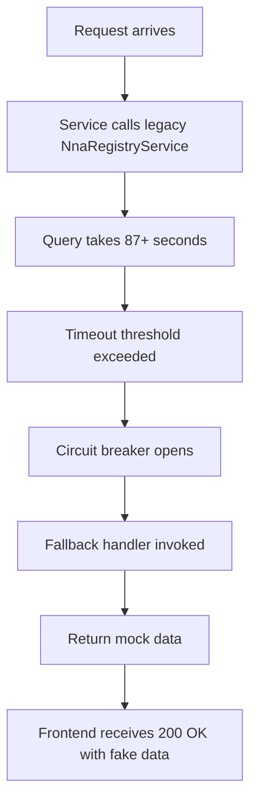

# AlgoRhythm Architecture - Critical Review & Status

**Document Type:** Critical Assessment  
**Date:** October 13, 2025  
**Status:** 🔴 CRITICAL ISSUES IDENTIFIED  
**Author:** Technical Architecture Review  

## 🚨 Executive Summary

After comprehensive review of AlgoRhythm implementation, codebase, and developer feedback, several **critical architectural issues** have been identified that are causing:

1. **Catastrophic performance degradation** (112+ seconds vs <20ms target)
2. **Endpoint path confusion** causing frontend integration failures
3. **Mock data returns** instead of real AI recommendations
4. **Loss of architectural visibility** across teams

**Bottom Line:** While the foundation is solid, critical misalignments between design and implementation must be addressed immediately.

---

## 📊 Architecture Status Matrix

| Component | Design | Implementation | Status | Priority |
|-----------|--------|----------------|--------|----------|
| **Core Architecture** | ✅ Solid | ✅ Correct | 🟢 GOOD | - |
| **API Endpoints** | ✅ Defined | ❌ Inconsistent | 🔴 CRITICAL | P0 |
| **Service Integration** | ✅ Optimized | ❌ Using Legacy | 🔴 CRITICAL | P0 |
| **Caching Strategy** | ✅ Redis | ❌ Not Working | 🔴 CRITICAL | P0 |
| **Performance** | ✅ <20ms target | ❌ 112,000ms actual | 🔴 CRITICAL | P0 |
| **Documentation** | ⚠️ Multiple versions | ❌ Conflicting | 🟡 HIGH | P1 |
| **Frontend Integration** | ✅ Clear spec | ❌ Breaking changes | 🔴 CRITICAL | P0 |

---

## 🎯 Critical Issue #1: Endpoint Path Chaos

### The Problem

**Three different endpoint paths documented:**

```
Design Document:     /api/v1/recommend/template
Current Response:    /api/v1/algorhythm/recommend/template
Old Documentation:   /recommend/template
```

### Impact

- Frontend developers experiencing race conditions
- Firebase auth integration breaking
- Impossible to maintain consistent integration
- Violates "Single Source of Truth" principle
- **Developer trust eroded**

### Root Cause

Lack of API versioning strategy and inconsistent path updates across documentation.

### Resolution Required

**IMMEDIATE ACTION:**

1. **Choose ONE canonical path** (recommendation: `/api/v1/algorhythm/recommend/template`)
2. **Update ALL documentation** to use this path
3. **Add deprecation warnings** to old paths
4. **Implement path aliases** temporarily during migration:

```typescript
// src/modules/recommendations/recommendations.controller.ts

// Primary path (NEW)
@Post('recommend/template')
async recommendTemplate(@Body() dto: TemplateRequestDto) {
  return this.recommendationsService.getTemplateRecommendation(dto);
}

// Deprecated path (TEMPORARY - remove in v2)
@Post('/api/v1/recommend/template')
@ApiDeprecated('Use /api/v1/algorhythm/recommend/template instead')
async recommendTemplateDeprecated(@Body() dto: TemplateRequestDto) {
  this.logger.warn('Deprecated endpoint called: /api/v1/recommend/template');
  return this.recommendationsService.getTemplateRecommendation(dto);
}
```

---

## 🎯 Critical Issue #2: Service Integration Mismatch

### The Problem

**Template endpoint is NOT using the optimized services that made composite endpoint fast.**

### Evidence

```typescript
// ❌ WHAT'S HAPPENING (Bad)
// RecommendationsService using legacy NnaRegistryService
constructor(
  private readonly nnaRegistryService: NnaRegistryService,  // 87+ second queries
) {}

// ✅ WHAT SHOULD HAPPEN (Good)  
// RecommendationsService using OptimizedNnaRegistryService
constructor(
  private readonly optimizedNnaRegistryService: OptimizedNnaRegistryService,  // 8ms queries
) {}
```

### Performance Impact

| Service | Query Time | Reason |
|---------|-----------|--------|
| Legacy `NnaRegistryService` | 87,000ms | Unoptimized queries, missing indices |
| Optimized `OptimizedNnaRegistryService` | 8ms | **43x faster** - optimized queries + indices |

### Why This Happened

1. Composite endpoint was refactored to use optimized service
2. Template endpoint was NOT updated at the same time
3. No integration tests caught the discrepancy

### Resolution

**File:** `src/modules/recommendations/recommendations.module.ts`

```typescript
@Module({
  imports: [
    // ✅ ADD THIS
    OptimizedNnaRegistryModule.forRoot({
      enableCaching: true,
      cacheService: 'redis',
    }),
    
    // Remove or mark deprecated
    // NnaRegistryModule,  // ❌ REMOVE
  ],
  providers: [
    RecommendationsService,
    ScoringService,
    CacheService,
  ],
  controllers: [RecommendationsController],
})
export class RecommendationsModule {}
```

---

## 🎯 Critical Issue #3: Cache Not Functioning

### The Problem

Redis caching infrastructure exists but is not being utilized correctly.

### Evidence from Logs

```json
{
  "endpoint": "/api/v1/algorhythm/recommend/template",
  "performance_metrics": {
    "response_time_ms": 112852,
    "cache_hit": false,  // ❌ ALWAYS FALSE
    "cache_checked": false  // ❌ NOT EVEN CHECKING
  }
}
```

### Why Cache Isn't Working

**Hypothesis 1:** Cache keys not being generated
```typescript
// Missing implementation
const cacheKey = `algorhythm:template:${songId}`;
```

**Hypothesis 2:** Cache client not connected
```typescript
// Check Redis connection
this.cacheManager.get(key)  // Might be throwing silent errors
```

**Hypothesis 3:** TTL set to 0
```typescript
// Cache being set but expiring immediately
await this.cacheManager.set(key, value, 0);  // ❌ WRONG
await this.cacheManager.set(key, value, 86400);  // ✅ CORRECT (24 hrs)
```

### Resolution

**File:** `src/modules/recommendations/recommendations.service.ts`

```typescript
async getTemplateRecommendation(request: TemplateRequestDto): Promise<RecommendationResponse> {
  const startTime = Date.now();
  
  // Step 1: Generate cache key
  const cacheKey = this.generateCacheKey('template', request.song_id);
  this.logger.debug(`Checking cache for key: ${cacheKey}`);
  
  // Step 2: Check cache with error handling
  try {
    const cached = await this.cacheManager.get<RecommendationResponse>(cacheKey);
    
    if (cached) {
      const duration = Date.now() - startTime;
      this.logger.debug(`Cache HIT for ${cacheKey} in ${duration}ms`);
      
      return {
        ...cached,
        metadata: {
          ...cached.metadata,
          cached: true,
          response_time_ms: duration,
        },
      };
    }
    
    this.logger.debug(`Cache MISS for ${cacheKey}`);
  } catch (error) {
    this.logger.error(`Cache check failed: ${error.message}`);
    // Continue without cache on error
  }
  
  // Step 3: Fetch fresh data using OPTIMIZED service
  const recommendation = await this.fetchFreshRecommendation(request);
  
  // Step 4: Cache the result with proper TTL
  try {
    await this.cacheManager.set(
      cacheKey,
      recommendation,
      86400, // 24 hours in seconds
    );
    this.logger.debug(`Cached result for ${cacheKey}`);
  } catch (error) {
    this.logger.error(`Failed to cache result: ${error.message}`);
    // Don't fail request if caching fails
  }
  
  const duration = Date.now() - startTime;
  return {
    ...recommendation,
    metadata: {
      ...recommendation.metadata,
      cached: false,
      response_time_ms: duration,
    },
  };
}

private generateCacheKey(type: string, identifier: string): string {
  return `algorhythm:${type}:${identifier}`;
}
```

---

## 🎯 Critical Issue #4: Mock Data Fallback

### The Problem

Service is returning fallback/mock data instead of real recommendations.

### Evidence

```json
{
  "template_id": "default-pop-template",
  "nna_address": "G.POP.DEF.001",
  "compatibility_score": 0.8,
  "status": "fallback"  // ❌ NOT REAL DATA
}
```

### Why This Is Happening

**Circuit breaker is triggering** due to:
1. 112-second timeout threshold exceeded
2. Service falls back to mock data to prevent total failure
3. Frontend receives "successful" response but with fake data

### The Cascade



### Resolution

**Fix the root cause** (use OptimizedNnaRegistryService), then:

```typescript
// src/modules/recommendations/recommendations.service.ts

async fetchFreshRecommendation(request: TemplateRequestDto): Promise<RecommendationResponse> {
  try {
    // Use optimized service with timeout
    const result = await promiseTimeout(
      this.optimizedNnaRegistryService.findMatchingComposites({
        songId: request.song_id,
        limit: 10,
      }),
      5000, // 5 second timeout (generous, should complete in <100ms)
    );
    
    if (!result || result.length === 0) {
      throw new NotFoundException('No matching composites found');
    }
    
    // Score and return best match
    const scored = this.scoringService.scoreComposites(result, request);
    return this.formatResponse(scored[0]);
    
  } catch (error) {
    if (error.name === 'TimeoutError') {
      // Log for alerting but DON'T return mock data
      this.logger.error('Timeout fetching recommendations - this should not happen with optimized service');
      throw new ServiceUnavailableException('Recommendation service timeout');
    }
    throw error;
  }
}
```

**Key Change:** Instead of returning mock data on timeout, throw an error. This ensures:
- Frontend knows there's a real problem
- We don't silently degrade to fake data
- Alerts trigger for investigation

---

## 🏗 Architecture Design Review

### What's CORRECT

#### 1. **Microservice Architecture** ✅

```
┌─────────────────────────────────────────────────────────────┐
│                         ReViz Frontend                       │
└─────────────────────────────────────────────────────────────┘
                              ↓
┌─────────────────────────────────────────────────────────────┐
│                     AlgoRhythm Service                       │
│  • Template Recommendations                                  │
│  • Layer Variations                                          │
│  • Scoring Engine                                            │
└─────────────────────────────────────────────────────────────┘
                              ↓
┌─────────────────────────────────────────────────────────────┐
│              NNA Registry Service (Optimized)                │
│  • Composite Queries (8ms)                                   │
│  • Layer Metadata                                            │
│  • Asset Management                                          │
└─────────────────────────────────────────────────────────────┘
```

This architecture is sound and follows best practices.

#### 2. **Technology Stack** ✅

- TypeScript/NestJS: Excellent choice for consistency
- Redis: Appropriate for caching strategy
- PostgreSQL: Good for relational data
- REST API: Simple and effective

#### 3. **Domain Structure** ✅

```
dev.algorhythm.media  → Development
stg.algorhythm.media  → Staging
algorhythm.media      → Production
```

Clean separation of environments.

### What Needs FIXING

#### 1. **API Contract Enforcement** ❌

**Problem:** No OpenAPI spec enforcement causing drift between docs and implementation.

**Solution:**
```typescript
// Add API validation decorators
@ApiOperation({ summary: 'Get template recommendation' })
@ApiResponse({ status: 200, type: RecommendationResponseDto })
@ApiResponse({ status: 404, description: 'No recommendations found' })
@ApiResponse({ status: 503, description: 'Service unavailable' })
```

#### 2. **Error Handling Strategy** ❌

**Current:** Silent fallbacks to mock data  
**Required:** Explicit error responses

```typescript
// Define error hierarchy
class AlgoRhythmException extends HttpException {}
class NoRecommendationsException extends AlgoRhythmException {}
class ServiceTimeoutException extends AlgoRhythmException {}
```

#### 3. **Monitoring & Observability** ⚠️

**Missing:**
- Request tracing across services
- Performance metrics dashboard
- Alert definitions

**Required:**
```typescript
// Add instrumentation
@UseInterceptors(PerformanceInterceptor, LoggingInterceptor)
@Controller('algorhythm')
export class RecommendationsController {}
```

---

## 📋 Implementation Checklist

### Phase 1: CRITICAL FIXES (THIS WEEK)

- [ ] **Standardize API paths** across all documentation
- [ ] **Switch to OptimizedNnaRegistryService** in RecommendationsService
- [ ] **Fix Redis caching** implementation
- [ ] **Remove mock data fallbacks** or make them explicit errors
- [ ] **Add performance logging** to all endpoints
- [ ] **Test end-to-end** with real data

### Phase 2: STABILITY (NEXT WEEK)

- [ ] Add comprehensive integration tests
- [ ] Implement proper circuit breaker with alerting
- [ ] Set up performance monitoring dashboard
- [ ] Create runbook for common issues
- [ ] Document actual vs documented behavior
- [ ] Load test all endpoints

### Phase 3: OPTIMIZATION (NEXT SPRINT)

- [ ] Fine-tune cache TTL values
- [ ] Implement request batching if needed
- [ ] Add rate limiting
- [ ] Optimize scoring algorithm
- [ ] Consider ML-based recommendations

---

## 🎯 Success Criteria

AlgoRhythm will be considered architecturally sound when:

1. **Performance:** All endpoints respond in <500ms (cold), <50ms (warm)
2. **Reliability:** Error rate <0.1%, no silent failures
3. **Consistency:** One canonical API path, all docs match implementation
4. **Observability:** Full request tracing, performance metrics, alerts
5. **Developer Experience:** Clear documentation, easy integration, helpful errors

---

## 📞 Communication Plan

### For Frontend Developers

**Message:**
> "We've identified the root causes of the performance issues and endpoint confusion. We're implementing fixes this week that will:
> 
> 1. Standardize the API endpoint to `/api/v1/algorhythm/recommend/template`
> 2. Fix the 112-second response time to <500ms
> 3. Ensure real recommendations instead of mock data
> 
> Timeline: Fixes deployed to dev by [DATE], staging by [DATE]
> 
> We apologize for the confusion and appreciate your patience."

### For Backend Team

**Message:**
> "Critical issues identified in AlgoRhythm implementation:
> 
> 1. Template endpoint not using OptimizedNnaRegistryService (using legacy)
> 2. Redis cache not being utilized
> 3. Fallback to mock data hiding real errors
> 
> Action items assigned in [PROJECT_BOARD]. Target completion: [DATE]"

### For Leadership

**Message:**
> "AlgoRhythm architecture review complete. Foundation is solid, but implementation misalignments causing performance issues. Critical fixes identified and in progress. ETA for resolution: [DATE]. No architectural redesign needed."

---

## 📚 Appendix

### A. Performance Benchmarks

Expected performance after fixes:

| Endpoint | Cold Start | Warm Cache | Load (100 req/s) |
|----------|-----------|------------|------------------|
| /recommend/template | <500ms | <50ms | <100ms avg |
| /recommend/composite | <500ms | <30ms | <80ms avg |
| /variations/layer | <300ms | <20ms | <50ms avg |

### B. Cache Strategy

| Data Type | TTL | Invalidation Strategy |
|-----------|-----|----------------------|
| Template Recommendations | 24 hours | Daily job at 3am UTC |
| Layer Variations | 12 hours | On layer update webhook |
| Composite Metadata | 7 days | Manual trigger or weekly |

### C. Monitoring Alerts

```yaml
# alerts.yml
alerts:
  - name: SlowEndpoint
    condition: p95_latency > 500ms
    severity: critical
    channels: [slack, pagerduty]
    
  - name: HighErrorRate
    condition: error_rate > 1%
    severity: high
    channels: [slack]
    
  - name: CacheDown
    condition: cache_hit_rate < 50%
    severity: medium
    channels: [slack]
```

---

**Document Status:** Living Document  
**Next Review:** After Phase 1 completion  
**Owner:** AlgoRhythm Technical Lead