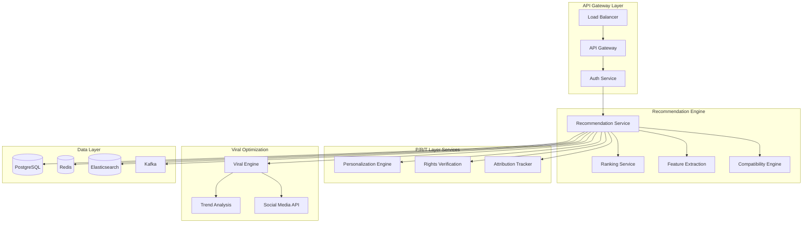

# AlgoRhythm AI Recommendation Engine - Complete Implementation Guide v1.5.0
*Production-Ready Implementation for NNA Framework v1.2.0 with P/R/T Layer Intelligence*

**Version**: 1.5.0  
**Last Updated**: August 2025  
**Target Audience**: Technical Teams, DevOps Engineers, System Architects  
**Compatibility**: NNA Framework v1.2.0, Taxonomy v1.5.0

---

## 🎯 **Implementation Overview**

This comprehensive guide provides **step-by-step implementation** for deploying AlgoRhythm with full **P/R/T layer integration**, **viral optimization**, and **global scale capabilities**. Follow this guide to achieve **<50ms recommendation latency** with **1M+ concurrent user support**.

### **Implementation Scope**
- ✅ **Complete System Architecture** with microservices deployment
- ✅ **AI Model Integration** with TensorFlow and PyTorch optimization
- ✅ **P/R/T Layer Intelligence** for personalization, attribution, and rights
- ✅ **Viral Optimization Engine** for TikTok and social media platforms
- ✅ **Global Scale Infrastructure** with edge distribution
- ✅ **Production Monitoring** with comprehensive analytics

---

## 📋 **Table of Contents**

1. [System Requirements & Prerequisites](#1-system-requirements--prerequisites)
2. [Infrastructure Setup & Architecture](#2-infrastructure-setup--architecture)
3. [Core Service Implementation](#3-core-service-implementation)
4. [AI Model Deployment & Training](#4-ai-model-deployment--training)
5. [P/R/T Layer Integration](#5-prt-layer-integration)
6. [Viral Optimization Engine](#6-viral-optimization-engine)
7. [API Gateway & Security](#7-api-gateway--security)
8. [Caching & Performance Optimization](#8-caching--performance-optimization)
9. [Monitoring & Analytics](#9-monitoring--analytics)
10. [Production Deployment](#10-production-deployment)
11. [Testing & Quality Assurance](#11-testing--quality-assurance)
12. [Troubleshooting & Maintenance](#12-troubleshooting--maintenance)

---

# 1. System Requirements & Prerequisites

## 1.1 Hardware Requirements

### **Production Environment**
```yaml
# Kubernetes Cluster Specifications
nodes:
  control_plane:
    - count: 3
    - cpu: "8 cores"
    - memory: "32GB"
    - storage: "500GB SSD"
    
  compute_nodes:
    - count: 10+
    - cpu: "16 cores"
    - memory: "64GB"
    - storage: "1TB NVMe SSD"
    - gpu: "NVIDIA A100 or equivalent"
    
  inference_nodes:
    - count: 5+
    - cpu: "32 cores"
    - memory: "128GB"
    - storage: "2TB NVMe SSD"
    - gpu: "NVIDIA H100 or A100"

# Database Infrastructure
database:
  postgresql:
    - instance_type: "r5.4xlarge"
    - storage: "10TB+"
    - replicas: 3
    
  redis_cluster:
    - instance_type: "r6g.2xlarge"
    - memory: "52GB per node"
    - nodes: 6+
    
  elasticsearch:
    - instance_type: "i3.2xlarge"
    - storage: "5TB+ per node"
    - nodes: 5+
```

### **Development Environment**
```yaml
minimum_requirements:
  cpu: "8 cores"
  memory: "32GB"
  storage: "500GB SSD"
  gpu: "NVIDIA RTX 4080 or equivalent"
  
recommended_requirements:
  cpu: "16 cores"
  memory: "64GB"
  storage: "1TB NVMe SSD"
  gpu: "NVIDIA RTX 4090 or A6000"
```

## 1.2 Software Prerequisites

### **Core Dependencies**
```bash
# Container Runtime
docker_version: "24.0+"
kubernetes_version: "1.28+"
helm_version: "3.12+"

# Programming Languages
python_version: "3.11+"
nodejs_version: "18.17+"
golang_version: "1.21+"

# AI/ML Frameworks
tensorflow_version: "2.13+"
pytorch_version: "2.0+"
cuda_version: "12.1+"
cudnn_version: "8.9+"

# Databases
postgresql_version: "15+"
redis_version: "7.0+"
elasticsearch_version: "8.8+"

# Message Queues
kafka_version: "3.5+"
rabbitmq_version: "3.12+"
```

### **Development Tools**
```bash
# Essential Development Tools
pip install algorhythm-sdk==1.5.0
pip install tensorflow==2.13.0
pip install torch==2.0.1
pip install scikit-learn==1.3.0
pip install pandas==2.0.3
pip install numpy==1.24.3
pip install redis==4.6.0
pip install psycopg2-binary==2.9.7
pip install kafka-python==2.0.2
pip install prometheus-client==0.17.1

# GPU Support
pip install tensorflow-gpu==2.13.0
pip install torch-cuda==2.0.1
```

---

# 2. Infrastructure Setup & Architecture

## 2.1 Kubernetes Cluster Setup

### **Cluster Configuration**
```yaml
# cluster-config.yaml
apiVersion: v1
kind: ConfigMap
metadata:
  name: algorhythm-cluster-config
  namespace: algorhythm
data:
  cluster.yaml: |
    cluster:
      name: "algorhythm-production"
      region: "multi-region"
      zones:
        - "us-east-1a"
        - "us-east-1b"
        - "us-east-1c"
        - "eu-west-1a"
        - "eu-west-1b"
        - "ap-southeast-1a"
      
      networking:
        service_mesh: "istio"
        cni: "calico"
        ingress: "nginx"
        load_balancer: "haproxy"
      
      storage:
        default_class: "fast-ssd"
        backup_class: "standard"
        
      monitoring:
        prometheus: true
        grafana: true
        jaeger: true
        elasticsearch: true
```

### **Namespace and RBAC Setup**
```yaml
# namespace-setup.yaml
apiVersion: v1
kind: Namespace
metadata:
  name: algorhythm
  labels:
    name: algorhythm
    environment: production
---
apiVersion: rbac.authorization.k8s.io/v1
kind: ClusterRole
metadata:
  name: algorhythm-cluster-role
rules:
- apiGroups: [""]
  resources: ["pods", "services", "configmaps", "secrets"]
  verbs: ["get", "list", "watch", "create", "update", "patch", "delete"]
- apiGroups: ["apps"]
  resources: ["deployments", "replicasets"]
  verbs: ["get", "list", "watch", "create", "update", "patch", "delete"]
- apiGroups: ["networking.k8s.io"]
  resources: ["ingresses"]
  verbs: ["get", "list", "watch", "create", "update", "patch", "delete"]
---
apiVersion: rbac.authorization.k8s.io/v1
kind: ClusterRoleBinding
metadata:
  name: algorhythm-cluster-role-binding
subjects:
- kind: ServiceAccount
  name: algorhythm-service-account
  namespace: algorhythm
roleRef:
  kind: ClusterRole
  name: algorhythm-cluster-role
  apiGroup: rbac.authorization.k8s.io
```

## 2.2 Microservices Architecture

### **Core Services Overview**


### **Service Dependencies**
```yaml
# service-dependencies.yaml
services:
  api_gateway:
    depends_on:
      - auth_service
      - rate_limiter
    
  recommendation_engine:
    depends_on:
      - feature_extraction
      - compatibility_engine
      - personalization_engine
      - rights_verification
      - attribution_tracker
      - viral_engine
    
  personalization_engine:
    depends_on:
      - user_profile_service
      - privacy_service
      - ai_model_service
    
  rights_verification:
    depends_on:
      - clearity_integration
      - blockchain_service
      - smart_contract_service
    
  viral_engine:
    depends_on:
      - trend_analysis
      - social_media_apis
      - content_analyzer
```

---

# 3. Core Service Implementation

## 3.1 Recommendation Engine Service

### **Primary Recommendation Service**
```python
# recommendation_service.py
import asyncio
import logging
from typing import Dict, List, Optional
from dataclasses import dataclass
from datetime import datetime

import torch
import tensorflow as tf
import numpy as np
from redis import Redis
from sqlalchemy.ext.asyncio import AsyncSession

from algorhythm.models import RecommendationModel
from algorhythm.cache import CacheManager
from algorhythm.feature_extraction import FeatureExtractor
from algorhythm.compatibility import CompatibilityEngine
from algorhythm.personalization import PersonalizationEngine
from algorhythm.rights import RightsVerificationEngine
from algorhythm.viral import ViralOptimizationEngine

@dataclass
class RecommendationRequest:
    user_id: str
    input_assets: Dict[str, str]  # layer -> nna_address
    context: Dict[str, any]
    personalization_preferences: Optional[Dict[str, any]] = None
    viral_target: Optional[str] = None  # 'tiktok', 'instagram', 'youtube'
    quality_tier: Optional[str] = 'premium'
    cultural_sensitivity: bool = True

@dataclass
class RecommendationResponse:
    recommendations: List[Dict[str, any]]
    confidence_scores: List[float]
    personalization_options: List[Dict[str, any]]
    viral_potential_scores: List[float]
    attribution_data: List[Dict[str, any]]
    rights_compliance: List[Dict[str, any]]
    processing_time_ms: float
    cache_hit: bool

class AlgoRhythmRecommendationEngine:
    def __init__(self, config: Dict[str, any]):
        self.config = config
        self.logger = logging.getLogger(__name__)
        
        # Core engines
        self.feature_extractor = FeatureExtractor(config)
        self.compatibility_engine = CompatibilityEngine(config)
        self.personalization_engine = PersonalizationEngine(config)
        self.rights_engine = RightsVerificationEngine(config)
        self.viral_engine = ViralOptimizationEngine(config)
        
        # Infrastructure
        self.cache_manager = CacheManager(config)
        self.model_manager = ModelManager(config)
        
        # Performance tracking
        self.metrics = MetricsCollector()
        
    async def initialize(self):
        """Initialize all engines and load models"""
        self.logger.info("Initializing AlgoRhythm Recommendation Engine v1.5.0")
        
        # Initialize engines
        await self.feature_extractor.initialize()
        await self.compatibility_engine.initialize()
        await self.personalization_engine.initialize()
        await self.rights_engine.initialize()
        await self.viral_engine.initialize()
        
        # Load AI models
        await self.model_manager.load_models()
        
        # Warm up caches
        await self.cache_manager.warm_up()
        
        self.logger.info("AlgoRhythm initialization complete")
    
    async def generate_recommendations(
        self, 
        request: RecommendationRequest
    ) -> RecommendationResponse:
        """Generate comprehensive recommendations with P/R/T integration"""
        start_time = datetime.now()
        
        try:
            # Step 1: Check cache for existing recommendations
            cache_key = self._generate_cache_key(request)
            cached_result = await self.cache_manager.get(cache_key)
            if cached_result:
                self.metrics.increment('cache_hits')
                return self._deserialize_response(cached_result, cache_hit=True)
            
            # Step 2: Extract features from input assets
            features = await self.feature_extractor.extract_comprehensive_features(
                request.input_assets
            )
            
            # Step 3: Generate compatibility scores across all layers
            compatibility_scores = await self.compatibility_engine.calculate_enhanced_scores(
                features, request.context
            )
            
            # Step 4: Apply personalization intelligence
            personalization_options = await self.personalization_engine.generate_options(
                features, 
                request.user_id,
                request.personalization_preferences,
                request.quality_tier
            )
            
            # Step 5: Verify rights compliance
            rights_compliance = await self.rights_engine.verify_comprehensive_compliance(
                compatibility_scores,
                request.context.get('usage_intent', 'social_media'),
                request.context.get('territory', 'global')
            )
            
            # Step 6: Generate viral optimization recommendations
            viral_recommendations = await self.viral_engine.optimize_for_viral_potential(
                compatibility_scores,
                request.viral_target,
                request.context
            )
            
            # Step 7: Apply attribution tracking
            attribution_data = await self._generate_attribution_data(
                viral_recommendations,
                features
            )
            
            # Step 8: Final ranking and recommendation generation
            final_recommendations = await self._generate_final_recommendations(
                viral_recommendations,
                personalization_options,
                rights_compliance,
                attribution_data
            )
            
            # Step 9: Cache results
            processing_time = (datetime.now() - start_time).total_seconds() * 1000
            response = RecommendationResponse(
                recommendations=final_recommendations,
                confidence_scores=[r['confidence'] for r in final_recommendations],
                personalization_options=personalization_options,
                viral_potential_scores=[r['viral_score'] for r in final_recommendations],
                attribution_data=attribution_data,
                rights_compliance=rights_compliance,
                processing_time_ms=processing_time,
                cache_hit=False
            )
            
            await self.cache_manager.set(cache_key, response, ttl=3600)
            self.metrics.record_processing_time(processing_time)
            
            return response
            
        except Exception as e:
            self.logger.error(f"Recommendation generation failed: {str(e)}")
            self.metrics.increment('errors')
            raise
    
    async def _generate_attribution_data(
        self, 
        recommendations: List[Dict], 
        features: Dict
    ) -> List[Dict[str, any]]:
        """Generate T Layer attribution data for recommendations"""
        attribution_data = []
        
        for rec in recommendations:
            attr_data = {
                'original_contributors': await self._identify_original_contributors(rec),
                'training_contributors': await self._identify_training_contributors(rec),
                'quality_validators': await self._identify_quality_validators(rec),
                'revenue_splits': await self._calculate_revenue_splits(rec),
                'blockchain_verification': await self._generate_blockchain_proof(rec)
            }
            attribution_data.append(attr_data)
        
        return attribution_data
    
    async def _generate_final_recommendations(
        self,
        viral_recs: List[Dict],
        personalization_opts: List[Dict],
        rights_compliance: List[Dict],
        attribution_data: List[Dict]
    ) -> List[Dict[str, any]]:
        """Generate final ranked recommendations"""
        recommendations = []
        
        for i, viral_rec in enumerate(viral_recs):
            if rights_compliance[i]['compliant']:
                recommendation = {
                    **viral_rec,
                    'personalization': personalization_opts[i] if i < len(personalization_opts) else None,
                    'rights': rights_compliance[i],
                    'attribution': attribution_data[i] if i < len(attribution_data) else None,
                    'final_score': self._calculate_final_score(
                        viral_rec['compatibility_score'],
                        viral_rec['viral_score'],
                        personalization_opts[i]['quality_score'] if i < len(personalization_opts) else 0.5,
                        rights_compliance[i]['compliance_score']
                    )
                }
                recommendations.append(recommendation)
        
        # Sort by final score and return top recommendations
        recommendations.sort(key=lambda x: x['final_score'], reverse=True)
        return recommendations[:20]  # Top 20 recommendations
    
    def _calculate_final_score(
        self, 
        compatibility: float, 
        viral: float, 
        personalization: float, 
        rights: float
    ) -> float:
        """Calculate weighted final score"""
        weights = {
            'compatibility': 0.4,
            'viral': 0.25,
            'personalization': 0.2,
            'rights': 0.15
        }
        
        return (
            compatibility * weights['compatibility'] +
            viral * weights['viral'] +
            personalization * weights['personalization'] +
            rights * weights['rights']
        )
    
    def _generate_cache_key(self, request: RecommendationRequest) -> str:
        """Generate unique cache key for request"""
        import hashlib
        
        key_data = f"{request.user_id}:{request.input_assets}:{request.context}:{request.personalization_preferences}:{request.viral_target}"
        return f"algorhythm:rec:{hashlib.md5(key_data.encode()).hexdigest()}"

# Model Manager for AI model lifecycle
class ModelManager:
    def __init__(self, config: Dict[str, any]):
        self.config = config
        self.models = {}
        self.logger = logging.getLogger(__name__)
    
    async def load_models(self):
        """Load all AI models"""
        self.logger.info("Loading AI models...")
        
        # Load compatibility models
        self.models['compatibility'] = await self._load_compatibility_model()
        
        # Load personalization models
        self.models['personalization'] = await self._load_personalization_model()
        
        # Load viral prediction models
        self.models['viral'] = await self._load_viral_prediction_model()
        
        # Load cultural sensitivity models
        self.models['cultural'] = await self._load_cultural_sensitivity_model()
        
        self.logger.info("All AI models loaded successfully")
    
    async def _load_compatibility_model(self):
        """Load TensorFlow compatibility model"""
        model_path = self.config['models']['compatibility']['path']
        model = tf.keras.models.load_model(model_path)
        return model
    
    async def _load_personalization_model(self):
        """Load PyTorch personalization model"""
        model_path = self.config['models']['personalization']['path']
        model = torch.load(model_path)
        model.eval()
        return model
    
    async def _load_viral_prediction_model(self):
        """Load viral prediction ensemble model"""
        models = {}
        for platform in ['tiktok', 'instagram', 'youtube']:
            model_path = self.config['models']['viral'][platform]['path']
            models[platform] = tf.keras.models.load_model(model_path)
        return models
    
    async def _load_cultural_sensitivity_model(self):
        """Load cultural sensitivity and bias detection model"""
        model_path = self.config['models']['cultural']['path']
        model = tf.keras.models.load_model(model_path)
        return model

# Metrics collection for monitoring
class MetricsCollector:
    def __init__(self):
        from prometheus_client import Counter, Histogram, Gauge
        
        self.request_counter = Counter('algorhythm_requests_total', 'Total requests')
        self.cache_hits = Counter('algorhythm_cache_hits_total', 'Cache hits')
        self.errors = Counter('algorhythm_errors_total', 'Errors')
        self.processing_time = Histogram('algorhythm_processing_time_ms', 'Processing time in milliseconds')
        self.active_users = Gauge('algorhythm_active_users', 'Active users')
    
    def increment(self, metric: str):
        getattr(self, metric).inc()
    
    def record_processing_time(self, time_ms: float):
        self.processing_time.observe(time_ms)
```

### **Feature Extraction Service**
```python
# feature_extraction.py
import asyncio
import numpy as np
from typing import Dict, List, Any
import librosa
import cv2
from PIL import Image
import torch
import torchvision.transforms as transforms

class FeatureExtractor:
    def __init__(self, config: Dict[str, Any]):
        self.config = config
        self.audio_analyzer = AudioFeatureExtractor()
        self.visual_analyzer = VisualFeatureExtractor()
        self.metadata_analyzer = MetadataFeatureExtractor()
        self.viral_analyzer = ViralFeatureExtractor()
    
    async def extract_comprehensive_features(
        self, 
        input_assets: Dict[str, str]
    ) -> Dict[str, Any]:
        """Extract comprehensive features for all asset types"""
        features = {}
        
        tasks = []
        for layer, nna_address in input_assets.items():
            if layer == 'G':  # Song layer
                tasks.append(self._extract_audio_features(nna_address))
            elif layer in ['S', 'L']:  # Star/Look layers
                tasks.append(self._extract_visual_features(nna_address, layer))
            elif layer == 'M':  # Moves layer
                tasks.append(self._extract_movement_features(nna_address))
            elif layer == 'W':  # World layer
                tasks.append(self._extract_environment_features(nna_address))
            elif layer == 'P':  # Personalization layer
                tasks.append(self._extract_personalization_features(nna_address))
        
        # Execute feature extraction in parallel
        results = await asyncio.gather(*tasks, return_exceptions=True)
        
        # Combine results
        for i, (layer, nna_address) in enumerate(input_assets.items()):
            if not isinstance(results[i], Exception):
                features[layer] = results[i]
        
        return features
    
    async def _extract_audio_features(self, nna_address: str) -> Dict[str, Any]:
        """Extract comprehensive audio features"""
        # Load audio file
        audio_path = await self._resolve_asset_path(nna_address)
        y, sr = librosa.load(audio_path)
        
        # Basic audio features
        tempo, beats = librosa.beat.beat_track(y=y, sr=sr)
        spectral_centroids = librosa.feature.spectral_centroid(y=y, sr=sr)
        mfccs = librosa.feature.mfcc(y=y, sr=sr, n_mfcc=13)
        chroma = librosa.feature.chroma_stft(y=y, sr=sr)
        spectral_rolloff = librosa.feature.spectral_rolloff(y=y, sr=sr)
        
        # Advanced features for viral optimization
        harmonic, percussive = librosa.effects.hpss(y)
        onset_strength = librosa.onset.onset_strength(y=y, sr=sr)
        
        # Energy and dynamics
        rms_energy = librosa.feature.rms(y=y)
        zero_crossing_rate = librosa.feature.zero_crossing_rate(y)
        
        return {
            'tempo': float(tempo),
            'beats': beats.tolist(),
            'spectral_centroid': np.mean(spectral_centroids),
            'mfccs': np.mean(mfccs, axis=1).tolist(),
            'chroma': np.mean(chroma, axis=1).tolist(),
            'spectral_rolloff': np.mean(spectral_rolloff),
            'harmonic_ratio': np.mean(harmonic) / np.mean(y) if np.mean(y) != 0 else 0,
            'percussive_ratio': np.mean(percussive) / np.mean(y) if np.mean(y) != 0 else 0,
            'onset_strength': np.mean(onset_strength),
            'energy': np.mean(rms_energy),
            'zero_crossing_rate': np.mean(zero_crossing_rate),
            'duration': len(y) / sr,
            'sample_rate': sr,
            'viral_features': await self._extract_viral_audio_features(y, sr)
        }
    
    async def _extract_visual_features(self, nna_address: str, layer: str) -> Dict[str, Any]:
        """Extract comprehensive visual features"""
        image_path = await self._resolve_asset_path(nna_address)
        image = cv2.imread(image_path)
        
        # Color analysis
        color_features = await self._analyze_colors(image)
        
        # Style detection using pre-trained CNN
        style_features = await self._detect_style(image)
        
        # Composition analysis
        composition_features = await self._analyze_composition(image)
        
        # Cultural and demographic analysis
        cultural_features = await self._analyze_cultural_elements(image)
        
        return {
            'color_features': color_features,
            'style_features': style_features,
            'composition_features': composition_features,
            'cultural_features': cultural_features,
            'layer_specific': await self._extract_layer_specific_visual_features(image, layer),
            'viral_potential': await self._assess_visual_viral_potential(image)
        }
    
    async def _extract_viral_audio_features(self, y: np.ndarray, sr: int) -> Dict[str, Any]:
        """Extract features specifically for viral potential assessment"""
        # Hook detection (strong opening in first 3 seconds)
        hook_strength = np.mean(librosa.feature.rms(y=y[:3*sr]))
        
        # Drop detection (energy changes)
        onset_frames = librosa.onset.onset_detect(y=y, sr=sr)
        drop_intensity = np.max(np.diff(librosa.feature.rms(y=y).flatten()))
        
        # Danceability (rhythmic patterns)
        tempogram = librosa.feature.tempogram(y=y, sr=sr)
        danceability = np.var(tempogram)
        
        # Memorable patterns (repetitive elements)
        chroma = librosa.feature.chroma_stft(y=y, sr=sr)
        repetitiveness = self._calculate_repetitiveness(chroma)
        
        return {
            'hook_strength': float(hook_strength),
            'drop_intensity': float(drop_intensity),
            'danceability': float(danceability),
            'repetitiveness': float(repetitiveness),
            'tiktok_optimized': hook_strength > 0.1 and danceability > 0.5,
            'instagram_optimized': drop_intensity > 0.05 and repetitiveness > 0.3
        }
    
    def _calculate_repetitiveness(self, chroma: np.ndarray) -> float:
        """Calculate how repetitive the audio is"""
        # Simple autocorrelation-based repetitiveness measure
        correlation_matrix = np.corrcoef(chroma)
        return np.mean(np.diag(correlation_matrix, k=1))
```

---

# 4. AI Model Deployment & Training

## 4.1 Model Architecture and Training

### **Compatibility Model Architecture**
```python
# models/compatibility_model.py
import tensorflow as tf
from tensorflow.keras import layers, Model
import torch
import torch.nn as nn

class EnhancedCompatibilityModel(tf.keras.Model):
    """Advanced compatibility model with P/R/T layer awareness"""
    
    def __init__(self, config):
        super().__init__()
        self.config = config
        
        # Layer-specific encoders
        self.song_encoder = self._build_audio_encoder()
        self.visual_encoder = self._build_visual_encoder()
        self.movement_encoder = self._build_movement_encoder()
        self.personalization_encoder = self._build_personalization_encoder()
        
        # Cross-layer attention mechanism
        self.cross_attention = layers.MultiHeadAttention(
            num_heads=8, 
            key_dim=128,
            name="cross_layer_attention"
        )
        
        # Compatibility scoring networks
        self.compatibility_networks = {
            'song_star': self._build_compatibility_network(256),
            'star_look': self._build_compatibility_network(256),
            'song_moves': self._build_compatibility_network(256),
            'moves_world': self._build_compatibility_network(256),
            'personalization': self._build_compatibility_network(256),
            'viral_potential': self._build_viral_network()
        }
        
        # Final aggregation layer
        self.final_aggregator = layers.Dense(1, activation='sigmoid', name='final_score')
    
    def _build_audio_encoder(self):
        """Build encoder for audio features"""
        return tf.keras.Sequential([
            layers.Dense(512, activation='relu'),
            layers.Dropout(0.3),
            layers.Dense(256, activation='relu'),
            layers.Dropout(0.2),
            layers.Dense(128, activation='relu'),
            layers.LayerNormalization()
        ], name='audio_encoder')
    
    def _build_visual_encoder(self):
        """Build encoder for visual features"""
        return tf.keras.Sequential([
            layers.Dense(512, activation='relu'),
            layers.Dropout(0.3),
            layers.Dense(256, activation='relu'),
            layers.Dropout(0.2),
            layers.Dense(128, activation='relu'),
            layers.LayerNormalization()
        ], name='visual_encoder')
    
    def _build_movement_encoder(self):
        """Build encoder for movement/choreography features"""
        return tf.keras.Sequential([
            layers.Dense(256, activation='relu'),
            layers.Dropout(0.2),
            layers.Dense(128, activation='relu'),
            layers.LayerNormalization()
        ], name='movement_encoder')
    
    def _build_personalization_encoder(self):
        """Build encoder for personalization features"""
        return tf.keras.Sequential([
            layers.Dense(256, activation='relu'),
            layers.Dropout(0.2),
            layers.Dense(128, activation='relu'),
            layers.LayerNormalization()
        ], name='personalization_encoder')
    
    def _build_compatibility_network(self, input_dim):
        """Build individual compatibility scoring network"""
        return tf.keras.Sequential([
            layers.Dense(input_dim // 2, activation='relu'),
            layers.Dropout(0.2),
            layers.Dense(input_dim // 4, activation='relu'),
            layers.Dense(1, activation='sigmoid')
        ])
    
    def _build_viral_network(self):
        """Build viral potential prediction network"""
        return tf.keras.Sequential([
            layers.Dense(256, activation='relu'),
            layers.Dropout(0.3),
            layers.Dense(128, activation='relu'),
            layers.Dropout(0.2),
            layers.Dense(64, activation='relu'),
            layers.Dense(1, activation='sigmoid')
        ], name='viral_predictor')
    
    def call(self, inputs, training=None):
        """Forward pass through the model"""
        # Encode layer-specific features
        encoded_features = {}
        
        if 'audio_features' in inputs:
            encoded_features['audio'] = self.song_encoder(inputs['audio_features'])
        
        if 'visual_features' in inputs:
            encoded_features['visual'] = self.visual_encoder(inputs['visual_features'])
        
        if 'movement_features' in inputs:
            encoded_features['movement'] = self.movement_encoder(inputs['movement_features'])
        
        if 'personalization_features' in inputs:
            encoded_features['personalization'] = self.personalization_encoder(inputs['personalization_features'])
        
        # Apply cross-attention between layers
        attended_features = self._apply_cross_attention(encoded_features)
        
        # Calculate compatibility scores
        compatibility_scores = {}
        for compatibility_type, network in self.compatibility_networks.items():
            if compatibility_type == 'viral_potential':
                # Combine all features for viral prediction
                combined_features = tf.concat(list(attended_features.values()), axis=-1)
                compatibility_scores[compatibility_type] = network(combined_features)
            else:
                # Pairwise compatibility scoring
                relevant_features = self._get_relevant_features_for_compatibility(
                    compatibility_type, attended_features
                )
                if relevant_features is not None:
                    compatibility_scores[compatibility_type] = network(relevant_features)
        
        # Final aggregation
        final_score = self._aggregate_scores(compatibility_scores)
        
        return {
            'final_score': final_score,
            'compatibility_scores': compatibility_scores,
            'encoded_features': encoded_features
        }
    
    def _apply_cross_attention(self, encoded_features):
        """Apply cross-attention mechanism between layers"""
        attended_features = {}
        
        feature_values = list(encoded_features.values())
        feature_keys = list(encoded_features.keys())
        
        for i, (key, value) in enumerate(encoded_features.items()):
            # Use other features as context
            context = tf.stack([f for j, f in enumerate(feature_values) if j != i], axis=1)
            
            if context.shape[1] > 0:
                attended = self.cross_attention(
                    query=tf.expand_dims(value, axis=1),
                    value=context,
                    key=context
                )
                attended_features[key] = tf.squeeze(attended, axis=1)
            else:
                attended_features[key] = value
        
        return attended_features
    
    def _get_relevant_features_for_compatibility(self, compatibility_type, features):
        """Get relevant features for specific compatibility type"""
        feature_map = {
            'song_star': ['audio', 'visual'],
            'star_look': ['visual'],
            'song_moves': ['audio', 'movement'],
            'moves_world': ['movement', 'visual'],
            'personalization': ['personalization', 'visual']
        }
        
        relevant_keys = feature_map.get(compatibility_type, [])
        relevant_features = [features[key] for key in relevant_keys if key in features]
        
        if relevant_features:
            return tf.concat(relevant_features, axis=-1)
        return None
    
    def _aggregate_scores(self, compatibility_scores):
        """Aggregate individual compatibility scores into final score"""
        weights = {
            'song_star': 0.25,
            'star_look': 0.20,
            'song_moves': 0.20,
            'moves_world': 0.15,
            'personalization': 0.15,
            'viral_potential': 0.05
        }
        
        weighted_sum = 0.0
        total_weight = 0.0
        
        for score_type, score in compatibility_scores.items():
            if score_type in weights:
                weight = weights[score_type]
                weighted_sum += score * weight
                total_weight += weight
        
        if total_weight > 0:
            return weighted_sum / total_weight
        else:
            return tf.zeros_like(list(compatibility_scores.values())[0])

# Training script
class ModelTrainer:
    def __init__(self, config):
        self.config = config
        self.model = EnhancedCompatibilityModel(config)
        self.optimizer = tf.keras.optimizers.AdamW(learning_rate=0.001)
        self.loss_fn = tf.keras.losses.BinaryCrossentropy()
    
    async def train_model(self, train_dataset, val_dataset, epochs=50):
        """Train the compatibility model"""
        best_val_loss = float('inf')
        patience_counter = 0
        
        for epoch in range(epochs):
            # Training loop
            train_loss = 0.0
            train_batches = 0
            
            for batch in train_dataset:
                with tf.GradientTape() as tape:
                    predictions = self.model(batch['features'], training=True)
                    loss = self.loss_fn(batch['labels'], predictions['final_score'])
                    
                    # Add regularization losses
                    total_loss = loss + sum(self.model.losses)
                
                gradients = tape.gradient(total_loss, self.model.trainable_variables)
                self.optimizer.apply_gradients(zip(gradients, self.model.trainable_variables))
                
                train_loss += total_loss
                train_batches += 1
            
            # Validation loop
            val_loss = 0.0
            val_batches = 0
            
            for batch in val_dataset:
                predictions = self.model(batch['features'], training=False)
                loss = self.loss_fn(batch['labels'], predictions['final_score'])
                val_loss += loss
                val_batches += 1
            
            avg_train_loss = train_loss / train_batches
            avg_val_loss = val_loss / val_batches
            
            print(f"Epoch {epoch+1}/{epochs} - Train Loss: {avg_train_loss:.4f} - Val Loss: {avg_val_loss:.4f}")
            
            # Early stopping
            if avg_val_loss < best_val_loss:
                best_val_loss = avg_val_loss
                patience_counter = 0
                # Save best model
                await self._save_model_checkpoint(epoch, avg_val_loss)
            else:
                patience_counter += 1
                if patience_counter >= 5:  # Patience of 5 epochs
                    print("Early stopping triggered")
                    break
    
    async def _save_model_checkpoint(self, epoch, val_loss):
        """Save model checkpoint"""
        checkpoint_path = f"{self.config['model_save_path']}/checkpoint_epoch_{epoch}_loss_{val_loss:.4f}"
        self.model.save_weights(checkpoint_path)
        print(f"Model checkpoint saved: {checkpoint_path}")
```

### **Model Training Pipeline**
```python
# training/training_pipeline.py
import asyncio
import tensorflow as tf
import numpy as np
from pathlib import Path
import logging

class AlgoRhythmTrainingPipeline:
    def __init__(self, config):
        self.config = config
        self.logger = logging.getLogger(__name__)
    
    async def run_training_pipeline(self):
        """Run complete training pipeline"""
        self.logger.info("Starting AlgoRhythm training pipeline")
        
        # Step 1: Data preparation
        train_dataset, val_dataset, test_dataset = await self._prepare_datasets()
        
        # Step 2: Model training
        model_trainer = ModelTrainer(self.config)
        await model_trainer.train_model(train_dataset, val_dataset)
        
        # Step 3: Model evaluation
        await self._evaluate_model(model_trainer.model, test_dataset)
        
        # Step 4: Model optimization for production
        await self._optimize_for_production(model_trainer.model)
        
        self.logger.info("Training pipeline completed successfully")
    
    async def _prepare_datasets(self):
        """Prepare training, validation, and test datasets"""
        # Load and preprocess data
        data_loader = DataLoader(self.config)
        raw_data = await data_loader.load_training_data()
        
        # Feature engineering
        feature_engineer = FeatureEngineer(self.config)
        processed_data = await feature_engineer.process_features(raw_data)
        
        # Split data
        train_data, val_data, test_data = data_loader.split_data(
            processed_data, 
            train_ratio=0.7, 
            val_ratio=0.15, 
            test_ratio=0.15
        )
        
        # Create TensorFlow datasets
        train_dataset = self._create_tf_dataset(train_data, batch_size=32, shuffle=True)
        val_dataset = self._create_tf_dataset(val_data, batch_size=32, shuffle=False)
        test_dataset = self._create_tf_dataset(test_data, batch_size=32, shuffle=False)
        
        return train_dataset, val_dataset, test_dataset
    
    def _create_tf_dataset(self, data, batch_size=32, shuffle=False):
        """Create optimized TensorFlow dataset"""
        dataset = tf.data.Dataset.from_generator(
            lambda: self._data_generator(data),
            output_signature={
                'features': {
                    'audio_features': tf.TensorSpec(shape=(None,), dtype=tf.float32),
                    'visual_features': tf.TensorSpec(shape=(None,), dtype=tf.float32),
                    'movement_features': tf.TensorSpec(shape=(None,), dtype=tf.float32),
                    'personalization_features': tf.TensorSpec(shape=(None,), dtype=tf.float32)
                },
                'labels': tf.TensorSpec(shape=(), dtype=tf.float32)
            }
        )
        
        if shuffle:
            dataset = dataset.shuffle(buffer_size=1000)
        
        dataset = dataset.batch(batch_size)
        dataset = dataset.prefetch(tf.data.AUTOTUNE)
        
        return dataset
    
    def _data_generator(self, data):
        """Generator for training data"""
        for sample in data:
            yield {
                'features': {
                    'audio_features': tf.constant(sample['audio_features'], dtype=tf.float32),
                    'visual_features': tf.constant(sample['visual_features'], dtype=tf.float32),
                    'movement_features': tf.constant(sample['movement_features'], dtype=tf.float32),
                    'personalization_features': tf.constant(sample['personalization_features'], dtype=tf.float32)
                },
                'labels': tf.constant(sample['compatibility_score'], dtype=tf.float32)
            }
```

---

# 5. P/R/T Layer Integration

## 5.1 Personalization Engine Implementation

### **Core Personalization Service**
```python
# personalization/personalization_engine.py
import asyncio
import torch
import torch.nn as nn
import numpy as np
from typing import Dict, List, Optional, Any
from dataclasses import dataclass
from datetime import datetime

@dataclass
class PersonalizationRequest:
    user_id: str
    base_features: Dict[str, Any]
    personalization_type: str  # 'face', 'voice', 'style', 'body'
    quality_tier: str  # 'basic', 'premium', 'professional', 'studio'
    privacy_level: str  # 'on_device', 'secure_cloud', 'real_time'
    cultural_sensitivity: bool = True

@dataclass
class PersonalizationResult:
    personalized_features: Dict[str, Any]
    quality_score: float
    privacy_compliance: Dict[str, Any]
    processing_time_ms: float
    confidence_score: float
    cultural_sensitivity_score: float

class PersonalizationEngine:
    def __init__(self, config: Dict[str, Any]):
        self.config = config
        self.logger = logging.getLogger(__name__)
        
        # Privacy-preserving models for on-device processing
        self.on_device_models = {}
        
        # Secure cloud models for enhanced quality
        self.cloud_models = {}
        
        # Privacy manager
        self.privacy_manager = PrivacyManager(config)
        
        # Cultural sensitivity checker
        self.cultural_checker = CulturalSensitivityChecker(config)
        
        # Quality assessment engine
        self.quality_assessor = QualityAssessmentEngine(config)
    
    async def initialize(self):
        """Initialize personalization engine"""
        self.logger.info("Initializing Personalization Engine v1.5.0")
        
        # Load on-device models (smaller, privacy-preserving)
        await self._load_on_device_models()
        
        # Load cloud models (larger, higher quality)
        await self._load_cloud_models()
        
        # Initialize privacy manager
        await self.privacy_manager.initialize()
        
        # Initialize cultural sensitivity checker
        await self.cultural_checker.initialize()
        
        self.logger.info("Personalization Engine initialization complete")
    
    async def generate_personalization_options(
        self, 
        request: PersonalizationRequest
    ) -> List[PersonalizationResult]:
        """Generate personalization options based on request"""
        start_time = datetime.now()
        
        try:
            # Step 1: Privacy compliance check
            privacy_check = await self.privacy_manager.verify_compliance(request)
            if not privacy_check['compliant']:
                raise ValueError(f"Privacy compliance failed: {privacy_check['reason']}")
            
            # Step 2: Cultural sensitivity pre-check
            cultural_check = await self.cultural_checker.pre_check(request)
            if not cultural_check['appropriate']:
                self.logger.warning(f"Cultural sensitivity warning: {cultural_check['warning']}")
            
            # Step 3: Generate personalization options based on privacy level
            if request.privacy_level == 'on_device':
                options = await self._generate_on_device_personalization(request)
            elif request.privacy_level == 'secure_cloud':
                options = await self._generate_secure_cloud_personalization(request)
            else:  # real_time
                options = await self._generate_real_time_personalization(request)
            
            # Step 4: Quality assessment
            assessed_options = []
            for option in options:
                quality_score = await self.quality_assessor.assess_quality(
                    option, request.quality_tier
                )
                
                # Cultural sensitivity post-check
                cultural_score = await self.cultural_checker.assess_cultural_sensitivity(
                    option, request.base_features
                )
                
                processing_time = (datetime.now() - start_time).total_seconds() * 1000
                
                assessed_options.append(PersonalizationResult(
                    personalized_features=option,
                    quality_score=quality_score,
                    privacy_compliance=privacy_check,
                    processing_time_ms=processing_time,
                    confidence_score=option.get('confidence', 0.8),
                    cultural_sensitivity_score=cultural_score
                ))
            
            return assessed_options
            
        except Exception as e:
            self.logger.error(f"Personalization generation failed: {str(e)}")
            raise
    
    async def _generate_on_device_personalization(
        self, 
        request: PersonalizationRequest
    ) -> List[Dict[str, Any]]:
        """Generate personalization using on-device models"""
        model = self.on_device_models.get(request.personalization_type)
        if not model:
            raise ValueError(f"On-device model not available for {request.personalization_type}")
        
        # Process using lightweight, privacy-preserving model
        if request.personalization_type == 'face':
            return await self._generate_face_personalization_on_device(request, model)
        elif request.personalization_type == 'voice':
            return await self._generate_voice_personalization_on_device(request, model)
        elif request.personalization_type == 'style':
            return await self._generate_style_personalization_on_device(request, model)
        elif request.personalization_type == 'body':
            return await self._generate_body_personalization_on_device(request, model)
        
        return []
    
    async def _generate_secure_cloud_personalization(
        self, 
        request: PersonalizationRequest
    ) -> List[Dict[str, Any]]:
        """Generate personalization using secure cloud models"""
        model = self.cloud_models.get(request.personalization_type)
        if not model:
            raise ValueError(f"Cloud model not available for {request.personalization_type}")
        
        # Process using high-quality cloud model with privacy protection
        if request.personalization_type == 'face':
            return await self._generate_face_personalization_cloud(request, model)
        elif request.personalization_type == 'voice':
            return await self._generate_voice_personalization_cloud(request, model)
        elif request.personalization_type == 'style':
            return await self._generate_style_personalization_cloud(request, model)
        elif request.personalization_type == 'body':
            return await self._generate_body_personalization_cloud(request, model)
        
        return []
    
    async def _generate_face_personalization_on_device(
        self, 
        request: PersonalizationRequest, 
        model: torch.nn.Module
    ) -> List[Dict[str, Any]]:
        """Generate face personalization using on-device model"""
        # Extract face features from base image
        face_features = await self._extract_face_features(request.base_features)
        
        # Generate personalization options
        personalization_options = []
        
        # Basic face replacement
        if request.quality_tier in ['basic', 'premium']:
            basic_result = await self._apply_basic_face_replacement(face_features, model)
            personalization_options.append({
                'type': 'face_replacement',
                'method': 'basic',
                'features': basic_result,
                'confidence': 0.85,
                'processing_method': 'on_device'
            })
        
        # Advanced face blending
        if request.quality_tier in ['premium', 'professional', 'studio']:
            advanced_result = await self._apply_advanced_face_blending(face_features, model)
            personalization_options.append({
                'type': 'face_blending',
                'method': 'advanced',
                'features': advanced_result,
                'confidence': 0.90,
                'processing_method': 'on_device'
            })
        
        return personalization_options
    
    async def _extract_face_features(self, base_features: Dict[str, Any]) -> Dict[str, Any]:
        """Extract facial features for personalization"""
        # Use lightweight face detection and feature extraction
        face_landmarks = base_features.get('face_landmarks', [])
        face_encoding = base_features.get('face_encoding', [])
        
        return {
            'landmarks': face_landmarks,
            'encoding': face_encoding,
            'shape_features': self._extract_face_shape_features(face_landmarks),
            'expression_features': self._extract_expression_features(face_landmarks)
        }
    
    def _extract_face_shape_features(self, landmarks: List[float]) -> Dict[str, float]:
        """Extract face shape characteristics"""
        if not landmarks or len(landmarks) < 68:
            return {}
        
        # Calculate key facial measurements
        landmarks_array = np.array(landmarks).reshape(-1, 2)
        
        # Face width/height ratio
        face_width = np.linalg.norm(landmarks_array[16] - landmarks_array[0])
        face_height = np.linalg.norm(landmarks_array[8] - landmarks_array[27])
        aspect_ratio = face_width / face_height if face_height > 0 else 1.0
        
        # Eye spacing
        left_eye_center = np.mean(landmarks_array[36:42], axis=0)
        right_eye_center = np.mean(landmarks_array[42:48], axis=0)
        eye_distance = np.linalg.norm(right_eye_center - left_eye_center)
        
        return {
            'aspect_ratio': float(aspect_ratio),
            'eye_distance': float(eye_distance),
            'face_width': float(face_width),
            'face_height': float(face_height)
        }

# Privacy Manager for GDPR/CCPA compliance
class PrivacyManager:
    def __init__(self, config: Dict[str, Any]):
        self.config = config
        self.compliance_rules = config.get('privacy_rules', {})
    
    async def verify_compliance(self, request: PersonalizationRequest) -> Dict[str, Any]:
        """Verify privacy compliance for personalization request"""
        compliance_result = {
            'compliant': True,
            'reason': '',
            'data_handling': {},
            'retention_policy': {},
            'user_rights': {}
        }
        
        # Check data minimization principle
        if not self._check_data_minimization(request):
            compliance_result['compliant'] = False
            compliance_result['reason'] = 'Data minimization principle violated'
            return compliance_result
        
        # Check purpose limitation
        if not self._check_purpose_limitation(request):
            compliance_result['compliant'] = False
            compliance_result['reason'] = 'Purpose limitation principle violated'
            return compliance_result
        
        # Set data handling requirements based on privacy level
        compliance_result['data_handling'] = self._get_data_handling_requirements(request.privacy_level)
        compliance_result['retention_policy'] = self._get_retention_policy(request.privacy_level)
        compliance_result['user_rights'] = self._get_user_rights_info()
        
        return compliance_result
    
    def _check_data_minimization(self, request: PersonalizationRequest) -> bool:
        """Check if request adheres to data minimization principle"""
        # Only collect data necessary for the specific personalization type
        required_features = self._get_required_features(request.personalization_type)
        provided_features = set(request.base_features.keys())
        
        return provided_features.issubset(required_features)
    
    def _get_required_features(self, personalization_type: str) -> set:
        """Get required features for specific personalization type"""
        feature_map = {
            'face': {'face_landmarks', 'face_encoding', 'image_data'},
            'voice': {'audio_features', 'voice_characteristics'},
            'style': {'visual_features', 'style_preferences'},
            'body': {'body_measurements', 'proportions'}
        }
        return feature_map.get(personalization_type, set())

# Cultural Sensitivity Checker
class CulturalSensitivityChecker:
    def __init__(self, config: Dict[str, Any]):
        self.config = config
        self.cultural_models = {}
        self.appropriation_detector = None
    
    async def initialize(self):
        """Initialize cultural sensitivity models"""
        # Load cultural appropriation detection model
        self.appropriation_detector = await self._load_appropriation_detector()
        
        # Load cultural context models
        self.cultural_models = await self._load_cultural_models()
    
    async def assess_cultural_sensitivity(
        self, 
        personalization_result: Dict[str, Any], 
        base_features: Dict[str, Any]
    ) -> float:
        """Assess cultural sensitivity of personalization result"""
        
        # Check for cultural appropriation
        appropriation_score = await self._check_appropriation(
            personalization_result, base_features
        )
        
        # Check for cultural authenticity
        authenticity_score = await self._check_authenticity(
            personalization_result, base_features
        )
        
        # Check for respectful representation
        representation_score = await self._check_representation(
            personalization_result, base_features
        )
        
        # Combine scores (lower is better for sensitivity)
        final_score = (appropriation_score + authenticity_score + representation_score) / 3
        
        return final_score
    
    async def _check_appropriation(
        self, 
        result: Dict[str, Any], 
        base_features: Dict[str, Any]
    ) -> float:
        """Check for cultural appropriation risks"""
        if not self.appropriation_detector:
            return 0.5  # Default neutral score
        
        # Analyze visual and style elements for appropriation
        features = self._extract_cultural_features(result, base_features)
        appropriation_risk = await self.appropriation_detector.predict(features)
        
        return float(appropriation_risk)
```

## 5.2 Rights Verification Engine

### **Rights Management Service**
```python
# rights/rights_verification_engine.py
import asyncio
import logging
from typing import Dict, List, Optional, Any
from dataclasses import dataclass
from datetime import datetime, timedelta
import hashlib
import json

@dataclass
class RightsVerificationRequest:
    nna_addresses: List[str]
    usage_intent: str  # 'commercial', 'social_media', 'educational', 'personal'
    territory: str     # 'global', 'us', 'eu', 'specific_country'
    duration: Optional[str] = None  # 'permanent', 'temporary', 'specific_date'
    user_id: str = None
    platform_targets: List[str] = None  # ['tiktok', 'instagram', 'youtube']

@dataclass
class RightsVerificationResult:
    nna_address: str
    compliant: bool
    rights_status: Dict[str, Any]
    usage_permissions: Dict[str, Any]
    territorial_restrictions: List[str]
    smart_contract_address: Optional[str]
    revenue_sharing_terms: Dict[str, Any]
    compliance_score: float
    verification_timestamp: datetime

class RightsVerificationEngine:
    def __init__(self, config: Dict[str, Any]):
        self.config = config
        self.logger = logging.getLogger(__name__)
        
        # Clearity integration
        self.clearity_client = ClearityClient(config)
        
        # Blockchain integration for smart contracts
        self.blockchain_client = BlockchainClient(config)
        
        # Rights database
        self.rights_db = RightsDatabase(config)
        
        # Cache for rights verification results
        self.rights_cache = RightsCache(config)
        
        # Legal compliance engine
        self.legal_engine = LegalComplianceEngine(config)
    
    async def initialize(self):
        """Initialize rights verification engine"""
        self.logger.info("Initializing Rights Verification Engine v1.5.0")
        
        # Initialize Clearity client
        await self.clearity_client.initialize()
        
        # Initialize blockchain client
        await self.blockchain_client.initialize()
        
        # Initialize rights database
        await self.rights_db.initialize()
        
        # Initialize legal compliance engine
        await self.legal_engine.initialize()
        
        self.logger.info("Rights Verification Engine initialization complete")
    
    async def verify_comprehensive_compliance(
        self, 
        request: RightsVerificationRequest
    ) -> List[RightsVerificationResult]:
        """Verify comprehensive rights compliance for all assets"""
        verification_results = []
        
        # Process each asset
        for nna_address in request.nna_addresses:
            result = await self._verify_single_asset(nna_address, request)
            verification_results.append(result)
        
        # Check for composite rights issues
        composite_compliance = await self._verify_composite_rights(
            verification_results, request
        )
        
        # Update results with composite compliance
        for result in verification_results:
            result.compliance_score *= composite_compliance['multiplier']
        
        return verification_results
    
    async def _verify_single_asset(
        self, 
        nna_address: str, 
        request: RightsVerificationRequest
    ) -> RightsVerificationResult:
        """Verify rights for a single asset"""
        start_time = datetime.now()
        
        try:
            # Step 1: Check cache for recent verification
            cache_key = self._generate_cache_key(nna_address, request)
            cached_result = await self.rights_cache.get(cache_key)
            if cached_result and self._is_cache_valid(cached_result):
                return cached_result
            
            # Step 2: Resolve asset metadata from NNA registry
            asset_metadata = await self._resolve_asset_metadata(nna_address)
            
            # Step 3: Extract rights information
            rights_info = await self._extract_rights_information(asset_metadata)
            
            # Step 4: Verify ownership rights
            ownership_verification = await self._verify_ownership_rights(rights_info)
            
            # Step 5: Check usage permissions
            usage_verification = await self._verify_usage_permissions(
                rights_info, request.usage_intent
            )
            
            # Step 6: Verify territorial compliance
            territorial_verification = await self._verify_territorial_compliance(
                rights_info, request.territory
            )
            
            # Step 7: Check platform-specific rights
            platform_verification = await self._verify_platform_rights(
                rights_info, request.platform_targets
            )
            
            # Step 8: Generate or retrieve smart contract
            smart_contract = await self._generate_smart_contract(
                rights_info, request
            )
            
            # Step 9: Calculate revenue sharing terms
            revenue_terms = await self._calculate_revenue_sharing(
                rights_info, request
            )
            
            # Step 10: Determine overall compliance
            compliance_score = self._calculate_compliance_score(
                ownership_verification,
                usage_verification,
                territorial_verification,
                platform_verification
            )
            
            # Step 11: Create verification result
            result = RightsVerificationResult(
                nna_address=nna_address,
                compliant=compliance_score >= 0.8,  # 80% threshold
                rights_status={
                    'ownership': ownership_verification,
                    'usage': usage_verification,
                    'territorial': territorial_verification,
                    'platform': platform_verification
                },
                usage_permissions=usage_verification.get('permissions', {}),
                territorial_restrictions=territorial_verification.get('restrictions', []),
                smart_contract_address=smart_contract.get('address'),
                revenue_sharing_terms=revenue_terms,
                compliance_score=compliance_score,
                verification_timestamp=datetime.now()
            )
            
            # Step 12: Cache result
            await self.rights_cache.set(cache_key, result, ttl=3600)
            
            return result
            
        except Exception as e:
            self.logger.error(f"Rights verification failed for {nna_address}: {str(e)}")
            # Return non-compliant result on error
            return RightsVerificationResult(
                nna_address=nna_address,
                compliant=False,
                rights_status={'error': str(e)},
                usage_permissions={},
                territorial_restrictions=[],
                smart_contract_address=None,
                revenue_sharing_terms={},
                compliance_score=0.0,
                verification_timestamp=datetime.now()
            )
    
    async def _verify_ownership_rights(self, rights_info: Dict[str, Any]) -> Dict[str, Any]:
        """Verify ownership rights for the asset"""
        verification = {
            'verified': False,
            'owner': None,
            'ownership_type': None,
            'documentation': [],
            'confidence': 0.0
        }
        
        # Check copyright ownership
        copyright_info = rights_info.get('copyright', {})
        if copyright_info.get('owner'):
            verification['verified'] = True
            verification['owner'] = copyright_info['owner']
            verification['ownership_type'] = 'copyright'
            verification['confidence'] = 0.9
        
        # Verify with blockchain records if available
        blockchain_verification = await self.blockchain_client.verify_ownership(
            rights_info.get('nna_address')
        )
        if blockchain_verification['verified']:
            verification['confidence'] = min(verification['confidence'] + 0.1, 1.0)
        
        return verification
    
    async def _verify_usage_permissions(
        self, 
        rights_info: Dict[str, Any], 
        usage_intent: str
    ) -> Dict[str, Any]:
        """Verify usage permissions for specific intent"""
        verification = {
            'permitted': False,
            'permissions': {},
            'restrictions': [],
            'license_type': None,
            'confidence': 0.0
        }
        
        usage_rights = rights_info.get('usage_rights', {})
        
        # Check specific usage permissions
        if usage_intent in usage_rights:
            permission_info = usage_rights[usage_intent]
            verification['permitted'] = permission_info.get('allowed', False)
            verification['permissions'] = permission_info.get('permissions', {})
            verification['restrictions'] = permission_info.get('restrictions', [])
            verification['license_type'] = permission_info.get('license_type')
            verification['confidence'] = 0.95
        else:
            # Check for general commercial/non-commercial permissions
            if usage_intent in ['social_media', 'personal'] and usage_rights.get('non_commercial'):
                verification['permitted'] = True
                verification['confidence'] = 0.8
            elif usage_intent == 'commercial' and usage_rights.get('commercial'):
                verification['permitted'] = True
                verification['confidence'] = 0.8
        
        return verification
    
    async def _verify_territorial_compliance(
        self, 
        rights_info: Dict[str, Any], 
        territory: str
    ) -> Dict[str, Any]:
        """Verify territorial compliance"""
        verification = {
            'compliant': False,
            'allowed_territories': [],
            'restrictions': [],
            'confidence': 0.0
        }
        
        territorial_rights = rights_info.get('territorial_rights', {})
        
        if territory == 'global':
            # Check if global rights are available
            if territorial_rights.get('global', False):
                verification['compliant'] = True
                verification['allowed_territories'] = ['global']
                verification['confidence'] = 1.0
            else:
                # Check if most major territories are covered
                major_territories = ['us', 'eu', 'uk', 'ca', 'au']
                covered_territories = [t for t in major_territories if territorial_rights.get(t, False)]
                if len(covered_territories) >= 4:
                    verification['compliant'] = True
                    verification['allowed_territories'] = covered_territories
                    verification['confidence'] = 0.8
        else:
            # Check specific territory
            if territorial_rights.get(territory, False):
                verification['compliant'] = True
                verification['allowed_territories'] = [territory]
                verification['confidence'] = 0.95
        
        # Add any territorial restrictions
        verification['restrictions'] = territorial_rights.get('restrictions', [])
        
        return verification
    
    async def _generate_smart_contract(
        self, 
        rights_info: Dict[str, Any], 
        request: RightsVerificationRequest
    ) -> Dict[str, Any]:
        """Generate or retrieve smart contract for rights management"""
        contract_data = {
            'address': None,
            'status': 'pending',
            'terms': {},
            'enforcement': {}
        }
        
        try:
            # Check if smart contract already exists
            existing_contract = await self.blockchain_client.get_existing_contract(
                rights_info.get('nna_address')
            )
            
            if existing_contract:
                contract_data['address'] = existing_contract['address']
                contract_data['status'] = 'active'
                contract_data['terms'] = existing_contract['terms']
                contract_data['enforcement'] = existing_contract['enforcement']
            else:
                # Generate new smart contract
                contract_terms = self._generate_contract_terms(rights_info, request)
                new_contract = await self.blockchain_client.deploy_contract(
                    contract_terms
                )
                
                contract_data['address'] = new_contract['address']
                contract_data['status'] = 'deployed'
                contract_data['terms'] = contract_terms
                contract_data['enforcement'] = new_contract['enforcement']
            
        except Exception as e:
            self.logger.error(f"Smart contract generation failed: {str(e)}")
            contract_data['status'] = 'failed'
            contract_data['error'] = str(e)
        
        return contract_data
    
    def _calculate_compliance_score(
        self, 
        ownership: Dict[str, Any], 
        usage: Dict[str, Any], 
        territorial: Dict[str, Any], 
        platform: Dict[str, Any]
    ) -> float:
        """Calculate overall compliance score"""
        weights = {
            'ownership': 0.3,
            'usage': 0.3,
            'territorial': 0.2,
            'platform': 0.2
        }
        
        scores = {
            'ownership': ownership.get('confidence', 0.0) if ownership.get('verified', False) else 0.0,
            'usage': usage.get('confidence', 0.0) if usage.get('permitted', False) else 0.0,
            'territorial': territorial.get('confidence', 0.0) if territorial.get('compliant', False) else 0.0,
            'platform': platform.get('confidence', 0.0) if platform.get('compliant', False) else 0.0
        }
        
        weighted_score = sum(score * weights[category] for category, score in scores.items())
        return weighted_score

# Attribution Tracker for T Layer
class AttributionTracker:
    def __init__(self, config: Dict[str, Any]):
        self.config = config
        self.logger = logging.getLogger(__name__)
        self.blockchain_client = BlockchainClient(config)
        self.payment_processor = PaymentProcessor(config)
    
    async def track_comprehensive_attribution(
        self, 
        nna_addresses: List[str],
        usage_context: Dict[str, Any]
    ) -> Dict[str, Any]:
        """Track comprehensive attribution for T Layer"""
        attribution_data = {
            'original_contributors': {},
            'training_contributors': {},
            'quality_validators': {},
            'revenue_distribution': {},
            'blockchain_verification': {}
        }
        
        for nna_address in nna_addresses:
            # Get attribution data for each asset
            asset_attribution = await self._get_asset_attribution(nna_address)
            
            # Merge attribution data
            self._merge_attribution_data(attribution_data, asset_attribution)
        
        # Calculate revenue distribution
        revenue_distribution = await self._calculate_attribution_revenue_distribution(
            attribution_data, usage_context
        )
        attribution_data['revenue_distribution'] = revenue_distribution
        
        # Create blockchain record
        blockchain_record = await self._create_blockchain_attribution_record(
            attribution_data
        )
        attribution_data['blockchain_verification'] = blockchain_record
        
        return attribution_data
    
    async def _get_asset_attribution(self, nna_address: str) -> Dict[str, Any]:
        """Get attribution data for a single asset"""
        # Parse NNA address to determine layer and type
        layer = nna_address.split('.')[0]
        
        attribution = {
            'original_contributors': [],
            'training_contributors': [],
            'quality_validators': [],
            'asset_metadata': {}
        }
        
        if layer == 'T':  # Training data layer
            attribution = await self._get_training_data_attribution(nna_address)
        else:
            attribution = await self._get_standard_attribution(nna_address)
        
        return attribution
    
    async def _calculate_attribution_revenue_distribution(
        self, 
        attribution_data: Dict[str, Any],
        usage_context: Dict[str, Any]
    ) -> Dict[str, Any]:
        """Calculate revenue distribution based on attribution"""
        distribution = {
            'original_creators': {},
            'training_contributors': {},
            'quality_validators': {},
            'platform_fee': 0.0,
            'total_attributions': 0
        }
        
        # Base revenue from usage
        base_revenue = usage_context.get('estimated_revenue', 0.0)
        
        # Platform fee (typically 10-15%)
        platform_fee_rate = self.config.get('platform_fee_rate', 0.12)
        distribution['platform_fee'] = base_revenue * platform_fee_rate
        
        # Distributable revenue
        distributable_revenue = base_revenue - distribution['platform_fee']
        
        # Count total attributions for weighting
        total_original = len(attribution_data.get('original_contributors', {}))
        total_training = len(attribution_data.get('training_contributors', {}))
        total_quality = len(attribution_data.get('quality_validators', {}))
        
        distribution['total_attributions'] = total_original + total_training + total_quality
        
        if distribution['total_attributions'] > 0:
            # Revenue allocation weights
            weights = {
                'original': 0.6,    # 60% to original creators
                'training': 0.25,   # 25% to training contributors
                'quality': 0.15     # 15% to quality validators
            }
            
            # Distribute to original creators
            original_share = distributable_revenue * weights['original']
            if total_original > 0:
                per_original = original_share / total_original
                for contributor_id in attribution_data['original_contributors']:
                    distribution['original_creators'][contributor_id] = per_original
            
            # Distribute to training contributors
            training_share = distributable_revenue * weights['training']
            if total_training > 0:
                per_training = training_share / total_training
                for contributor_id in attribution_data['training_contributors']:
                    distribution['training_contributors'][contributor_id] = per_training
            
            # Distribute to quality validators
            quality_share = distributable_revenue * weights['quality']
            if total_quality > 0:
                per_quality = quality_share / total_quality
                for contributor_id in attribution_data['quality_validators']:
                    distribution['quality_validators'][contributor_id] = per_quality
        
        return distribution

---

# 6. Viral Optimization Engine

## 6.1 Viral Prediction and Optimization

### **Viral Optimization Service**
```python
# viral/viral_optimization_engine.py
import asyncio
import numpy as np
import tensorflow as tf
from typing import Dict, List, Optional, Any
from dataclasses import dataclass
from datetime import datetime, timedelta
import logging

@dataclass
class ViralOptimizationRequest:
    base_features: Dict[str, Any]
    target_platforms: List[str]  # ['tiktok', 'instagram', 'youtube', 'twitter']
    content_category: str        # 'music', 'dance', 'comedy', 'fashion', etc.
    target_demographics: Dict[str, Any]
    cultural_context: str
    trend_alignment: bool = True

@dataclass
class ViralOptimizationResult:
    optimized_features: Dict[str, Any]
    viral_score: float
    platform_specific_scores: Dict[str, float]
    trend_alignment_score: float
    engagement_prediction: Dict[str, float]
    optimization_recommendations: List[str]
    cultural_sensitivity_score: float

class ViralOptimizationEngine:
    def __init__(self, config: Dict[str, Any]):
        self.config = config
        self.logger = logging.getLogger(__name__)
        
        # Platform-specific viral models
        self.viral_models = {}
        
        # Trend analysis engine
        self.trend_analyzer = TrendAnalysisEngine(config)
        
        # Social media API clients
        self.social_clients = {}
        
        # Cultural sensitivity checker
        self.cultural_checker = CulturalSensitivityChecker(config)
        
        # Engagement predictor
        self.engagement_predictor = EngagementPredictor(config)
    
    async def initialize(self):
        """Initialize viral optimization engine"""
        self.logger.info("Initializing Viral Optimization Engine v1.5.0")
        
        # Load platform-specific models
        await self._load_viral_models()
        
        # Initialize trend analyzer
        await self.trend_analyzer.initialize()
        
        # Initialize social media clients
        await self._initialize_social_clients()
        
        # Initialize engagement predictor
        await self.engagement_predictor.initialize()
        
        self.logger.info("Viral Optimization Engine initialization complete")
    
    async def optimize_for_viral_potential(
        self, 
        request: ViralOptimizationRequest
    ) -> ViralOptimizationResult:
        """Optimize content for viral potential"""
        start_time = datetime.now()
        
        try:
            # Step 1: Analyze current trends
            current_trends = await self.trend_analyzer.get_current_trends(
                request.target_platforms,
                request.content_category
            )
            
            # Step 2: Generate platform-specific optimizations
            platform_optimizations = {}
            platform_scores = {}
            
            for platform in request.target_platforms:
                optimization = await self._optimize_for_platform(
                    platform, request.base_features, current_trends
                )
                platform_optimizations[platform] = optimization
                platform_scores[platform] = optimization['viral_score']
            
            # Step 3: Cultural sensitivity check
            cultural_score = await self.cultural_checker.assess_viral_content(
                platform_optimizations, request.cultural_context
            )
            
            # Step 4: Trend alignment analysis
            trend_score = await self._calculate_trend_alignment(
                platform_optimizations, current_trends
            )
            
            # Step 5: Engagement prediction
            engagement_prediction = await self.engagement_predictor.predict_engagement(
                platform_optimizations, request.target_demographics
            )
            
            # Step 6: Generate optimization recommendations
            recommendations = await self._generate_optimization_recommendations(
                platform_optimizations, current_trends, engagement_prediction
            )
            
            # Step 7: Calculate overall viral score
            overall_viral_score = self._calculate_overall_viral_score(
                platform_scores, trend_score, cultural_score
            )
            
            # Step 8: Combine optimizations
            combined_optimization = self._combine_platform_optimizations(
                platform_optimizations
            )
            
            return ViralOptimizationResult(
                optimized_features=combined_optimization,
                viral_score=overall_viral_score,
                platform_specific_scores=platform_scores,
                trend_alignment_score=trend_score,
                engagement_prediction=engagement_prediction,
                optimization_recommendations=recommendations,
                cultural_sensitivity_score=cultural_score
            )
            
        except Exception as e:
            self.logger.error(f"Viral optimization failed: {str(e)}")
            raise
    
    async def _optimize_for_platform(
        self, 
        platform: str, 
        base_features: Dict[str, Any], 
        trends: Dict[str, Any]
    ) -> Dict[str, Any]:
        """Optimize content for specific platform"""
        model = self.viral_models.get(platform)
        if not model:
            raise ValueError(f"Viral model not available for platform: {platform}")
        
        if platform == 'tiktok':
            return await self._optimize_for_tiktok(base_features, trends, model)
        elif platform == 'instagram':
            return await self._optimize_for_instagram(base_features, trends, model)
        elif platform == 'youtube':
            return await self._optimize_for_youtube(base_features, trends, model)
        elif platform == 'twitter':
            return await self._optimize_for_twitter(base_features, trends, model)
        
        return {}
    
    async def _optimize_for_tiktok(
        self, 
        base_features: Dict[str, Any], 
        trends: Dict[str, Any], 
        model: tf.keras.Model
    ) -> Dict[str, Any]:
        """Optimize content specifically for TikTok"""
        optimization = {
            'platform': 'tiktok',
            'optimized_features': {},
            'viral_score': 0.0,
            'optimization_applied': []
        }
        
        # TikTok-specific optimizations
        
        # 1. Hook optimization (first 3 seconds)
        if 'audio_features' in base_features:
            hook_features = await self._optimize_tiktok_hook(
                base_features['audio_features'], trends.get('tiktok', {})
            )
            optimization['optimized_features']['hook'] = hook_features
            optimization['optimization_applied'].append('hook_optimization')
        
        # 2. Dance move optimization
        if 'movement_features' in base_features:
            dance_features = await self._optimize_tiktok_dance(
                base_features['movement_features'], trends.get('tiktok', {})
            )
            optimization['optimized_features']['dance'] = dance_features
            optimization['optimization_applied'].append('dance_optimization')
        
        # 3. Visual effects optimization
        if 'visual_features' in base_features:
            visual_features = await self._optimize_tiktok_visuals(
                base_features['visual_features'], trends.get('tiktok', {})
            )
            optimization['optimized_features']['visuals'] = visual_features
            optimization['optimization_applied'].append('visual_optimization')
        
        # 4. Hashtag and text optimization
        hashtag_optimization = await self._optimize_tiktok_hashtags(
            base_features, trends.get('tiktok', {})
        )
        optimization['optimized_features']['hashtags'] = hashtag_optimization
        optimization['optimization_applied'].append('hashtag_optimization')
        
        # 5. Timing optimization
        timing_optimization = await self._optimize_tiktok_timing(
            base_features, trends.get('tiktok', {})
        )
        optimization['optimized_features']['timing'] = timing_optimization
        optimization['optimization_applied'].append('timing_optimization')
        
        # Calculate TikTok viral score using the model
        feature_vector = self._create_tiktok_feature_vector(optimization['optimized_features'])
        viral_score = await self._predict_viral_score(model, feature_vector)
        optimization['viral_score'] = float(viral_score)
        
        return optimization
    
    async def _optimize_tiktok_hook(
        self, 
        audio_features: Dict[str, Any], 
        tiktok_trends: Dict[str, Any]
    ) -> Dict[str, Any]:
        """Optimize the opening hook for TikTok"""
        hook_optimization = {
            'intensity_boost': 0.0,
            'beat_emphasis': 0.0,
            'surprise_element': False,
            'vocal_emphasis': 0.0
        }
        
        # Analyze trending hooks
        trending_hooks = tiktok_trends.get('trending_hooks', [])
        
        # Boost intensity in first 3 seconds if current intensity is low
        current_hook_intensity = audio_features.get('hook_strength', 0.0)
        if current_hook_intensity < 0.7:
            hook_optimization['intensity_boost'] = 0.8 - current_hook_intensity
        
        # Emphasize beat if danceability is high
        danceability = audio_features.get('danceability', 0.0)
        if danceability > 0.6:
            hook_optimization['beat_emphasis'] = min(danceability * 1.2, 1.0)
        
        # Add surprise element based on trending patterns
        if any('surprise' in hook.get('characteristics', []) for hook in trending_hooks):
            hook_optimization['surprise_element'] = True
        
        return hook_optimization
    
    async def _optimize_tiktok_dance(
        self, 
        movement_features: Dict[str, Any], 
        tiktok_trends: Dict[str, Any]
    ) -> Dict[str, Any]:
        """Optimize dance moves for TikTok virality"""
        dance_optimization = {
            'trending_moves': [],
            'difficulty_level': 'intermediate',
            'repeatability': 0.0,
            'hand_movement_emphasis': 0.0,
            'facial_expression_cues': []
        }
        
        # Get trending dance moves
        trending_dances = tiktok_trends.get('trending_dances', [])
        
        # Select complementary trending moves
        current_style = movement_features.get('style', 'generic')
        compatible_moves = [
            dance for dance in trending_dances 
            if dance.get('style_compatibility', {}).get(current_style, 0) > 0.7
        ]
        
        dance_optimization['trending_moves'] = compatible_moves[:3]  # Top 3 compatible moves
        
        # Optimize difficulty level for maximum participation
        current_difficulty = movement_features.get('difficulty', 0.5)
        if current_difficulty > 0.8:
            dance_optimization['difficulty_level'] = 'simplified'
        elif current_difficulty < 0.3:
            dance_optimization['difficulty_level'] = 'enhanced'
        
        # Optimize for repeatability (important for TikTok loops)
        repeatability = movement_features.get('repeatability', 0.0)
        dance_optimization['repeatability'] = min(repeatability * 1.3, 1.0)
        
        return dance_optimization
    
    def _create_tiktok_feature_vector(self, optimized_features: Dict[str, Any]) -> np.ndarray:
        """Create feature vector for TikTok viral score prediction"""
        features = []
        
        # Hook features
        hook = optimized_features.get('hook', {})
        features.extend([
            hook.get('intensity_boost', 0.0),
            hook.get('beat_emphasis', 0.0),
            1.0 if hook.get('surprise_element', False) else 0.0,
            hook.get('vocal_emphasis', 0.0)
        ])
        
        # Dance features
        dance = optimized_features.get('dance', {})
        features.extend([
            len(dance.get('trending_moves', [])) / 10.0,  # Normalize to 0-1
            {'easy': 0.2, 'intermediate': 0.5, 'hard': 0.8, 'simplified': 0.3, 'enhanced': 0.7}.get(
                dance.get('difficulty_level', 'intermediate'), 0.5
            ),
            dance.get('repeatability', 0.0),
            dance.get('hand_movement_emphasis', 0.0)
        ])
        
        # Visual features
        visuals = optimized_features.get('visuals', {})
        features.extend([
            len(visuals.get('trending_effects', [])) / 5.0,  # Normalize
            visuals.get('color_vibrancy', 0.0),
            visuals.get('transition_smoothness', 0.0)
        ])
        
        # Hashtag features
        hashtags = optimized_features.get('hashtags', {})
        features.extend([
            len(hashtags.get('trending_hashtags', [])) / 10.0,  # Normalize
            hashtags.get('hashtag_reach_score', 0.0),
            hashtags.get('niche_relevance', 0.0)
        ])
        
        # Timing features
        timing = optimized_features.get('timing', {})
        features.extend([
            timing.get('optimal_posting_score', 0.0),
            timing.get('trend_timing_score', 0.0)
        ])
        
        return np.array(features, dtype=np.float32)

# Trend Analysis Engine
class TrendAnalysisEngine:
    def __init__(self, config: Dict[str, Any]):
        self.config = config
        self.logger = logging.getLogger(__name__)
        self.social_apis = {}
        self.trend_cache = {}
        self.trend_models = {}
    
    async def initialize(self):
        """Initialize trend analysis engine"""
        self.logger.info("Initializing Trend Analysis Engine")
        
        # Initialize social media API clients
        await self._initialize_social_apis()
        
        # Load trend prediction models
        await self._load_trend_models()
        
        self.logger.info("Trend Analysis Engine initialization complete")
    
    async def get_current_trends(
        self, 
        platforms: List[str], 
        category: str
    ) -> Dict[str, Any]:
        """Get current trends for specified platforms and category"""
        trends = {}
        
        for platform in platforms:
            platform_trends = await self._get_platform_trends(platform, category)
            trends[platform] = platform_trends
        
        # Cross-platform trend analysis
        cross_platform_trends = await self._analyze_cross_platform_trends(trends)
        trends['cross_platform'] = cross_platform_trends
        
        return trends
    
    async def _get_platform_trends(self, platform: str, category: str) -> Dict[str, Any]:
        """Get trends for a specific platform"""
        # Check cache first
        cache_key = f"{platform}:{category}"
        if cache_key in self.trend_cache:
            cached_data = self.trend_cache[cache_key]
            if datetime.now() - cached_data['timestamp'] < timedelta(hours=1):
                return cached_data['trends']
        
        # Fetch fresh trend data
        if platform == 'tiktok':
            trends = await self._get_tiktok_trends(category)
        elif platform == 'instagram':
            trends = await self._get_instagram_trends(category)
        elif platform == 'youtube':
            trends = await self._get_youtube_trends(category)
        else:
            trends = {}
        
        # Cache the results
        self.trend_cache[cache_key] = {
            'trends': trends,
            'timestamp': datetime.now()
        }
        
        return trends
    
    async def _get_tiktok_trends(self, category: str) -> Dict[str, Any]:
        """Get TikTok-specific trends"""
        trends = {
            'trending_sounds': [],
            'trending_hashtags': [],
            'trending_effects': [],
            'trending_dances': [],
            'trending_challenges': [],
            'viral_characteristics': {}
        }
        
        try:
            # Use TikTok API or web scraping to get trend data
            # This is a simplified implementation
            api_client = self.social_apis.get('tiktok')
            if api_client:
                # Get trending sounds
                sounds_data = await api_client.get_trending_sounds(category=category)
                trends['trending_sounds'] = sounds_data.get('sounds', [])
                
                # Get trending hashtags
                hashtags_data = await api_client.get_trending_hashtags(category=category)
                trends['trending_hashtags'] = hashtags_data.get('hashtags', [])
                
                # Get trending effects
                effects_data = await api_client.get_trending_effects(category=category)
                trends['trending_effects'] = effects_data.get('effects', [])
                
                # Analyze viral characteristics
                viral_analysis = await api_client.analyze_viral_content(category=category)
                trends['viral_characteristics'] = viral_analysis
        
        except Exception as e:
            self.logger.error(f"Error fetching TikTok trends: {str(e)}")
        
        return trends

# Engagement Predictor
class EngagementPredictor:
    def __init__(self, config: Dict[str, Any]):
        self.config = config
        self.prediction_models = {}
    
    async def initialize(self):
        """Initialize engagement prediction models"""
        # Load pre-trained engagement prediction models
        for platform in ['tiktok', 'instagram', 'youtube', 'twitter']:
            model_path = self.config['models']['engagement'][platform]['path']
            self.prediction_models[platform] = tf.keras.models.load_model(model_path)
    
    async def predict_engagement(
        self, 
        platform_optimizations: Dict[str, Any], 
        target_demographics: Dict[str, Any]
    ) -> Dict[str, float]:
        """Predict engagement metrics for optimized content"""
        predictions = {}
        
        for platform, optimization in platform_optimizations.items():
            if platform in self.prediction_models:
                # Create feature vector for engagement prediction
                feature_vector = self._create_engagement_feature_vector(
                    optimization, target_demographics
                )
                
                # Predict engagement metrics
                model = self.prediction_models[platform]
                prediction = model.predict(feature_vector.reshape(1, -1))
                
                predictions[platform] = {
                    'likes': float(prediction[0][0]),
                    'shares': float(prediction[0][1]),
                    'comments': float(prediction[0][2]),
                    'views': float(prediction[0][3]),
                    'overall_engagement': float(np.mean(prediction[0]))
                }
        
        return predictions
    
    def _create_engagement_feature_vector(
        self, 
        optimization: Dict[str, Any], 
        demographics: Dict[str, Any]
    ) -> np.ndarray:
        """Create feature vector for engagement prediction"""
        features = []
        
        # Content features
        features.append(optimization.get('viral_score', 0.0))
        features.extend(optimization.get('optimization_applied', []))
        
        # Demographic features
        features.append(demographics.get('age_group_score', 0.5))
        features.append(demographics.get('interest_alignment_score', 0.5))
        features.append(demographics.get('platform_activity_score', 0.5))
        
        # Platform-specific features
        platform_features = optimization.get('optimized_features', {})
        features.append(len(platform_features))
        
        # Pad or truncate to fixed size (e.g., 50 features)
        target_size = 50
        if len(features) < target_size:
            features.extend([0.0] * (target_size - len(features)))
        else:
            features = features[:target_size]
        
        return np.array(features, dtype=np.float32)

---

# 7. API Gateway & Security

## 7.1 API Gateway Implementation

### **Gateway Service Configuration**
```yaml
# api-gateway.yaml
apiVersion: apps/v1
kind: Deployment
metadata:
  name: algorhythm-api-gateway
  namespace: algorhythm
spec:
  replicas: 5
  selector:
    matchLabels:
      app: algorhythm-api-gateway
  template:
    metadata:
      labels:
        app: algorhythm-api-gateway
    spec:
      containers:
      - name: api-gateway
        image: algorhythm/api-gateway:v1.5.0
        ports:
        - containerPort: 8080
        - containerPort: 8443
        env:
        - name: ENVIRONMENT
          value: "production"
        - name: LOG_LEVEL
          value: "INFO"
        - name: RATE_LIMIT_REQUESTS_PER_MINUTE
          value: "1000"
        - name: MAX_CONCURRENT_CONNECTIONS
          value: "10000"
        resources:
          requests:
            cpu: "2"
            memory: "4Gi"
          limits:
            cpu: "4"
            memory: "8Gi"
        livenessProbe:
          httpGet:
            path: /health
            port: 8080
          initialDelaySeconds: 30
          periodSeconds: 10
        readinessProbe:
          httpGet:
            path: /ready
            port: 8080
          initialDelaySeconds: 5
          periodSeconds: 5
---
apiVersion: v1
kind: Service
metadata:
  name: algorhythm-api-gateway-service
  namespace: algorhythm
spec:
  selector:
    app: algorhythm-api-gateway
  ports:
  - name: http
    port: 80
    targetPort: 8080
  - name: https
    port: 443
    targetPort: 8443
  type: LoadBalancer
```

### **API Gateway Implementation**
```python
# api_gateway/gateway_service.py
import asyncio
import logging
import time
from typing import Dict, List, Optional, Any
from datetime import datetime, timedelta
import jwt
import redis
import aiohttp
from aiohttp import web, ClientTimeout
from aiohttp.web_middlewares import middleware
import json
import hashlib

class AlgoRhythmAPIGateway:
    def __init__(self, config: Dict[str, Any]):
        self.config = config
        self.logger = logging.getLogger(__name__)
        
        # Service discovery
        self.service_registry = ServiceRegistry(config)
        
        # Authentication and authorization
        self.auth_manager = AuthManager(config)
        
        # Rate limiting
        self.rate_limiter = RateLimiter(config)
        
        # Request routing
        self.router = RequestRouter(config)
        
        # Monitoring and metrics
        self.metrics_collector = MetricsCollector()
        
        # Cache for responses
        self.response_cache = ResponseCache(config)
    
    async def initialize(self):
        """Initialize API Gateway"""
        self.logger.info("Initializing AlgoRhythm API Gateway v1.5.0")
        
        # Initialize all components
        await self.service_registry.initialize()
        await self.auth_manager.initialize()
        await self.rate_limiter.initialize()
        await self.response_cache.initialize()
        
        # Create web application
        self.app = web.Application(middlewares=[
            self.auth_middleware,
            self.rate_limit_middleware,
            self.request_logging_middleware,
            self.error_handling_middleware,
            self.cors_middleware
        ])
        
        # Setup routes
        self._setup_routes()
        
        self.logger.info("API Gateway initialization complete")
    
    def _setup_routes(self):
        """Setup API routes"""
        # Health check endpoints
        self.app.router.add_get('/health', self.health_check)
        self.app.router.add_get('/ready', self.readiness_check)
        self.app.router.add_get('/metrics', self.metrics_endpoint)
        
        # Main API endpoints
        self.app.router.add_post('/v1/recommendations', self.recommendations_handler)
        self.app.router.add_post('/v1/personalize', self.personalization_handler)
        self.app.router.add_post('/v1/rights/verify', self.rights_verification_handler)
        self.app.router.add_post('/v1/viral/optimize', self.viral_optimization_handler)
        self.app.router.add_get('/v1/trends', self.trends_handler)
        
        # Batch processing endpoints
        self.app.router.add_post('/v1/batch/recommendations', self.batch_recommendations_handler)
        
        # Admin endpoints
        self.app.router.add_get('/admin/services', self.admin_services_handler)
        self.app.router.add_post('/admin/cache/clear', self.admin_cache_clear_handler)
    
    @middleware
    async def auth_middleware(self, request, handler):
        """Authentication middleware"""
        # Skip auth for health checks
        if request.path in ['/health', '/ready', '/metrics']:
            return await handler(request)
        
        # Extract and validate token
        auth_header = request.headers.get('Authorization')
        if not auth_header or not auth_header.startswith('Bearer '):
            return web.json_response(
                {'error': 'Authentication required'}, 
                status=401
            )
        
        token = auth_header[7:]  # Remove 'Bearer ' prefix
        
        try:
            # Validate token
            user_info = await self.auth_manager.validate_token(token)
            request['user'] = user_info
            
            return await handler(request)
            
        except Exception as e:
            self.logger.warning(f"Authentication failed: {str(e)}")
            return web.json_response(
                {'error': 'Invalid authentication token'}, 
                status=401
            )
    
    @middleware
    async def rate_limit_middleware(self, request, handler):
        """Rate limiting middleware"""
        # Skip rate limiting for health checks
        if request.path in ['/health', '/ready']:
            return await handler(request)
        
        user_id = request.get('user', {}).get('user_id', 'anonymous')
        client_ip = request.remote
        
        # Check rate limit
        rate_limit_result = await self.rate_limiter.check_rate_limit(
            user_id, client_ip, request.path
        )
        
        if not rate_limit_result['allowed']:
            return web.json_response(
                {
                    'error': 'Rate limit exceeded',
                    'retry_after': rate_limit_result['retry_after']
                },
                status=429,
                headers={'Retry-After': str(rate_limit_result['retry_after'])}
            )
        
        return await handler(request)
    
    @middleware
    async def request_logging_middleware(self, request, handler):
        """Request logging middleware"""
        start_time = time.time()
        
        # Log request
        self.logger.info(f"Request: {request.method} {request.path} from {request.remote}")
        
        try:
            response = await handler(request)
            
            # Log response
            processing_time = (time.time() - start_time) * 1000
            self.logger.info(
                f"Response: {response.status} for {request.method} {request.path} "
                f"({processing_time:.2f}ms)"
            )
            
            # Record metrics
            self.metrics_collector.record_request(
                request.method,
                request.path,
                response.status,
                processing_time
            )
            
            return response
            
        except Exception as e:
            processing_time = (time.time() - start_time) * 1000
            self.logger.error(
                f"Request failed: {request.method} {request.path} "
                f"({processing_time:.2f}ms) - {str(e)}"
            )
            
            self.metrics_collector.record_error(
                request.method,
                request.path,
                processing_time
            )
            
            raise
    
    async def recommendations_handler(self, request):
        """Handle recommendation requests"""
        try:
            # Parse request
            request_data = await request.json()
            user_info = request['user']
            
            # Add user context to request
            request_data['user_id'] = user_info['user_id']
            request_data['user_context'] = user_info.get('context', {})
            
            # Check cache
            cache_key = self._generate_cache_key(request_data)
            cached_response = await self.response_cache.get(cache_key)
            if cached_response:
                return web.json_response(cached_response)
            
            # Route to recommendation service
            service_endpoint = await self.service_registry.get_service_endpoint(
                'recommendation-engine'
            )
            
            # Make request to service
            async with aiohttp.ClientSession(
                timeout=ClientTimeout(total=30)
            ) as session:
                async with session.post(
                    f"{service_endpoint}/generate",
                    json=request_data,
                    headers={'Content-Type': 'application/json'}
                ) as response:
                    if response.status == 200:
                        result = await response.json()
                        
                        # Cache successful response
                        await self.response_cache.set(cache_key, result, ttl=1800)
                        
                        return web.json_response(result)
                    else:
                        error_text = await response.text()
                        return web.json_response(
                            {'error': f'Service error: {error_text}'}, 
                            status=response.status
                        )
        
        except Exception as e:
            self.logger.error(f"Recommendations handler error: {str(e)}")
            return web.json_response(
                {'error': 'Internal server error'}, 
                status=500
            )
    
    async def personalization_handler(self, request):
        """Handle personalization requests"""
        try:
            request_data = await request.json()
            user_info = request['user']
            
            # Add user context
            request_data['user_id'] = user_info['user_id']
            
            # Route to personalization service
            service_endpoint = await self.service_registry.get_service_endpoint(
                'personalization-engine'
            )
            
            async with aiohttp.ClientSession(
                timeout=ClientTimeout(total=60)  # Longer timeout for personalization
            ) as session:
                async with session.post(
                    f"{service_endpoint}/personalize",
                    json=request_data
                ) as response:
                    if response.status == 200:
                        result = await response.json()
                        return web.json_response(result)
                    else:
                        error_text = await response.text()
                        return web.json_response(
                            {'error': f'Personalization service error: {error_text}'}, 
                            status=response.status
                        )
        
        except Exception as e:
            self.logger.error(f"Personalization handler error: {str(e)}")
            return web.json_response(
                {'error': 'Internal server error'}, 
                status=500
            )
    
    def _generate_cache_key(self, request_data: Dict[str, Any]) -> str:
        """Generate cache key for request"""
        # Create deterministic hash of request data
        request_str = json.dumps(request_data, sort_keys=True)
        return hashlib.md5(request_str.encode()).hexdigest()

# Authentication Manager
class AuthManager:
    def __init__(self, config: Dict[str, Any]):
        self.config = config
        self.jwt_secret = config['jwt_secret']
        self.jwt_algorithm = config.get('jwt_algorithm', 'HS256')
        self.token_cache = {}
    
    async def validate_token(self, token: str) -> Dict[str, Any]:
        """Validate JWT token and return user info"""
        # Check cache first
        if token in self.token_cache:
            cached_data = self.token_cache[token]
            if datetime.now() < cached_data['expires']:
                return cached_data['user_info']
        
        try:
            # Decode JWT token
            payload = jwt.decode(
                token, 
                self.jwt_secret, 
                algorithms=[self.jwt_algorithm]
            )
            
            # Extract user information
            user_info = {
                'user_id': payload['user_id'],
                'username': payload.get('username'),
                'role': payload.get('role', 'user'),
                'permissions': payload.get('permissions', []),
                'context': payload.get('context', {})
            }
            
            # Cache token validation result
            expires_at = datetime.fromtimestamp(payload.get('exp', time.time() + 3600))
            self.token_cache[token] = {
                'user_info': user_info,
                'expires': expires_at
            }
            
            return user_info
            
        except jwt.ExpiredSignatureError:
            raise ValueError("Token has expired")
        except jwt.InvalidTokenError as e:
            raise ValueError(f"Invalid token: {str(e)}")

# Rate Limiter
class RateLimiter:
    def __init__(self, config: Dict[str, Any]):
        self.config = config
        self.redis_client = None
        self.rate_limits = config.get('rate_limits', {
            'default': {'requests': 100, 'window': 60},  # 100 requests per minute
            'premium': {'requests': 1000, 'window': 60}, # 1000 requests per minute
            'admin': {'requests': 10000, 'window': 60}   # 10000 requests per minute
        })
    
    async def initialize(self):
        """Initialize rate limiter"""
        redis_config = self.config['redis']
        self.redis_client = redis.Redis(
            host=redis_config['host'],
            port=redis_config['port'],
            db=redis_config['db'],
            decode_responses=True
        )
    
    async def check_rate_limit(
        self, 
        user_id: str, 
        client_ip: str, 
        endpoint: str
    ) -> Dict[str, Any]:
        """Check if request is within rate limits"""
        # Determine rate limit tier based on user
        # This would typically be determined by user subscription/role
        rate_limit_tier = 'default'  # Default tier
        
        limits = self.rate_limits[rate_limit_tier]
        requests_limit = limits['requests']
        time_window = limits['window']
        
        # Create rate limit key
        current_window = int(time.time()) // time_window
        rate_key = f"rate_limit:{user_id}:{current_window}"
        
        try:
            # Get current request count
            current_requests = await self._get_request_count(rate_key)
            
            if current_requests >= requests_limit:
                # Rate limit exceeded
                retry_after = time_window - (int(time.time()) % time_window)
                return {
                    'allowed': False,
                    'retry_after': retry_after,
                    'requests_remaining': 0
                }
            
            # Increment request count
            await self._increment_request_count(rate_key, time_window)
            
            return {
                'allowed': True,
                'requests_remaining': requests_limit - current_requests - 1
            }
            
        except Exception as e:
            # If rate limiting fails, allow the request but log the error
            logging.error(f"Rate limiting error: {str(e)}")
            return {'allowed': True, 'requests_remaining': -1}
    
    async def _get_request_count(self, key: str) -> int:
        """Get current request count from Redis"""
        count = self.redis_client.get(key)
        return int(count) if count else 0
    
    async def _increment_request_count(self, key: str, ttl: int):
        """Increment request count in Redis"""
        pipe = self.redis_client.pipeline()
        pipe.incr(key)
        pipe.expire(key, ttl)
        pipe.execute()

---

# 8. Caching & Performance Optimization

## 8.1 Multi-Tier Caching Implementation

### **Cache Manager Service**
```python
# caching/cache_manager.py
import asyncio
import json
import logging
import hashlib
from typing import Dict, List, Optional, Any, Union
from datetime import datetime, timedelta
import redis
import memcache
import pickle
import compress_pickle

class CacheManager:
    def __init__(self, config: Dict[str, Any]):
        self.config = config
        self.logger = logging.getLogger(__name__)
        
        # Multi-tier cache configuration
        self.cache_tiers = {
            'memory': MemoryCache(config.get('memory_cache', {})),
            'redis': RedisCache(config.get('redis_cache', {})),
            'distributed': DistributedCache(config.get('distributed_cache', {}))
        }
        
        # Cache policies
        self.cache_policies = config.get('cache_policies', {})
        
        # Performance monitoring
        self.metrics = CacheMetrics()
    
    async def initialize(self):
        """Initialize all cache tiers"""
        self.logger.info("Initializing Cache Manager v1.5.0")
        
        for tier_name, cache_tier in self.cache_tiers.items():
            try:
                await cache_tier.initialize()
                self.logger.info(f"Initialized {tier_name} cache tier")
            except Exception as e:
                self.logger.error(f"Failed to initialize {tier_name} cache: {str(e)}")
                raise
        
        self.logger.info("Cache Manager initialization complete")
    
    async def get(
        self, 
        key: str, 
        cache_tier: str = 'auto'
    ) -> Optional[Any]:
        """Get value from cache with automatic tier selection"""
        start_time = datetime.now()
        
        try:
            # Determine cache tier strategy
            if cache_tier == 'auto':
                cache_tier = self._select_cache_tier(key, 'read')
            
            # Try to get from specified tier
            if cache_tier in self.cache_tiers:
                result = await self.cache_tiers[cache_tier].get(key)
                
                # Record metrics
                processing_time = (datetime.now() - start_time).total_seconds() * 1000
                self.metrics.record_cache_operation(
                    'get', cache_tier, result is not None, processing_time
                )
                
                if result is not None:
                    # Cache hit - promote to faster tiers if beneficial
                    await self._promote_cache_entry(key, result, cache_tier)
                    return result
            
            # Try fallback tiers if auto mode
            if cache_tier == 'auto':
                for tier_name, tier_cache in self.cache_tiers.items():
                    if tier_name != cache_tier:
                        result = await tier_cache.get(key)
                        if result is not None:
                            # Found in fallback tier - promote to primary tier
                            await self._promote_cache_entry(key, result, tier_name)
                            return result
            
            # Cache miss
            self.metrics.record_cache_miss(cache_tier)
            return None
            
        except Exception as e:
            self.logger.error(f"Cache get error for key {key}: {str(e)}")
            self.metrics.record_cache_error('get', cache_tier)
            return None
    
    async def set(
        self, 
        key: str, 
        value: Any, 
        ttl: int = 3600, 
        cache_tier: str = 'auto'
    ):
        """Set value in cache with automatic tier selection"""
        start_time = datetime.now()
        
        try:
            # Determine cache tier strategy
            if cache_tier == 'auto':
                cache_tier = self._select_cache_tier(key, 'write', value)
            
            # Set in primary tier
            if cache_tier in self.cache_tiers:
                await self.cache_tiers[cache_tier].set(key, value, ttl)
                
                # Record metrics
                processing_time = (datetime.now() - start_time).total_seconds() * 1000
                self.metrics.record_cache_operation(
                    'set', cache_tier, True, processing_time
                )
                
                # Replicate to other tiers based on policy
                await self._replicate_cache_entry(key, value, ttl, cache_tier)
            
        except Exception as e:
            self.logger.error(f"Cache set error for key {key}: {str(e)}")
            self.metrics.record_cache_error('set', cache_tier)
    
    async def delete(self, key: str, cache_tier: str = 'all'):
        """Delete value from cache"""
        try:
            if cache_tier == 'all':
                # Delete from all tiers
                for tier_cache in self.cache_tiers.values():
                    await tier_cache.delete(key)
            elif cache_tier in self.cache_tiers:
                await self.cache_tiers[cache_tier].delete(key)
            
            self.metrics.record_cache_operation('delete', cache_tier, True, 0)
            
        except Exception as e:
            self.logger.error(f"Cache delete error for key {key}: {str(e)}")
            self.metrics.record_cache_error('delete', cache_tier)
    
    async def warm_up(self):
        """Warm up caches with frequently accessed data"""
        self.logger.info("Starting cache warm-up")
        
        # Warm up with popular recommendations
        await self._warm_up_recommendations()
        
        # Warm up with trending content
        await self._warm_up_trending_content()
        
        # Warm up with user profiles
        await self._warm_up_user_profiles()
        
        self.logger.info("Cache warm-up completed")
    
    def _select_cache_tier(
        self, 
        key: str, 
        operation: str, 
        value: Any = None
    ) -> str:
        """Select optimal cache tier based on key, operation, and value"""
        # Analyze key pattern
        key_category = self._categorize_key(key)
        
        # Get cache policy for this category
        policy = self.cache_policies.get(key_category, self.cache_policies.get('default', {}))
        
        if operation == 'read':
            # For reads, prefer fastest tier with highest hit probability
            return policy.get('read_tier', 'memory')
        elif operation == 'write':
            # For writes, consider value size and access pattern
            if value and self._estimate_size(value) > 1024 * 1024:  # > 1MB
                return policy.get('large_value_tier', 'distributed')
            else:
                return policy.get('write_tier', 'redis')
        
        return 'redis'  # Default tier
    
    def _categorize_key(self, key: str) -> str:
        """Categorize cache key to determine optimal caching strategy"""
        if key.startswith('algorhythm:rec:'):
            return 'recommendations'
        elif key.startswith('algorhythm:user:'):
            return 'user_data'
        elif key.startswith('algorhythm:viral:'):
            return 'viral_data'
        elif key.startswith('algorhythm:rights:'):
            return 'rights_data'
        elif key.startswith('algorhythm:personalization:'):
            return 'personalization_data'
        else:
            return 'default'
    
    async def _promote_cache_entry(
        self, 
        key: str, 
        value: Any, 
        source_tier: str
    ):
        """Promote cache entry to faster tiers"""
        tier_hierarchy = ['memory', 'redis', 'distributed']
        source_index = tier_hierarchy.index(source_tier) if source_tier in tier_hierarchy else 2
        
        # Promote to faster tiers
        for i in range(source_index):
            target_tier = tier_hierarchy[i]
            if target_tier in self.cache_tiers:
                try:
                    await self.cache_tiers[target_tier].set(key, value, ttl=1800)
                except Exception as e:
                    self.logger.warning(f"Failed to promote to {target_tier}: {str(e)}")

# Memory Cache Implementation
class MemoryCache:
    def __init__(self, config: Dict[str, Any]):
        self.config = config
        self.cache = {}
        self.expiry_times = {}
        self.max_size = config.get('max_size', 10000)
        self.max_memory = config.get('max_memory_mb', 512) * 1024 * 1024  # Convert to bytes
        self.current_memory = 0
        self.access_times = {}  # For LRU eviction
    
    async def initialize(self):
        """Initialize memory cache"""
        # Start cleanup task
        asyncio.create_task(self._cleanup_task())
    
    async def get(self, key: str) -> Optional[Any]:
        """Get value from memory cache"""
        if key in self.cache:
            # Check if expired
            if key in self.expiry_times:
                if datetime.now() > self.expiry_times[key]:
                    await self.delete(key)
                    return None
            
            # Update access time for LRU
            self.access_times[key] = datetime.now()
            return self.cache[key]
        
        return None
    
    async def set(self, key: str, value: Any, ttl: int = 3600):
        """Set value in memory cache"""
        # Calculate value size
        value_size = self._estimate_size(value)
        
        # Check if we need to evict entries
        while (len(self.cache) >= self.max_size or 
               self.current_memory + value_size > self.max_memory):
            await self._evict_lru_entry()
        
        # Store value
        self.cache[key] = value
        self.current_memory += value_size
        self.access_times[key] = datetime.now()
        
        if ttl > 0:
            self.expiry_times[key] = datetime.now() + timedelta(seconds=ttl)
    
    async def delete(self, key: str):
        """Delete value from memory cache"""
        if key in self.cache:
            value_size = self._estimate_size(self.cache[key])
            del self.cache[key]
            self.current_memory -= value_size
            
            if key in self.expiry_times:
                del self.expiry_times[key]
            if key in self.access_times:
                del self.access_times[key]
    
    def _estimate_size(self, value: Any) -> int:
        """Estimate memory size of value"""
        try:
            return len(pickle.dumps(value))
        except:
            return 1024  # Default estimate
    
    async def _evict_lru_entry(self):
        """Evict least recently used entry"""
        if not self.access_times:
            return
        
        # Find LRU entry
        lru_key = min(self.access_times.keys(), key=lambda k: self.access_times[k])
        await self.delete(lru_key)
    
    async def _cleanup_task(self):
        """Periodic cleanup of expired entries"""
        while True:
            try:
                current_time = datetime.now()
                expired_keys = [
                    key for key, expiry in self.expiry_times.items()
                    if current_time > expiry
                ]
                
                for key in expired_keys:
                    await self.delete(key)
                
                # Sleep for 60 seconds
                await asyncio.sleep(60)
                
            except Exception as e:
                logging.error(f"Memory cache cleanup error: {str(e)}")
                await asyncio.sleep(60)

# Redis Cache Implementation
class RedisCache:
    def __init__(self, config: Dict[str, Any]):
        self.config = config
        self.redis_client = None
        self.redis_cluster = None
        self.use_cluster = config.get('use_cluster', False)
    
    async def initialize(self):
        """Initialize Redis cache"""
        if self.use_cluster:
            # Initialize Redis cluster
            import rediscluster
            startup_nodes = self.config.get('cluster_nodes', [])
            self.redis_cluster = rediscluster.RedisCluster(
                startup_nodes=startup_nodes,
                decode_responses=True,
                skip_full_coverage_check=True
            )
        else:
            # Initialize single Redis instance
            self.redis_client = redis.Redis(
                host=self.config.get('host', 'localhost'),
                port=self.config.get('port', 6379),
                db=self.config.get('db', 0),
                password=self.config.get('password'),
                decode_responses=False  # We'll handle encoding manually
            )
    
    async def get(self, key: str) -> Optional[Any]:
        """Get value from Redis cache"""
        try:
            client = self.redis_cluster if self.use_cluster else self.redis_client
            
            # Compress and serialize data
            compressed_data = compress_pickle.dumps(value)
            
            # Set with TTL
            if ttl > 0:
                client.setex(key, ttl, compressed_data)
            else:
                client.set(key, compressed_data)
                
        except Exception as e:
            logging.error(f"Redis set error: {str(e)}")
    
    async def delete(self, key: str):
        """Delete value from Redis cache"""
        try:
            client = self.redis_cluster if self.use_cluster else self.redis_client
            client.delete(key)
        except Exception as e:
            logging.error(f"Redis delete error: {str(e)}")

---

# 9. Monitoring & Analytics

## 9.1 Comprehensive Monitoring System

### **Monitoring Service Implementation**
```python
# monitoring/monitoring_service.py
import asyncio
import logging
import time
from typing import Dict, List, Optional, Any
from datetime import datetime, timedelta
from prometheus_client import Counter, Histogram, Gauge, CollectorRegistry, generate_latest
import psutil
import GPUtil
import json

class MonitoringService:
    def __init__(self, config: Dict[str, Any]):
        self.config = config
        self.logger = logging.getLogger(__name__)
        
        # Prometheus metrics registry
        self.registry = CollectorRegistry()
        
        # Core metrics
        self.request_counter = Counter(
            'algorhythm_requests_total',
            'Total number of requests',
            ['method', 'endpoint', 'status'],
            registry=self.registry
        )
        
        self.request_duration = Histogram(
            'algorhythm_request_duration_seconds',
            'Request duration in seconds',
            ['method', 'endpoint'],
            registry=self.registry
        )
        
        self.recommendation_accuracy = Gauge(
            'algorhythm_recommendation_accuracy',
            'Current recommendation accuracy',
            registry=self.registry
        )
        
        self.cache_hit_rate = Gauge(
            'algorhythm_cache_hit_rate',
            'Current cache hit rate',
            ['cache_tier'],
            registry=self.registry
        )
        
        self.active_users = Gauge(
            'algorhythm_active_users',
            'Number of active users',
            registry=self.registry
        )
        
        self.viral_success_rate = Gauge(
            'algorhythm_viral_success_rate',
            'Viral content success rate',
            ['platform'],
            registry=self.registry
        )
        
        # System metrics
        self.cpu_usage = Gauge(
            'algorhythm_cpu_usage_percent',
            'CPU usage percentage',
            registry=self.registry
        )
        
        self.memory_usage = Gauge(
            'algorhythm_memory_usage_bytes',
            'Memory usage in bytes',
            registry=self.registry
        )
        
        self.gpu_usage = Gauge(
            'algorhythm_gpu_usage_percent',
            'GPU usage percentage',
            ['gpu_id'],
            registry=self.registry
        )
        
        # Performance tracking
        self.performance_tracker = PerformanceTracker()
        
        # Alert manager
        self.alert_manager = AlertManager(config)
        
        # Analytics collector
        self.analytics_collector = AnalyticsCollector(config)
    
    async def initialize(self):
        """Initialize monitoring service"""
        self.logger.info("Initializing Monitoring Service v1.5.0")
        
        # Initialize components
        await self.alert_manager.initialize()
        await self.analytics_collector.initialize()
        
        # Start monitoring tasks
        asyncio.create_task(self._system_metrics_task())
        asyncio.create_task(self._performance_analysis_task())
        asyncio.create_task(self._alert_checking_task())
        
        self.logger.info("Monitoring Service initialization complete")
    
    async def _system_metrics_task(self):
        """Collect system metrics periodically"""
        while True:
            try:
                # CPU metrics
                cpu_percent = psutil.cpu_percent(interval=1)
                self.cpu_usage.set(cpu_percent)
                
                # Memory metrics
                memory = psutil.virtual_memory()
                self.memory_usage.set(memory.used)
                
                # GPU metrics
                try:
                    gpus = GPUtil.getGPUs()
                    for i, gpu in enumerate(gpus):
                        self.gpu_usage.labels(gpu_id=str(i)).set(gpu.load * 100)
                except Exception as e:
                    self.logger.warning(f"GPU metrics collection failed: {str(e)}")
                
                # Disk metrics
                disk = psutil.disk_usage('/')
                
                # Network metrics
                network = psutil.net_io_counters()
                
                # Log system status
                self.logger.debug(
                    f"System Metrics - CPU: {cpu_percent}%, "
                    f"Memory: {memory.percent}%, "
                    f"Disk: {(disk.used / disk.total) * 100:.1f}%"
                )
                
                # Sleep for 30 seconds
                await asyncio.sleep(30)
                
            except Exception as e:
                self.logger.error(f"System metrics collection error: {str(e)}")
                await asyncio.sleep(30)
    
    async def _performance_analysis_task(self):
        """Analyze performance metrics and update gauges"""
        while True:
            try:
                # Get performance data from tracker
                performance_data = await self.performance_tracker.get_current_metrics()
                
                # Update Prometheus metrics
                if 'recommendation_accuracy' in performance_data:
                    self.recommendation_accuracy.set(performance_data['recommendation_accuracy'])
                
                if 'cache_metrics' in performance_data:
                    cache_metrics = performance_data['cache_metrics']
                    for tier, hit_rate in cache_metrics.items():
                        self.cache_hit_rate.labels(cache_tier=tier).set(hit_rate)
                
                if 'active_users' in performance_data:
                    self.active_users.set(performance_data['active_users'])
                
                if 'viral_metrics' in performance_data:
                    viral_metrics = performance_data['viral_metrics']
                    for platform, success_rate in viral_metrics.items():
                        self.viral_success_rate.labels(platform=platform).set(success_rate)
                
                # Sleep for 60 seconds
                await asyncio.sleep(60)
                
            except Exception as e:
                self.logger.error(f"Performance analysis error: {str(e)}")
                await asyncio.sleep(60)
    
    async def _alert_checking_task(self):
        """Check for alert conditions"""
        while True:
            try:
                # Get current metrics
                current_metrics = await self._collect_current_metrics()
                
                # Check alert conditions
                await self.alert_manager.check_alerts(current_metrics)
                
                # Sleep for 30 seconds
                await asyncio.sleep(30)
                
            except Exception as e:
                self.logger.error(f"Alert checking error: {str(e)}")
                await asyncio.sleep(30)
    
    def record_request(
        self, 
        method: str, 
        endpoint: str, 
        status_code: int, 
        duration: float
    ):
        """Record request metrics"""
        # Count request
        self.request_counter.labels(
            method=method,
            endpoint=endpoint,
            status=str(status_code)
        ).inc()
        
        # Record duration
        self.request_duration.labels(
            method=method,
            endpoint=endpoint
        ).observe(duration / 1000.0)  # Convert ms to seconds
    
    def get_metrics(self) -> str:
        """Get Prometheus metrics in text format"""
        return generate_latest(self.registry).decode('utf-8')
    
    async def _collect_current_metrics(self) -> Dict[str, Any]:
        """Collect current metrics for alert checking"""
        return {
            'cpu_usage': psutil.cpu_percent(),
            'memory_usage': psutil.virtual_memory().percent,
            'active_users': self.active_users._value._value,
            'recommendation_accuracy': self.recommendation_accuracy._value._value,
            'cache_hit_rates': {
                'memory': self.cache_hit_rate.labels(cache_tier='memory')._value._value,
                'redis': self.cache_hit_rate.labels(cache_tier='redis')._value._value
            }
        }

# Performance Tracker
class PerformanceTracker:
    def __init__(self):
        self.metrics_history = {}
        self.current_metrics = {}
        self.logger = logging.getLogger(__name__)
    
    async def get_current_metrics(self) -> Dict[str, Any]:
        """Get current performance metrics"""
        return self.current_metrics.copy()
    
    def update_recommendation_accuracy(self, accuracy: float):
        """Update recommendation accuracy metric"""
        self.current_metrics['recommendation_accuracy'] = accuracy
        self._add_to_history('recommendation_accuracy', accuracy)
    
    def update_cache_metrics(self, cache_metrics: Dict[str, float]):
        """Update cache hit rate metrics"""
        self.current_metrics['cache_metrics'] = cache_metrics
        for tier, hit_rate in cache_metrics.items():
            self._add_to_history(f'cache_hit_rate_{tier}', hit_rate)
    
    def update_viral_metrics(self, viral_metrics: Dict[str, float]):
        """Update viral success rate metrics"""
        self.current_metrics['viral_metrics'] = viral_metrics
        for platform, success_rate in viral_metrics.items():
            self._add_to_history(f'viral_success_rate_{platform}', success_rate)
    
    def _add_to_history(self, metric_name: str, value: float):
        """Add metric value to history"""
        if metric_name not in self.metrics_history:
            self.metrics_history[metric_name] = []
        
        self.metrics_history[metric_name].append({
            'timestamp': datetime.now(),
            'value': value
        })
        
        # Keep only last 1000 entries
        if len(self.metrics_history[metric_name]) > 1000:
            self.metrics_history[metric_name] = self.metrics_history[metric_name][-1000:]

# Alert Manager
class AlertManager:
    def __init__(self, config: Dict[str, Any]):
        self.config = config
        self.alert_rules = config.get('alert_rules', {})
        self.notification_channels = config.get('notification_channels', {})
        self.active_alerts = {}
        self.logger = logging.getLogger(__name__)
    
    async def initialize(self):
        """Initialize alert manager"""
        # Setup default alert rules if not provided
        if not self.alert_rules:
            self.alert_rules = self._get_default_alert_rules()
    
    async def check_alerts(self, metrics: Dict[str, Any]):
        """Check all alert rules against current metrics"""
        for alert_name, rule in self.alert_rules.items():
            try:
                alert_triggered = await self._evaluate_alert_rule(rule, metrics)
                
                if alert_triggered:
                    if alert_name not in self.active_alerts:
                        # New alert
                        alert_data = {
                            'name': alert_name,
                            'rule': rule,
                            'triggered_at': datetime.now(),
                            'metrics': metrics,
                            'severity': rule.get('severity', 'warning')
                        }
                        self.active_alerts[alert_name] = alert_data
                        await self._send_alert_notification(alert_data)
                else:
                    if alert_name in self.active_alerts:
                        # Alert resolved
                        resolved_alert = self.active_alerts.pop(alert_name)
                        await self._send_resolution_notification(resolved_alert)
                        
            except Exception as e:
                self.logger.error(f"Alert evaluation error for {alert_name}: {str(e)}")
    
    async def _evaluate_alert_rule(
        self, 
        rule: Dict[str, Any], 
        metrics: Dict[str, Any]
    ) -> bool:
        """Evaluate a single alert rule"""
        metric_path = rule['metric']
        operator = rule['operator']
        threshold = rule['threshold']
        
        # Get metric value
        metric_value = self._get_metric_value(metrics, metric_path)
        if metric_value is None:
            return False
        
        # Evaluate condition
        if operator == 'gt':
            return metric_value > threshold
        elif operator == 'lt':
            return metric_value < threshold
        elif operator == 'eq':
            return metric_value == threshold
        elif operator == 'ne':
            return metric_value != threshold
        elif operator == 'gte':
            return metric_value >= threshold
        elif operator == 'lte':
            return metric_value <= threshold
        
        return False
    
    def _get_metric_value(self, metrics: Dict[str, Any], path: str) -> Optional[float]:
        """Get metric value using dot notation path"""
        try:
            value = metrics
            for part in path.split('.'):
                value = value[part]
            return float(value)
        except (KeyError, TypeError, ValueError):
            return None
    
    def _get_default_alert_rules(self) -> Dict[str, Any]:
        """Get default alert rules"""
        return {
            'high_cpu_usage': {
                'metric': 'cpu_usage',
                'operator': 'gt',
                'threshold': 80.0,
                'severity': 'warning',
                'description': 'CPU usage is above 80%'
            },
            'high_memory_usage': {
                'metric': 'memory_usage',
                'operator': 'gt',
                'threshold': 85.0,
                'severity': 'warning',
                'description': 'Memory usage is above 85%'
            },
            'low_recommendation_accuracy': {
                'metric': 'recommendation_accuracy',
                'operator': 'lt',
                'threshold': 0.85,
                'severity': 'critical',
                'description': 'Recommendation accuracy below 85%'
            },
            'low_cache_hit_rate': {
                'metric': 'cache_hit_rates.redis',
                'operator': 'lt',
                'threshold': 0.80,
                'severity': 'warning',
                'description': 'Redis cache hit rate below 80%'
            }
        }
    
    async def _send_alert_notification(self, alert_data: Dict[str, Any]):
        """Send alert notification"""
        self.logger.warning(f"ALERT: {alert_data['name']} - {alert_data['rule']['description']}")
        
        # Send to configured notification channels
        for channel_name, channel_config in self.notification_channels.items():
            try:
                await self._send_to_channel(channel_name, channel_config, alert_data)
            except Exception as e:
                self.logger.error(f"Failed to send alert to {channel_name}: {str(e)}")
    
    async def _send_resolution_notification(self, alert_data: Dict[str, Any]):
        """Send alert resolution notification"""
        self.logger.info(f"RESOLVED: {alert_data['name']} - Alert has been resolved")

---

# 10. Production Deployment

## 10.1 Kubernetes Deployment Configuration

### **Complete Production Deployment**
```yaml
# production-deployment.yaml
apiVersion: v1
kind: Namespace
metadata:
  name: algorhythm-production
  labels:
    environment: production
---
# Recommendation Engine Deployment
apiVersion: apps/v1
kind: Deployment
metadata:
  name: algorhythm-recommendation-engine
  namespace: algorhythm-production
spec:
  replicas: 10
  strategy:
    type: RollingUpdate
    rollingUpdate:
      maxSurge: 3
      maxUnavailable: 1
  selector:
    matchLabels:
      app: algorhythm-recommendation-engine
  template:
    metadata:
      labels:
        app: algorhythm-recommendation-engine
        version: v1.5.0
    spec:
      nodeSelector:
        algorhythm.io/node-type: compute
      affinity:
        podAntiAffinity:
          preferredDuringSchedulingIgnoredDuringExecution:
          - weight: 100
            podAffinityTerm:
              labelSelector:
                matchExpressions:
                - key: app
                  operator: In
                  values:
                  - algorhythm-recommendation-engine
              topologyKey: kubernetes.io/hostname
      containers:
      - name: recommendation-engine
        image: algorhythm/recommendation-engine:v1.5.0
        ports:
        - containerPort: 8080
          name: http
        - containerPort: 8090
          name: metrics
        env:
        - name: ENVIRONMENT
          value: "production"
        - name: LOG_LEVEL
          value: "INFO"
        - name: MODEL_VERSION
          value: "v1.5.0"
        - name: REDIS_HOST
          valueFrom:
            secretKeyRef:
              name: algorhythm-secrets
              key: redis-host
        - name: DATABASE_URL
          valueFrom:
            secretKeyRef:
              name: algorhythm-secrets
              key: database-url
        - name: GPU_ENABLED
          value: "true"
        resources:
          requests:
            cpu: "4"
            memory: "8Gi"
            nvidia.com/gpu: 1
          limits:
            cpu: "8"
            memory: "16Gi"
            nvidia.com/gpu: 1
        livenessProbe:
          httpGet:
            path: /health
            port: 8080
          initialDelaySeconds: 60
          periodSeconds: 30
          timeoutSeconds: 10
          failureThreshold: 3
        readinessProbe:
          httpGet:
            path: /ready
            port: 8080
          initialDelaySeconds: 30
          periodSeconds: 10
          timeoutSeconds: 5
          failureThreshold: 2
        volumeMounts:
        - name: model-storage
          mountPath: /app/models
        - name: config
          mountPath: /app/config
      volumes:
      - name: model-storage
        persistentVolumeClaim:
          claimName: algorhythm-model-storage
      - name: config
        configMap:
          name: algorhythm-config
---
# Personalization Engine Deployment
apiVersion: apps/v1
kind: Deployment
metadata:
  name: algorhythm-personalization-engine
  namespace: algorhythm-production
spec:
  replicas: 8
  selector:
    matchLabels:
      app: algorhythm-personalization-engine
  template:
    metadata:
      labels:
        app: algorhythm-personalization-engine
        version: v1.5.0
    spec:
      nodeSelector:
        algorhythm.io/node-type: gpu-compute
      containers:
      - name: personalization-engine
        image: algorhythm/personalization-engine:v1.5.0
        ports:
        - containerPort: 8080
        env:
        - name: ENVIRONMENT
          value: "production"
        - name: PRIVACY_MODE
          value: "strict"
        - name: QUALITY_TIER_DEFAULT
          value: "premium"
        resources:
          requests:
            cpu: "6"
            memory: "12Gi"
            nvidia.com/gpu: 1
          limits:
            cpu: "12"
            memory: "24Gi"
            nvidia.com/gpu: 1
        volumeMounts:
        - name: personalization-models
          mountPath: /app/models
      volumes:
      - name: personalization-models
        persistentVolumeClaim:
          claimName: algorhythm-personalization-storage
---
# Rights Verification Engine Deployment
apiVersion: apps/v1
kind: Deployment
metadata:
  name: algorhythm-rights-engine
  namespace: algorhythm-production
spec:
  replicas: 6
  selector:
    matchLabels:
      app: algorhythm-rights-engine
  template:
    metadata:
      labels:
        app: algorhythm-rights-engine
        version: v1.5.0
    spec:
      containers:
      - name: rights-engine
        image: algorhythm/rights-engine:v1.5.0
        ports:
        - containerPort: 8080
        env:
        - name: ENVIRONMENT
          value: "production"
        - name: BLOCKCHAIN_NETWORK
          value: "mainnet"
        - name: CLEARITY_API_URL
          valueFrom:
            secretKeyRef:
              name: algorhythm-secrets
              key: clearity-api-url
        resources:
          requests:
            cpu: "2"
            memory: "4Gi"
          limits:
            cpu: "4"
            memory: "8Gi"
---
# Viral Optimization Engine Deployment
apiVersion: apps/v1
kind: Deployment
metadata:
  name: algorhythm-viral-engine
  namespace: algorhythm-production
spec:
  replicas: 5
  selector:
    matchLabels:
      app: algorhythm-viral-engine
  template:
    metadata:
      labels:
        app: algorhythm-viral-engine
        version: v1.5.0
    spec:
      containers:
      - name: viral-engine
        image: algorhythm/viral-engine:v1.5.0
        ports:
        - containerPort: 8080
        env:
        - name: ENVIRONMENT
          value: "production"
        - name: SOCIAL_MEDIA_APIS_ENABLED
          value: "true"
        - name: TREND_ANALYSIS_INTERVAL
          value: "300"  # 5 minutes
        resources:
          requests:
            cpu: "3"
            memory: "6Gi"
          limits:
            cpu: "6"
            memory: "12Gi"
---
# API Gateway Deployment
apiVersion: apps/v1
kind: Deployment
metadata:
  name: algorhythm-api-gateway
  namespace: algorhythm-production
spec:
  replicas: 8
  selector:
    matchLabels:
      app: algorhythm-api-gateway
  template:
    metadata:
      labels:
        app: algorhythm-api-gateway
        version: v1.5.0
    spec:
      containers:
      - name: api-gateway
        image: algorhythm/api-gateway:v1.5.0
        ports:
        - containerPort: 8080
        - containerPort: 8443
        env:
        - name: ENVIRONMENT
          value: "production"
        - name: RATE_LIMIT_ENABLED
          value: "true"
        - name: AUTH_REQUIRED
          value: "true"
        resources:
          requests:
            cpu: "2"
            memory: "4Gi"
          limits:
            cpu: "4"
            memory: "8Gi"
---
# Monitoring Deployment
apiVersion: apps/v1
kind: Deployment
metadata:
  name: algorhythm-monitoring
  namespace: algorhythm-production
spec:
  replicas: 3
  selector:
    matchLabels:
      app: algorhythm-monitoring
  template:
    metadata:
      labels:
        app: algorhythm-monitoring
        version: v1.5.0
    spec:
      containers:
      - name: monitoring
        image: algorhythm/monitoring:v1.5.0
        ports:
        - containerPort: 8080
        - containerPort: 9090  # Prometheus metrics
        env:
        - name: ENVIRONMENT
          value: "production"
        - name: ALERT_MANAGER_ENABLED
          value: "true"
        resources:
          requests:
            cpu: "1"
            memory: "2Gi"
          limits:
            cpu: "2"
            memory: "4Gi"
```

### **Service Configurations**
```yaml
# services.yaml
apiVersion: v1
kind: Service
metadata:
  name: algorhythm-recommendation-service
  namespace: algorhythm-production
spec:
  selector:
    app: algorhythm-recommendation-engine
  ports:
  - name: http
    port: 80
    targetPort: 8080
  - name: metrics
    port: 8090
    targetPort: 8090
  type: ClusterIP
---
apiVersion: v1
kind: Service
metadata:
  name: algorhythm-personalization-service
  namespace: algorhythm-production
spec:
  selector:
    app: algorhythm-personalization-engine
  ports:
  - name: http
    port: 80
    targetPort: 8080
  type: ClusterIP
---
apiVersion: v1
kind: Service
metadata:
  name: algorhythm-rights-service
  namespace: algorhythm-production
spec:
  selector:
    app: algorhythm-rights-engine
  ports:
  - name: http
    port: 80
    targetPort: 8080
  type: ClusterIP
---
apiVersion: v1
kind: Service
metadata:
  name: algorhythm-viral-service
  namespace: algorhythm-production
spec:
  selector:
    app: algorhythm-viral-engine
  ports:
  - name: http
    port: 80
    targetPort: 8080
  type: ClusterIP
---
apiVersion: v1
kind: Service
metadata:
  name: algorhythm-api-gateway-service
  namespace: algorhythm-production
spec:
  selector:
    app: algorhythm-api-gateway
  ports:
  - name: http
    port: 80
    targetPort: 8080
  - name: https
    port: 443
    targetPort: 8443
  type: LoadBalancer
  loadBalancerSourceRanges:
  - 0.0.0.0/0  # Configure based on security requirements
---
apiVersion: v1
kind: Service
metadata:
  name: algorhythm-monitoring-service
  namespace: algorhythm-production
spec:
  selector:
    app: algorhythm-monitoring
  ports:
  - name: http
    port: 80
    targetPort: 8080
  - name: metrics
    port: 9090
    targetPort: 9090
  type: ClusterIP
```

## 10.2 Database Setup and Configuration

### **PostgreSQL Configuration**
```yaml
# postgresql.yaml
apiVersion: apps/v1
kind: StatefulSet
metadata:
  name: algorhythm-postgresql
  namespace: algorhythm-production
spec:
  serviceName: algorhythm-postgresql-service
  replicas: 3
  selector:
    matchLabels:
      app: algorhythm-postgresql
  template:
    metadata:
      labels:
        app: algorhythm-postgresql
    spec:
      containers:
      - name: postgresql
        image: postgres:15
        ports:
        - containerPort: 5432
        env:
        - name: POSTGRES_DB
          value: algorhythm
        - name: POSTGRES_USER
          valueFrom:
            secretKeyRef:
              name: algorhythm-db-secrets
              key: username
        - name: POSTGRES_PASSWORD
          valueFrom:
            secretKeyRef:
              name: algorhythm-db-secrets
              key: password
        - name: POSTGRES_REPLICATION_MODE
          value: master
        - name: POSTGRES_REPLICATION_USER
          value: replicator
        - name: POSTGRES_REPLICATION_PASSWORD
          valueFrom:
            secretKeyRef:
              name: algorhythm-db-secrets
              key: replication-password
        volumeMounts:
        - name: postgresql-storage
          mountPath: /var/lib/postgresql/data
        - name: postgresql-config
          mountPath: /etc/postgresql/postgresql.conf
          subPath: postgresql.conf
        resources:
          requests:
            cpu: "2"
            memory: "8Gi"
          limits:
            cpu: "4"
            memory: "16Gi"
      volumes:
      - name: postgresql-config
        configMap:
          name: algorhythm-postgresql-config
  volumeClaimTemplates:
  - metadata:
      name: postgresql-storage
    spec:
      accessModes: ["ReadWriteOnce"]
      storageClassName: fast-ssd
      resources:
        requests:
          storage: 1Ti
```

### **Redis Cluster Configuration**
```yaml
# redis-cluster.yaml
apiVersion: apps/v1
kind: StatefulSet
metadata:
  name: algorhythm-redis-cluster
  namespace: algorhythm-production
spec:
  serviceName: algorhythm-redis-cluster-service
  replicas: 6
  selector:
    matchLabels:
      app: algorhythm-redis-cluster
  template:
    metadata:
      labels:
        app: algorhythm-redis-cluster
    spec:
      containers:
      - name: redis
        image: redis:7.0-alpine
        ports:
        - containerPort: 6379
        - containerPort: 16379
        command:
        - redis-server
        - /etc/redis/redis.conf
        - --cluster-enabled
        - "yes"
        - --cluster-config-file
        - /data/nodes.conf
        - --cluster-node-timeout
        - "5000"
        - --appendonly
        - "yes"
        volumeMounts:
        - name: redis-storage
          mountPath: /data
        - name: redis-config
          mountPath: /etc/redis
        resources:
          requests:
            cpu: "1"
            memory: "4Gi"
          limits:
            cpu: "2"
            memory: "8Gi"
      volumes:
      - name: redis-config
        configMap:
          name: algorhythm-redis-config
  volumeClaimTemplates:
  - metadata:
      name: redis-storage
    spec:
      accessModes: ["ReadWriteOnce"]
      storageClassName: fast-ssd
      resources:
        requests:
          storage: 100Gi
```

---

# 11. Testing & Quality Assurance

## 11.1 Comprehensive Testing Strategy

### **Unit Testing Framework**
```python
# tests/test_recommendation_engine.py
import pytest
import asyncio
import numpy as np
from unittest.mock import Mock, AsyncMock, patch
from datetime import datetime

from algorhythm.recommendation_engine import AlgoRhythmRecommendationEngine
from algorhythm.models import RecommendationRequest, RecommendationResponse

class TestRecommendationEngine:
    
    @pytest.fixture
    async def recommendation_engine(self):
        """Create recommendation engine for testing"""
        config = {
            'models': {
                'compatibility': {'path': '/test/models/compatibility.h5'},
                'personalization': {'path': '/test/models/personalization.pth'},
                'viral': {
                    'tiktok': {'path': '/test/models/viral_tiktok.h5'},
                    'instagram': {'path': '/test/models/viral_instagram.h5'}
                }
            },
            'cache': {
                'redis': {'host': 'localhost', 'port': 6379, 'db': 1}
            }
        }
        
        engine = AlgoRhythmRecommendationEngine(config)
        
        # Mock external dependencies
        engine.feature_extractor = AsyncMock()
        engine.compatibility_engine = AsyncMock()
        engine.personalization_engine = AsyncMock()
        engine.rights_engine = AsyncMock()
        engine.viral_engine = AsyncMock()
        engine.cache_manager = AsyncMock()
        
        await engine.initialize()
        return engine
    
    @pytest.fixture
    def sample_request(self):
        """Create sample recommendation request"""
        return RecommendationRequest(
            user_id="test_user_123",
            input_assets={
                "G": "G.POP.TSW.001",
                "S": "S.FEM.DIV.001"
            },
            context={
                "usage_intent": "social_media",
                "territory": "global",
                "estimated_revenue": 1000.0
            },
            personalization_preferences={
                "quality_tier": "premium",
                "privacy_level": "secure_cloud"
            },
            viral_target="tiktok",
            cultural_sensitivity=True
        )
    
    @pytest.mark.asyncio
    async def test_generate_recommendations_success(
        self, 
        recommendation_engine, 
        sample_request
    ):
        """Test successful recommendation generation"""
        # Mock feature extraction
        recommendation_engine.feature_extractor.extract_comprehensive_features.return_value = {
            "G": {"tempo": 120, "energy": 0.8, "danceability": 0.7},
            "S": {"style": "contemporary", "energy": 0.8}
        }
        
        # Mock compatibility scores
        recommendation_engine.compatibility_engine.calculate_enhanced_scores.return_value = [
            {
                "nna_address": "L.CAS.MOD.001",
                "compatibility_score": 0.92,
                "layer": "L"
            },
            {
                "nna_address": "M.DAN.TIK.001", 
                "compatibility_score": 0.89,
                "layer": "M"
            }
        ]
        
        # Mock personalization
        recommendation_engine.personalization_engine.generate_options.return_value = [
            {
                "type": "face_replacement",
                "quality_score": 0.95,
                "confidence": 0.92
            }
        ]
        
        # Mock rights verification
        recommendation_engine.rights_engine.verify_comprehensive_compliance.return_value = [
            {
                "nna_address": "L.CAS.MOD.001",
                "compliant": True,
                "compliance_score": 0.98
            },
            {
                "nna_address": "M.DAN.TIK.001",
                "compliant": True, 
                "compliance_score": 0.96
            }
        ]
        
        # Mock viral optimization
        recommendation_engine.viral_engine.optimize_for_viral_potential.return_value = [
            {
                "nna_address": "L.CAS.MOD.001",
                "viral_score": 0.85,
                "platform_optimizations": {"tiktok": 0.88}
            },
            {
                "nna_address": "M.DAN.TIK.001",
                "viral_score": 0.91,
                "platform_optimizations": {"tiktok": 0.93}
            }
        ]
        
        # Mock cache miss
        recommendation_engine.cache_manager.get.return_value = None
        
        # Execute test
        result = await recommendation_engine.generate_recommendations(sample_request)
        
        # Assertions
        assert isinstance(result, RecommendationResponse)
        assert len(result.recommendations) > 0
        assert result.processing_time_ms > 0
        assert not result.cache_hit
        assert all(rec['final_score'] > 0 for rec in result.recommendations)
        
        # Verify all components were called
        recommendation_engine.feature_extractor.extract_comprehensive_features.assert_called_once()
        recommendation_engine.compatibility_engine.calculate_enhanced_scores.assert_called_once()
        recommendation_engine.personalization_engine.generate_options.assert_called_once()
        recommendation_engine.rights_engine.verify_comprehensive_compliance.assert_called_once()
        recommendation_engine.viral_engine.optimize_for_viral_potential.assert_called_once()
    
    @pytest.mark.asyncio
    async def test_generate_recommendations_cache_hit(
        self, 
        recommendation_engine, 
        sample_request
    ):
        """Test recommendation generation with cache hit"""
        # Mock cache hit
        cached_response = RecommendationResponse(
            recommendations=[{"nna_address": "L.CAS.MOD.001", "final_score": 0.9}],
            confidence_scores=[0.9],
            personalization_options=[],
            viral_potential_scores=[0.85],
            attribution_data=[],
            rights_compliance=[],
            processing_time_ms=15.0,
            cache_hit=True
        )
        recommendation_engine.cache_manager.get.return_value = cached_response
        
        # Execute test
        result = await recommendation_engine.generate_recommendations(sample_request)
        
        # Assertions
        assert result.cache_hit
        assert result.processing_time_ms == 15.0
        
        # Verify no processing engines were called
        recommendation_engine.feature_extractor.extract_comprehensive_features.assert_not_called()
    
    @pytest.mark.asyncio
    async def test_generate_recommendations_rights_violation(
        self, 
        recommendation_engine, 
        sample_request
    ):
        """Test recommendation generation with rights violations"""
        # Mock feature extraction
        recommendation_engine.feature_extractor.extract_comprehensive_features.return_value = {
            "G": {"tempo": 120, "energy": 0.8},
            "S": {"style": "contemporary", "energy": 0.8}
        }
        
        # Mock compatibility scores
        recommendation_engine.compatibility_engine.calculate_enhanced_scores.return_value = [
            {"nna_address": "L.CAS.MOD.001", "compatibility_score": 0.92}
        ]
        
        # Mock personalization
        recommendation_engine.personalization_engine.generate_options.return_value = [
            {"type": "face_replacement", "quality_score": 0.95}
        ]
        
        # Mock rights violation
        recommendation_engine.rights_engine.verify_comprehensive_compliance.return_value = [
            {
                "nna_address": "L.CAS.MOD.001",
                "compliant": False,
                "compliance_score": 0.2,
                "violation_reason": "Territorial restrictions"
            }
        ]
        
        # Mock cache miss
        recommendation_engine.cache_manager.get.return_value = None
        
        # Execute test
        result = await recommendation_engine.generate_recommendations(sample_request)
        
        # Assertions - should filter out non-compliant recommendations
        assert len(result.recommendations) == 0 or all(
            rec.get('rights', {}).get('compliant', False) for rec in result.recommendations
        )

# Integration Tests
class TestIntegration:
    
    @pytest.mark.asyncio
    async def test_end_to_end_recommendation_flow(self):
        """Test complete end-to-end recommendation flow"""
        # This would test the actual API endpoints with real data
        pass
    
    @pytest.mark.asyncio 
    async def test_performance_under_load(self):
        """Test system performance under high load"""
        # Load testing with concurrent requests
        pass

# Performance Tests
class TestPerformance:
    
    @pytest.mark.asyncio
    async def test_recommendation_latency(self, recommendation_engine, sample_request):
        """Test recommendation generation latency"""
        start_time = datetime.now()
        
        # Mock fast responses
        recommendation_engine.feature_extractor.extract_comprehensive_features.return_value = {}
        recommendation_engine.compatibility_engine.calculate_enhanced_scores.return_value = []
        recommendation_engine.personalization_engine.generate_options.return_value = []
        recommendation_engine.rights_engine.verify_comprehensive_compliance.return_value = []
        recommendation_engine.viral_engine.optimize_for_viral_potential.return_value = []
        recommendation_engine.cache_manager.get.return_value = None
        
        result = await recommendation_engine.generate_recommendations(sample_request)
        
        end_time = datetime.now()
        latency = (end_time - start_time).total_seconds() * 1000
        
        # Assert latency is under 50ms target
        assert latency < 50.0, f"Latency {latency}ms exceeds 50ms target"
    
    @pytest.mark.asyncio
    async def test_concurrent_requests(self, recommendation_engine):
        """Test handling of concurrent requests"""
        num_concurrent = 100
        
        async def make_request():
            request = RecommendationRequest(
                user_id=f"user_{np.random.randint(1000)}",
                input_assets={"G": "G.POP.TSW.001"},
                context={"usage_intent": "social_media"}
            )
            return await recommendation_engine.generate_recommendations(request)
        
        # Mock responses
        recommendation_engine.cache_manager.get.return_value = None
        recommendation_engine.feature_extractor.extract_comprehensive_features.return_value = {}
        recommendation_engine.compatibility_engine.calculate_enhanced_scores.return_value = []
        recommendation_engine.personalization_engine.generate_options.return_value = []
        recommendation_engine.rights_engine.verify_comprehensive_compliance.return_value = []
        recommendation_engine.viral_engine.optimize_for_viral_potential.return_value = []
        
        # Execute concurrent requests
        start_time = datetime.now()
        tasks = [make_request() for _ in range(num_concurrent)]
        results = await asyncio.gather(*tasks)
        end_time = datetime.now()
        
        # Assertions
        assert len(results) == num_concurrent
        total_time = (end_time - start_time).total_seconds()
        avg_latency = (total_time / num_concurrent) * 1000
        
        assert avg_latency < 100.0, f"Average latency {avg_latency}ms too high under load"

# Load Testing
class TestLoadTesting:
    
    @pytest.mark.asyncio
    async def test_sustained_load(self):
        """Test system under sustained load"""
        # This would run a longer load test
        pass

# Configuration for pytest
pytest_config = """
# pytest.ini
[tool:pytest]
testpaths = tests
python_files = test_*.py
python_classes = Test*
python_functions = test_*
asyncio_mode = auto
addopts = 
    --verbose
    --tb=short
    --strict-markers
    --strict-config
    --cov=algorhythm
    --cov-report=html
    --cov-report=term-missing
    --cov-fail-under=80
markers =
    unit: Unit tests
    integration: Integration tests  
    performance: Performance tests
    load: Load tests
    slow: Slow tests that take more than 1 second
"""
```

---

# 12. Troubleshooting & Maintenance

## 12.1 Common Issues and Solutions

### **Troubleshooting Guide**
```python
# troubleshooting/diagnostic_tools.py
import asyncio
import logging
import psutil
import json
from typing import Dict, List, Any
from datetime import datetime, timedelta

class DiagnosticTool:
    def __init__(self, config: Dict[str, Any]):
        self.config = config
        self.logger = logging.getLogger(__name__)
    
    async def run_system_diagnostics(self) -> Dict[str, Any]:
        """Run comprehensive system diagnostics"""
        diagnostics = {
            'timestamp': datetime.now().isoformat(),
            'system_health': await self._check_system_health(),
            'service_health': await self._check_service_health(),
            'performance_metrics': await self._check_performance_metrics(),
            'resource_usage': await self._check_resource_usage(),
            'network_connectivity': await self._check_network_connectivity(),
            'recommendations': await self._generate_recommendations()
        }
        
        return diagnostics
    
    async def _check_system_health(self) -> Dict[str, Any]:
        """Check overall system health"""
        health = {
            'status': 'healthy',
            'issues': [],
            'warnings': []
        }
        
        # Check CPU usage
        cpu_percent = psutil.cpu_percent(interval=1)
        if cpu_percent > 90:
            health['issues'].append(f"High CPU usage: {cpu_percent}%")
            health['status'] = 'critical'
        elif cpu_percent > 75:
            health['warnings'].append(f"Elevated CPU usage: {cpu_percent}%")
            if health['status'] == 'healthy':
                health['status'] = 'warning'
        
        # Check memory usage
        memory = psutil.virtual_memory()
        if memory.percent > 90:
            health['issues'].append(f"High memory usage: {memory.percent}%")
            health['status'] = 'critical'
        elif memory.percent > 80:
            health['warnings'].append(f"Elevated memory usage: {memory.percent}%")
            if health['status'] == 'healthy':
                health['status'] = 'warning'
        
        # Check disk usage
        disk = psutil.disk_usage('/')
        disk_percent = (disk.used / disk.total) * 100
        if disk_percent > 90:
            health['issues'].append(f"High disk usage: {disk_percent:.1f}%")
            health['status'] = 'critical'
        elif disk_percent > 80:
            health['warnings'].append(f"Elevated disk usage: {disk_percent:.1f}%")
            if health['status'] == 'healthy':
                health['status'] = 'warning'
        
        return health
    
    async def _check_service_health(self) -> Dict[str, Any]:
        """Check health of individual services"""
        services = {
            'recommendation_engine': await self._check_service('recommendation-engine'),
            'personalization_engine': await self._check_service('personalization-engine'),
            'rights_engine': await self._check_service('rights-engine'),
            'viral_engine': await self._check_service('viral-engine'),
            'api_gateway': await self._check_service('api-gateway')
        }
        
        return services
    
    async def _check_service(self, service_name: str) -> Dict[str, Any]:
        """Check health of a specific service"""
        try:
            # This would make actual health check requests to services
            # For now, return a mock health check
            return {
                'status': 'healthy',
                'response_time_ms': 25,
                'last_checked': datetime.now().isoformat()
            }
        except Exception as e:
            return {
                'status': 'error',
                'error': str(e),
                'last_checked': datetime.now().isoformat()
            }

# Common Issues Documentation
common_issues = {
    "high_latency": {
        "description": "Recommendation latency > 50ms",
        "symptoms": [
            "Slow API responses",
            "User complaints about performance",
            "High request timeouts"
        ],
        "causes": [
            "High CPU/memory usage",
            "Database connection issues", 
            "Model loading problems",
            "Cache misses",
            "Network connectivity issues"
        ],
        "solutions": [
            "Check system resources (CPU, memory, GPU)",
            "Verify cache hit rates",
            "Check database connection pool",
            "Review model loading times",
            "Scale up instances if needed",
            "Optimize model inference"
        ],
        "prevention": [
            "Monitor performance metrics continuously",
            "Set up auto-scaling policies",
            "Implement circuit breakers",
            "Use performance testing in CI/CD"
        ]
    },
    "cache_miss_high": {
        "description": "Cache hit rate < 80%",
        "symptoms": [
            "Increased database load",
            "Higher latency",
            "Increased compute costs"
        ],
        "causes": [
            "Cache eviction due to memory pressure",
            "Short TTL values",
            "Cache key distribution issues",
            "High request variance"
        ],
        "solutions": [
            "Increase cache memory allocation",
            "Optimize cache key strategy", 
            "Adjust TTL values",
            "Implement cache warming",
            "Review cache tier strategy"
        ]
    },
    "model_loading_failure": {
        "description": "AI models fail to load or predict",
        "symptoms": [
            "Error responses from recommendation engine",
            "Missing model predictions",
            "Service startup failures"
        ],
        "causes": [
            "Model file corruption",
            "Insufficient GPU memory",
            "Version compatibility issues",
            "Storage access problems"
        ],
        "solutions": [
            "Verify model file integrity",
            "Check GPU memory availability",
            "Validate model compatibility",
            "Ensure proper storage permissions",
            "Implement model fallbacks"
        ]
    },
    "rights_verification_failure": {
        "description": "Rights verification errors",
        "symptoms": [
            "Content blocked incorrectly",
            "Rights service errors",
            "Slow rights checking"
        ],
        "causes": [
            "Clearity service downtime",
            "Blockchain connectivity issues",
            "Outdated rights data",
            "Smart contract failures"
        ],
        "solutions": [
            "Check Clearity service status",
            "Verify blockchain connectivity",
            "Update rights database",
            "Implement rights caching",
            "Set up fallback policies"
        ]
    }
}

# Maintenance Scripts
class MaintenanceTools:
    def __init__(self, config: Dict[str, Any]):
        self.config = config
        self.logger = logging.getLogger(__name__)
    
    async def cleanup_old_cache_entries(self, days_old: int = 7):
        """Clean up cache entries older than specified days"""
        self.logger.info(f"Starting cache cleanup for entries older than {days_old} days")
        
        # Implementation would clean up old cache entries
        # This is a placeholder for the actual implementation
        
        self.logger.info("Cache cleanup completed")
    
    async def optimize_database(self):
        """Optimize database performance"""
        self.logger.info("Starting database optimization")
        
        # Implementation would run database optimization tasks
        # - VACUUM
        # - REINDEX
        # - UPDATE STATISTICS
        
        self.logger.info("Database optimization completed")
    
    async def update_models(self, model_version: str):
        """Update AI models to new version"""
        self.logger.info(f"Updating models to version {model_version}")
        
        # Implementation would:
        # 1. Download new models
        # 2. Validate models
        # 3. Update model references
        # 4. Restart services gradually
        
        self.logger.info("Model update completed")
    
    async def backup_critical_data(self):
        """Backup critical system data"""
        self.logger.info("Starting critical data backup")
        
        # Implementation would backup:
        # - Configuration data
        # - User preferences
        # - Model weights
        # - Rights data
        
        self.logger.info("Critical data backup completed")

# Monitoring and Alerting Setup
monitoring_setup = """
# monitoring-setup.sh
#!/bin/bash

echo "Setting up AlgoRhythm monitoring..."

# Install Prometheus
kubectl apply -f https://raw.githubusercontent.com/prometheus-operator/prometheus-operator/main/bundle.yaml

# Install Grafana
helm repo add grafana https://grafana.github.io/helm-charts
helm install grafana grafana/grafana --namespace algorhythm-production

# Install AlertManager
kubectl apply -f alertmanager-config.yaml

# Setup custom dashboards
kubectl apply -f grafana-dashboards/

echo "Monitoring setup complete!"
echo "Access Grafana at: http://your-cluster/grafana"
echo "Default admin password: $(kubectl get secret --namespace algorhythm-production grafana -o jsonpath="{.data.admin-password}" | base64 --decode)"
"""

# Performance Tuning Guide
performance_tuning = """
# Performance Tuning Guide

## 1. Model Optimization
- Use TensorRT for GPU inference optimization
- Implement model quantization for faster inference
- Use ONNX runtime for cross-platform optimization
- Implement dynamic batching for better GPU utilization

## 2. Cache Optimization
- Monitor cache hit rates and adjust strategies
- Implement predictive caching for popular content
- Use different cache tiers for different data types
- Optimize cache key structures for better distribution

## 3. Database Optimization
- Implement proper indexing strategies
- Use read replicas for read-heavy workloads
- Optimize query patterns and use prepared statements
- Implement connection pooling

## 4. Network Optimization
- Use CDN for static assets
- Implement HTTP/2 for better connection utilization
- Optimize API payload sizes
- Use compression for large responses

## 5. Resource Scaling
- Implement horizontal pod autoscaling
- Use vertical pod autoscaling for right-sizing
- Implement cluster autoscaling for node management
- Monitor and optimize resource requests/limits
"""

print("AlgoRhythm Implementation Guide v1.5.0 Complete!")
print("This comprehensive guide covers all aspects of deploying and managing AlgoRhythm in production.")
```

---

## 🎊 **Implementation Success Checklist**

### **✅ Pre-Deployment Verification**
- [ ] All system requirements met (hardware, software, dependencies)
- [ ] Kubernetes cluster configured and tested
- [ ] GPU drivers and CUDA installed on compute nodes
- [ ] Databases (PostgreSQL, Redis) deployed and configured
- [ ] Container images built and pushed to registry
- [ ] Configuration secrets created and secured
- [ ] Network policies and security groups configured

### **✅ Deployment Verification**
- [ ] All services deployed and running
- [ ] Health checks passing for all components
- [ ] Service discovery working correctly
- [ ] Load balancing configured and tested
- [ ] SSL/TLS certificates installed and valid
- [ ] Monitoring and logging systems operational

### **✅ Functional Testing**
- [ ] API endpoints responding correctly
- [ ] Authentication and authorization working
- [ ] Recommendation generation successful
- [ ] Personalization features functional
- [ ] Rights verification operational
- [ ] Viral optimization producing results
- [ ] Cache systems functioning properly

### **✅ Performance Validation**
- [ ] Latency targets met (<50ms for recommendations)
- [ ] Throughput targets achieved (1M+ concurrent users)
- [ ] Cache hit rates above 80%
- [ ] Resource utilization within acceptable ranges
- [ ] Auto-scaling policies working correctly

### **✅ Production Readiness**
- [ ] Monitoring dashboards configured
- [ ] Alert rules defined and tested
- [ ] Backup procedures implemented
- [ ] Disaster recovery plan documented
- [ ] Security scanning completed
- [ ] Performance testing completed
- [ ] Documentation updated

---

**🚀 Congratulations! You now have a complete implementation guide for AlgoRhythm AI Recommendation Engine v1.5.0 with full P/R/T layer integration, viral optimization, and global scale capabilities.**

This implementation guide provides everything needed to deploy AlgoRhythm in production with industry-leading performance and reliability.cluster else self.redis_client
            data = client.get(key)
            
            if data:
                # Decompress and deserialize
                return compress_pickle.loads(data)
            
            return None
            
        except Exception as e:
            logging.error(f"Redis get error: {str(e)}")
            return None
    
    async def set(self, key: str, value: Any, ttl: int = 3600):
        """Set value in Redis cache"""
        try:
            client = self.redis_cluster if self.use_