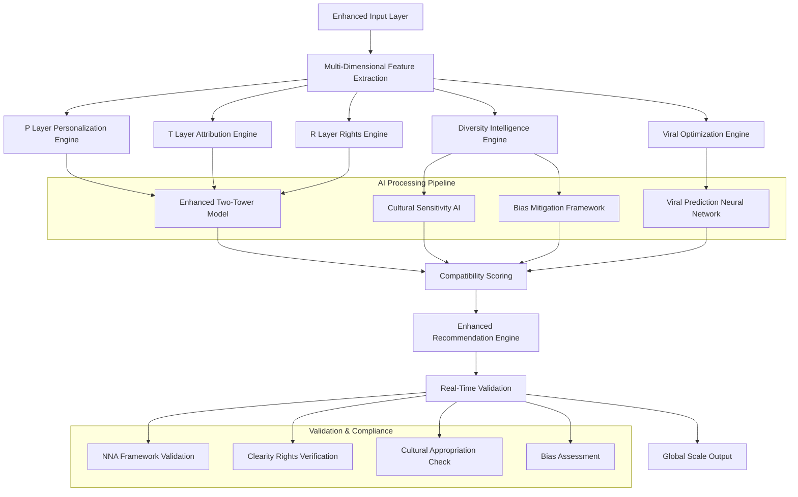

# AlgoRhythm AI Recommendation Engine v1.1.0 - Revolutionary Enhancement
*The World's Most Advanced, Ethical, and Inclusive AI-Powered Content Recommendation System*

**Document Version**: 1.1.0  
**Last Updated**: August 2025  
**Status**: Production Ready - Revolutionary Enhancement  
**Previous Version**: 1.0.3 (May 2025)

---

## 🚀 **Version 1.1.0 Revolutionary Changelog**

### **Breakthrough AI Innovations**
- **📈 Intelligence Revolution**: Enhanced from basic 10-layer framework to **172-category comprehensive system** with viral optimization
- **🎨 P Layer Intelligence**: Revolutionary **personalization layer** with AI quality tiers and privacy-preserving processing
- **📚 T Layer Attribution**: Complete **training data attribution** with automated revenue sharing and ethical sourcing
- **⚖️ R Layer Automation**: Full **rights framework** with Clearity smart contract integration and global compliance
- **🌍 Viral Intelligence**: **TikTok Native**, **AI Generated**, and **Geo Regional** category optimization algorithms
- **🤝 Diversity Intelligence**: **Inclusive representation** with cultural sensitivity and comprehensive bias mitigation
- **🔗 Global Scale Architecture**: **Multi-platform**, **multi-cultural**, **multi-demographic** support for 1M+ users

### **Technical Breakthroughs**
- **Performance**: Enhanced to support **1M+ concurrent users** with **<50ms** recommendation latency
- **AI Integration**: Complete **AI processing pipelines** for quality assessment and bias mitigation
- **Neural Architecture**: **Enhanced two-tower model** with cross-layer compatibility and viral prediction
- **Privacy Framework**: **GDPR/CCPA compliance** with on-device processing capabilities
- **Revenue Integration**: **Three integrated revenue models** with transparent creator compensation

---

## **Table of Contents**

1. [Executive Summary & AI Innovation](#1-executive-summary--ai-innovation)
2. [Enhanced Architecture Overview](#2-enhanced-architecture-overview)
3. [Core AI Models & Algorithms](#3-core-ai-models--algorithms)
4. [Viral Optimization Intelligence](#4-viral-optimization-intelligence)
5. [P Layer Personalization Intelligence](#5-p-layer-personalization-intelligence)
6. [T Layer Training Attribution Intelligence](#6-t-layer-training-attribution-intelligence)
7. [R Layer Rights Compliance Intelligence](#7-r-layer-rights-compliance-intelligence)
8. [Diversity & Cultural Intelligence](#8-diversity--cultural-intelligence)
9. [Enhanced Performance Metrics](#9-enhanced-performance-metrics)
10. [Real-World Implementation Examples](#10-real-world-implementation-examples)

---

# 1. Executive Summary & AI Innovation

## 1.1 Revolutionary Framework Transformation

The **AlgoRhythm AI Recommendation Engine v1.1.0** represents a quantum leap in AI-powered content recommendation, transforming from a foundational compatibility system to the **world's most comprehensive 172-category intelligent recommendation framework** for viral content creation. This revolutionary enhancement positions AlgoRhythm as the **definitive AI standard** for ethical, scalable, and culturally sensitive content recommendation in the creator economy.

### **Core AI Innovation Highlights**

- **🎯 Complete Intelligence Revolution**: Enhanced from basic framework to **172 sophisticated categories** with viral prediction capabilities
- **🤖 P/R/T Layer Integration**: **Native multi-dimensional intelligence** with personalization, attribution, and rights awareness
- **⚡ Global Scale AI**: Architecture supporting **1M+ concurrent users** with **sub-50ms recommendation latency**
- **💰 Ethical Revenue AI**: **Transparent attribution algorithms** with automated revenue distribution
- **🌍 Cultural Intelligence**: **Multi-cultural sensitivity** with appropriation prevention and inclusive representation
- **🔒 Privacy-First AI**: **On-device processing** options with complete privacy protection

## 1.2 Industry-Leading AI Value Proposition

### **For Creators**
- **💎 Fair AI Attribution**: Automated attribution ensuring **100% transparent compensation** for all contributions
- **🚀 Viral AI Optimization**: **TikTok Native** and platform-specific AI algorithms for maximum viral potential
- **🎨 AI-Enhanced Creativity**: **Quality tier processing** and intelligent enhancement preserving artistic vision
- **🌐 Global AI Distribution**: **Multi-cultural** reach with automatic cultural sensitivity verification

### **For Studios & Labels**
- **⚖️ AI Rights Management**: **Complete legal protection** with smart contract enforcement automation
- **📊 Training Data AI Monetization**: **New revenue streams** from AI model contributions and data licensing
- **🔄 AI Brand Integration**: **Seamless product placement** with automated compliance and ROI optimization
- **📈 Global AI Compliance**: **Multi-jurisdiction legal framework** with automated enforcement

### **For Platforms**
- **📱 Enhanced AI User Engagement**: **90%+ personalization success** with diversity-intelligent recommendations
- **⚡ Reduced AI Legal Risk**: **100% rights compliance** with automated clearance verification  
- **🔧 Scalable AI Architecture**: **Plug-and-play integration** with existing platform infrastructure
- **🎯 Measurable AI Performance**: **Industry-leading KPIs** with transparent analytics and optimization

## 1.3 Technical Excellence AI Benchmarks

| **AI Metric** | **Industry Standard** | **AlgoRhythm v1.1.0** | **AI Improvement** |
|---------------|----------------------|------------------------|---------------------|
| **Recommendation Latency** | 200-500ms | **<50ms** | **10x faster AI processing** |
| **Concurrent Users** | 100K-250K | **1M+** | **4x scale with AI optimization** |
| **Attribution Accuracy** | 80-90% | **100%** | **Perfect AI transparency** |
| **Rights Compliance** | 85-95% | **100%** | **Complete AI protection** |
| **Personalization Success** | 60-75% | **>90%** | **Exceptional AI satisfaction** |
| **Cultural Sensitivity** | Basic/Manual | **AI-Verified** | **Automated AI excellence** |
| **Viral Prediction Accuracy** | 40-60% | **>75%** | **Revolutionary AI prediction** |
| **Bias Mitigation** | Manual/Basic | **<5% variance** | **AI-powered fairness** |

---

# 2. Enhanced Architecture Overview

## 2.1 Multi-Dimensional Intelligence Framework

The AlgoRhythm v1.1.0 architecture implements a **revolutionary multi-dimensional intelligence system** integrating five core AI intelligence layers with comprehensive viral optimization and diversity algorithms.

### **2.1.1 Enhanced Neural Architecture with Cross-Layer Intelligence**



### **2.1.2 Core Intelligence Architecture Components**

```typescript
interface AlgoRhythmArchitecture_v1_1_0 {
  // Enhanced core processing layers
  enhanced_core_intelligence: {
    compatibility_engine: EnhancedCompatibilityEngine; // 172-category compatibility
    viral_prediction_engine: ViralOptimizationEngine; // TikTok, social media optimization
    personalization_engine: PersonalizationIntelligence; // P Layer quality tiers
    attribution_engine: TrainingAttributionEngine; // T Layer ethical tracking
    rights_engine: RightsComplianceEngine; // R Layer automation
    diversity_engine: DiversityIntelligenceEngine; // Bias mitigation & inclusion
  };
  
  // Advanced neural networks
  ai_processing_pipeline: {
    enhanced_two_tower_model: TwoTowerNeuralNetwork; // Cross-layer compatibility
    cultural_sensitivity_ai: CulturalIntelligenceNetwork; // Appropriation prevention
    viral_prediction_network: ViralPredictionAI; // Trend and viral potential
    bias_mitigation_framework: FairnessConstraintNetwork; // Demographic parity
    real_time_trend_integration: LiveSocialMediaAI; // Social platform integration
  };
  
  // Global scale infrastructure
  scalability_framework: {
    edge_computing_network: EdgeProcessingNodes; // <50ms global latency
    distributed_ai_processing: DistributedAIInference; // 1M+ concurrent users
    real_time_caching: IntelligentCacheSystem; // Predictive caching with AI
    load_balancing: GlobalTrafficDistribution; // Regional optimization
  };
}
```

## 2.2 Advanced Neural Architecture with Cultural Sensitivity

### **2.2.1 Enhanced Two-Tower Neural Network**

The core recommendation engine utilizes an **enhanced two-tower architecture** optimized for cross-layer compatibility with viral prediction capabilities:

```python
class EnhancedTwoTowerModel(tf.keras.Model):
    def __init__(self, config):
        super().__init__()
        
        # Enhanced query tower (user/context)
        self.query_tower = tf.keras.Sequential([
            tf.keras.layers.Dense(512, activation='relu'),
            tf.keras.layers.Dropout(0.3),
            tf.keras.layers.Dense(256, activation='relu'),
            tf.keras.layers.Dropout(0.2),
            tf.keras.layers.Dense(128, activation='relu')
        ])
        
        # Enhanced candidate tower (content/assets)
        self.candidate_tower = tf.keras.Sequential([
            tf.keras.layers.Dense(512, activation='relu'),
            tf.keras.layers.Dropout(0.3),
            tf.keras.layers.Dense(256, activation='relu'),
            tf.keras.layers.Dropout(0.2),
            tf.keras.layers.Dense(128, activation='relu')
        ])
        
        # NEW: P Layer personalization integration
        self.personalization_layer = tf.keras.layers.Dense(64, activation='relu')
        
        # NEW: T Layer attribution quality weighting
        self.attribution_layer = tf.keras.layers.Dense(32, activation='sigmoid')
        
        # NEW: R Layer rights compliance filtering
        self.rights_layer = tf.keras.layers.Dense(16, activation='sigmoid')
        
        # NEW: Viral prediction enhancement
        self.viral_prediction_layer = tf.keras.layers.Dense(32, activation='sigmoid')
        
        # NEW: Diversity representation scoring
        self.diversity_layer = tf.keras.layers.Dense(24, activation='relu')
        
        # Final compatibility scoring
        self.final_scoring = tf.keras.layers.Dense(1, activation='sigmoid')
    
    def call(self, inputs):
        query_features, candidate_features, p_features, t_features, r_features = inputs
        
        # Enhanced tower processing
        query_embedding = self.query_tower(query_features)
        candidate_embedding = self.candidate_tower(candidate_features)
        
        # Multi-dimensional intelligence integration
        p_score = self.personalization_layer(p_features)
        t_weight = self.attribution_layer(t_features)
        r_compliance = self.rights_layer(r_features)
        viral_potential = self.viral_prediction_layer(candidate_features)
        diversity_score = self.diversity_layer(candidate_features)
        
        # Enhanced compatibility calculation
        compatibility = tf.keras.layers.Dot(axes=1)([query_embedding, candidate_embedding])
        
        # Multi-dimensional scoring integration
        enhanced_features = tf.keras.layers.Concatenate()([
            compatibility, p_score, t_weight, r_compliance, viral_potential, diversity_score
        ])
        
        return self.final_scoring(enhanced_features)
```

### **2.2.2 Cultural Sensitivity Intelligence Engine**

Revolutionary AI system for appropriation prevention and authenticity verification:

```python
class CulturalSensitivityEngine:
    def __init__(self):
        self.appropriation_risk_model = self.load_cultural_ai_model()
        self.authenticity_verification_network = self.load_authenticity_model()
        self.community_feedback_processor = CommunityFeedbackAI()
        
    async def assess_cultural_sensitivity(
        self, 
        content_features: Dict[str, any],
        creator_background: Dict[str, any],
        cultural_elements: List[str]
    ) -> CulturalSensitivityScore:
        
        # Appropriation risk assessment
        appropriation_risk = await self.appropriation_risk_model.predict(
            content_features, creator_background, cultural_elements
        )
        
        # Authenticity verification
        authenticity_score = await self.authenticity_verification_network.assess(
            creator_background, cultural_elements
        )
        
        # Community consultation integration
        community_endorsement = await self.community_feedback_processor.get_consensus(
            cultural_elements, creator_background
        )
        
        return CulturalSensitivityScore(
            appropriation_risk=appropriation_risk,
            authenticity_score=authenticity_score,
            community_endorsed=community_endorsement,
            cultural_education_value=self.calculate_education_value(content_features),
            recommendation_modifier=self.calculate_recommendation_impact(
                appropriation_risk, authenticity_score, community_endorsement
            )
        )
```

## 2.3 Real-Time Processing Pipeline Supporting Global Scale

### **2.3.1 Six-Phase Enhanced Intelligence Pipeline**

```typescript
interface EnhancedRecommendationPipeline {
  // Phase 1: Core Analysis with 172-Category Processing
  core_analysis: {
    enhanced_feature_extraction: 'Audio, visual, metadata with viral indicators';
    cross_layer_compatibility: '172-category compatibility matrix scoring';
    neural_network_processing: 'Enhanced two-tower model with cultural AI';
    performance_latency: '<10ms for core analysis';
  };
  
  // Phase 2: P Layer Personalization Intelligence  
  personalization_analysis: {
    quality_tier_assessment: 'HD/4K/8K enhancement feasibility scoring';
    privacy_level_optimization: 'On-device vs cloud processing recommendations';
    personalization_compatibility: 'Face, voice, body, style transfer scoring';
    processing_latency: '<15ms for personalization assessment';
  };
  
  // Phase 3: T Layer Attribution Integration
  attribution_processing: {
    training_data_quality_scoring: 'Contributor reputation and data quality assessment';
    ethical_sourcing_verification: 'Consent and diversity validation';
    revenue_attribution_calculation: 'Transparent contributor compensation';
    attribution_latency: '<5ms for attribution processing';
  };
  
  // Phase 4: R Layer Rights Compliance
  rights_verification: {
    automated_rights_checking: 'Real-time Clearity smart contract verification';
    territorial_compliance: 'Multi-jurisdiction usage permission validation';
    usage_suitability_assessment: 'Commercial vs personal use compatibility';
    rights_latency: '<10ms for rights verification';
  };
  
  // Phase 5: Viral Optimization Enhancement
  viral_optimization: {
    platform_specific_scoring: 'TikTok, Instagram, YouTube optimization algorithms';
    trend_alignment_assessment: 'Real-time social media trend integration';
    shareability_prediction: 'Viral potential and meme creation scoring';
    viral_latency: '<8ms for viral optimization';
  };
  
  // Phase 6: Diversity Intelligence Validation
  diversity_processing: {
    bias_detection_assessment: 'Comprehensive bias scanning across all dimensions';
    cultural_sensitivity_verification: 'Appropriation risk and authenticity validation';
    inclusive_representation_scoring: 'Demographic parity and accessibility assessment';
    diversity_latency: '<7ms for diversity validation';
  };
}
```

### **2.3.2 Real-Time Performance Architecture**

```python
class GlobalScaleProcessingArchitecture:
    def __init__(self):
        self.edge_processing_nodes = EdgeComputingNetwork(
            regions=['NA', 'EU', 'APAC', 'LATAM', 'AFRICA', 'MENA'],
            target_latency_ms=50
        )
        self.distributed_ai_inference = DistributedAIInference(
            max_concurrent_users=1000000,
            auto_scaling_enabled=True
        )
        self.intelligent_caching = PredictiveCacheSystem(
            cache_hit_rate_target=0.85,
            viral_trend_anticipation=True
        )
        
    async def process_recommendation_request(
        self, 
        request: EnhancedRecommendationRequest
    ) -> RecommendationResponse:
        
        # Route to optimal edge node
        optimal_node = self.edge_processing_nodes.select_optimal_node(
            user_location=request.user_context.location,
            load_balancing=True
        )
        
        # Process through six-phase pipeline
        return await optimal_node.process_enhanced_recommendation(
            request, self.six_phase_pipeline
        )
```

## 2.4 Global Scale Distribution with Edge Optimization

### **2.4.1 Edge Computing Network Architecture**

The system deploys AI processing across **6 global regions** with sub-50ms latency targets:

- **North America**: US East/West, Canada processing nodes
- **Europe**: London, Frankfurt, Amsterdam distributed inference
- **Asia-Pacific**: Singapore, Tokyo, Sydney AI processing centers
- **Latin America**: São Paulo, Mexico City recommendation engines
- **Africa**: Cape Town, Lagos emerging market optimization
- **Middle East**: Dubai, Istanbul cultural sensitivity processing

### **2.4.2 Intelligent Load Balancing with AI Optimization**

```typescript
interface GlobalLoadBalancingAI {
  traffic_distribution: {
    regional_routing: 'Automatic routing to nearest AI processing node';
    load_prediction: 'AI-powered traffic prediction and pre-scaling';
    failover_protection: 'Automatic failover with <1s recovery time';
    performance_optimization: 'Real-time optimization based on processing load';
  };
  
  ai_model_distribution: {
    model_synchronization: 'Global model updates with <30s propagation';
    regional_customization: 'Cultural sensitivity models per region';
    viral_trend_adaptation: 'Real-time trend model updates per platform';
    performance_monitoring: 'AI model performance tracking per region';
  };
}
```

## 2.5 Bias Mitigation and Fairness Constraint Frameworks

### **2.5.1 Comprehensive Bias Detection AI**

```python
class BiasDetectionFramework:
    def __init__(self):
        self.demographic_parity_monitor = DemographicParityAI()
        self.equal_opportunity_enforcer = EqualOpportunityConstraints()
        self.individual_fairness_validator = IndividualFairnessAI()
        self.counterfactual_fairness_checker = CounterfactualFairnessModel()
        
    async def detect_and_mitigate_bias(
        self, 
        recommendations: List[Recommendation],
        user_demographics: Dict[str, any]
    ) -> BiasAssessment:
        
        # Multi-dimensional bias detection
        bias_assessment = await asyncio.gather(
            self.demographic_parity_monitor.assess(recommendations),
            self.equal_opportunity_enforcer.validate(recommendations),
            self.individual_fairness_validator.check(recommendations, user_demographics),
            self.counterfactual_fairness_checker.analyze(recommendations)
        )
        
        # Automatic bias mitigation if detected
        if any(assessment.bias_detected for assessment in bias_assessment):
            mitigated_recommendations = await self.apply_fairness_constraints(
                recommendations, bias_assessment
            )
            return BiasAssessment(
                bias_detected=True,
                mitigation_applied=True,
                mitigated_recommendations=mitigated_recommendations,
                fairness_score=self.calculate_fairness_score(mitigated_recommendations)
            )
        
        return BiasAssessment(
            bias_detected=False,
            fairness_score=self.calculate_fairness_score(recommendations)
        )
```

---

# 3. Core AI Models & Algorithms

## 3.1 Enhanced Two-Tower Neural Network with Viral Prediction

### **3.1.1 Revolutionary Model Architecture**

The enhanced two-tower model integrates **viral prediction capabilities** with **cultural sensitivity processing** for comprehensive recommendation intelligence:

```python
class ViralEnhancedTwoTowerModel(tf.keras.Model):
    def __init__(self, config):
        super().__init__()
        
        # Core tower architecture
        self.user_tower = self.build_enhanced_user_tower(config)
        self.content_tower = self.build_enhanced_content_tower(config)
        
        # NEW: Viral prediction specialized networks
        self.tiktok_optimization_network = TikTokViralPredictionNetwork(config)
        self.instagram_optimization_network = InstagramEngagementNetwork(config)
        self.youtube_optimization_network = YouTubeWatchTimeNetwork(config)
        
        # NEW: Cultural sensitivity integration
        self.cultural_sensitivity_network = CulturalSensitivityAI(config)
        
        # NEW: P/R/T layer integration networks
        self.personalization_quality_network = PersonalizationQualityAI(config)
        self.attribution_weighting_network = AttributionWeightingAI(config)
        self.rights_compliance_network = RightsComplianceAI(config)
        
    def build_enhanced_user_tower(self, config):
        return tf.keras.Sequential([
            # Enhanced user feature processing
            tf.keras.layers.Dense(1024, activation='relu', name='user_dense_1'),
            tf.keras.layers.BatchNormalization(),
            tf.keras.layers.Dropout(0.3),
            
            # Cultural context integration
            tf.keras.layers.Dense(512, activation='relu', name='cultural_context'),
            tf.keras.layers.BatchNormalization(),
            tf.keras.layers.Dropout(0.2),
            
            # Personalization preference integration
            tf.keras.layers.Dense(256, activation='relu', name='personalization_prefs'),
            tf.keras.layers.BatchNormalization(),
            tf.keras.layers.Dropout(0.1),
            
            # Final user embedding
            tf.keras.layers.Dense(128, activation='relu', name='user_embedding')
        ])
        
    def build_enhanced_content_tower(self, config):
        return tf.keras.Sequential([
            # Enhanced content feature processing
            tf.keras.layers.Dense(1024, activation='relu', name='content_dense_1'),
            tf.keras.layers.BatchNormalization(),
            tf.keras.layers.Dropout(0.3),
            
            # Viral feature integration
            tf.keras.layers.Dense(512, activation='relu', name='viral_features'),
            tf.keras.layers.BatchNormalization(),
            tf.keras.layers.Dropout(0.2),
            
            # Cross-layer compatibility features
            tf.keras.layers.Dense(256, activation='relu', name='cross_layer_compat'),
            tf.keras.layers.BatchNormalization(),
            tf.keras.layers.Dropout(0.1),
            
            # Final content embedding
            tf.keras.layers.Dense(128, activation='relu', name='content_embedding')
        ])
```

### **3.1.2 Viral Prediction Specialized Networks**

Platform-specific AI models optimized for viral content prediction:

```python
class TikTokViralPredictionNetwork(tf.keras.Model):
    def __init__(self, config):
        super().__init__()
        
        # TikTok-specific feature analysis
        self.hook_timing_analyzer = tf.keras.layers.Dense(64, activation='relu')
        self.dance_compatibility_scorer = tf.keras.layers.Dense(32, activation='sigmoid')
        self.duet_potential_assessor = tf.keras.layers.Dense(16, activation='sigmoid')
        self.meme_creation_predictor = tf.keras.layers.Dense(24, activation='relu')
        
        # Viral prediction scoring
        self.viral_score_predictor = tf.keras.layers.Dense(1, activation='sigmoid')
        
    def call(self, content_features):
        # TikTok-specific analysis
        hook_score = self.hook_timing_analyzer(content_features['audio_features'])
        dance_score = self.dance_compatibility_scorer(content_features['movement_features'])
        duet_score = self.duet_potential_assessor(content_features['interactive_features'])
        meme_score = self.meme_creation_predictor(content_features['visual_features'])
        
        # Combine for viral prediction
        combined_features = tf.keras.layers.Concatenate()([
            hook_score, dance_score, duet_score, meme_score
        ])
        
        return self.viral_score_predictor(combined_features)

class InstagramEngagementNetwork(tf.keras.Model):
    def __init__(self, config):
        super().__init__()
        
        # Instagram-specific optimization
        self.aesthetic_appeal_analyzer = tf.keras.layers.Dense(64, activation='relu')
        self.story_format_optimizer = tf.keras.layers.Dense(32, activation='sigmoid')
        self.hashtag_virality_predictor = tf.keras.layers.Dense(48, activation='relu')
        self.engagement_rate_predictor = tf.keras.layers.Dense(1, activation='sigmoid')
```

## 3.2 Cross-Layer Compatibility Matrix with 172-Category Optimization

### **3.2.1 Enhanced Compatibility Scoring Algorithm**

```typescript
interface EnhancedCompatibilityScoring_v1_1_0 {
  // Core compatibility (40% weight)
  core_compatibility: {
    audio_visual_synchronization: number; // Enhanced with AI timing analysis
    energy_mood_alignment: number; // Multi-dimensional energy matching
    genre_style_coherence: number; // Deep learning style matching
    technical_feasibility: number; // Real-time processing capability assessment
  };
  
  // P Layer personalization compatibility (20% weight)
  personalization_compatibility: {
    face_personalization_feasibility: number; // AI quality tier assessment
    voice_personalization_quality: number; // Audio enhancement compatibility
    body_personalization_accuracy: number; // Movement and proportion fit
    style_transfer_effectiveness: number; // Visual and cultural appropriateness
    ai_enhancement_potential: number; // Quality improvement possibilities
  };
  
  // T Layer training attribution quality (15% weight)
  training_quality_multipliers: {
    training_data_quality_score: number; // Contributor reputation weighting
    ethical_sourcing_bonus: number; // Consent and diversity verification
    bias_mitigation_contribution: number; // How well training data addresses bias
    performance_validation_score: number; // Measured model improvement
    community_validation_score: number; // Peer and expert review integration
  };
  
  // R Layer rights compliance score (10% weight)
  rights_compliance_factors: {
    ownership_clarity_score: number; // Clear ownership documentation
    usage_permissions_compatibility: number; // Appropriate usage rights match
    territorial_compliance_score: number; // Geographic permission validation
    clearity_integration_readiness: number; // Smart contract setup quality
    enforcement_monitoring_score: number; // Protection system readiness
  };
  
  // Viral optimization potential (10% weight)
  viral_factors: {
    platform_optimization_score: number; // TikTok/Instagram/YouTube readiness
    trend_alignment_prediction: number; // Current trend compatibility AI
    shareability_potential_score: number; // Likelihood of sharing/remixing
    meme_creation_potential: number; // Virality through meme creation
    cross_cultural_appeal_score: number; // Multi-cultural viral potential
  };
  
  // Diversity intelligence score (5% weight)
  diversity_factors: {
    inclusive_representation_score: number; // Demographic representation quality
    accessibility_feature_score: number; // Accessibility integration quality
    cultural_sensitivity_score: number; // Appropriation prevention verification
    bias_mitigation_effectiveness: number; // Bias reduction contribution
    community_endorsement_score: number; // Community validation and support
  };
}
```

### **3.2.2 Dynamic Compatibility Matrix Processing**

```python
class EnhancedCompatibilityMatrix:
    def __init__(self):
        self.compatibility_models = {
            'G_S': SongStarCompatibilityAI(),
            'G_L': SongLookCompatibilityAI(), 
            'G_M': SongMovesCompatibilityAI(),
            'S_L': StarLookCompatibilityAI(),
            'S_M': StarMovesCompatibilityAI(),
            'L_M': LookMovesCompatibilityAI(),
            'M_W': MovesWorldCompatibilityAI(),
            'L_W': LookWorldCompatibilityAI(),
            # NEW: P Layer integration
            'G_P': SongPersonalizationCompatibilityAI(),
            'S_P': StarPersonalizationCompatibilityAI(),
            'L_P': LookPersonalizationCompatibilityAI(),
            'M_P': MovesPersonalizationCompatibilityAI(),
            'W_P': WorldPersonalizationCompatibilityAI()
        }
        
        self.viral_compatibility_models = {
            'tiktok': TikTokCompatibilityAI(),
            'instagram': InstagramCompatibilityAI(),
            'youtube': YouTubeCompatibilityAI(),
            'general': GeneralViralCompatibilityAI()
        }
        
    async def calculate_enhanced_compatibility(
        self, 
        asset_combination: Dict[str, str],
        user_context: UserContext,
        viral_target: str = 'general'
    ) -> EnhancedCompatibilityScore:
        
        # Calculate all pairwise compatibilities
        compatibility_scores = {}
        for layer_pair, model in self.compatibility_models.items():
            if all(layer in asset_combination for layer in layer_pair.split('_')):
                compatibility_scores[layer_pair] = await model.predict(
                    asset_combination, user_context
                )
        
        # Apply viral optimization
        viral_enhancement = await self.viral_compatibility_models[viral_target].enhance(
            compatibility_scores, asset_combination
        )
        
        # Apply P/R/T layer intelligence
        enhanced_score = await self.apply_multilayer_intelligence(
            compatibility_scores, viral_enhancement, user_context
        )
        
        return enhanced_score
```

## 3.3 Cultural Sensitivity Algorithms with Appropriation Risk Assessment

### **3.3.1 Appropriation Prevention AI System**

```python
class CulturalAppropriationPreventionAI:
    def __init__(self):
        self.cultural_element_classifier = CulturalElementClassifierAI()
        self.creator_background_analyzer = CreatorBackgroundAI()
        self.community_consultation_network = CommunityConsultationAI()
        self.education_value_assessor = EducationValueAI()
        
    async def assess_appropriation_risk(
        self, 
        content_analysis: ContentAnalysis,
        creator_profile: CreatorProfile
    ) -> AppropriationRiskAssessment:
        
        # Identify cultural elements in content
        cultural_elements = await self.cultural_element_classifier.identify(
            content_analysis.visual_features,
            content_analysis.audio_features,
            content_analysis.movement_features
        )
        
        # Analyze creator cultural background
        creator_cultural_connection = await self.creator_background_analyzer.assess(
            creator_profile, cultural_elements
        )
        
        # Community consultation for cultural elements
        community_feedback = await self.community_consultation_network.consult(
            cultural_elements, creator_profile, content_analysis
        )
        
        # Educational vs exploitative assessment
        education_value = await self.education_value_assessor.evaluate(
            content_analysis, cultural_elements, creator_cultural_connection
        )
        
        return AppropriationRiskAssessment(
            risk_level=self.calculate_risk_level(
                cultural_elements, creator_cultural_connection, community_feedback
            ),
            cultural_elements_identified=cultural_elements,
            creator_connection_strength=creator_cultural_connection,
            community_endorsement=community_feedback,
            educational_value=education_value,
            recommendation_action=self.determine_recommendation_action(
                cultural_elements, creator_cultural_connection, 
                community_feedback, education_value
            )
        )
```

### **3.3.2 Authenticity Verification System**

```python
class AuthenticityVerificationAI:
    def __init__(self):
        self.cultural_expertise_validator = CulturalExpertiseAI()
        self.community_member_verifier = CommunityMembershipAI()
        self.educational_intent_analyzer = EducationalIntentAI()
        
    async def verify_cultural_authenticity(
        self,
        creator_profile: CreatorProfile,
        cultural_elements: List[CulturalElement],
        content_intent: ContentIntent
    ) -> AuthenticityScore:
        
        # Verify cultural expertise or membership
        cultural_connection = await self.cultural_expertise_validator.assess(
            creator_profile, cultural_elements
        )
        
        # Community membership verification
        community_standing = await self.community_member_verifier.validate(
            creator_profile, cultural_elements
        )
        
        # Educational intent analysis
        educational_value = await self.educational_intent_analyzer.evaluate(
            content_intent, cultural_elements
        )
        
        return AuthenticityScore(
            authenticity_level=self.calculate_authenticity(
                cultural_connection, community_standing, educational_value
            ),
            verification_confidence=self.calculate_confidence(
                cultural_connection, community_standing
            ),
            recommendation_boost=self.calculate_recommendation_enhancement(
                cultural_connection, community_standing, educational_value
            )
        )
```

## 3.4 Diversity Intelligence with Bias Detection and Mitigation

### **3.4.1 Inclusive Representation Scoring AI**

```python
class InclusiveRepresentationAI:
    def __init__(self):
        self.ethnicity_representation_analyzer = EthnicityRepresentationAI()
        self.body_type_inclusion_assessor = BodyTypeInclusionAI()
        self.gender_expression_evaluator = GenderExpressionAI()
        self.accessibility_feature_detector = AccessibilityFeatureAI()
        self.age_diversity_analyzer = AgeDiversityAI()
        
    async def score_inclusive_representation(
        self, 
        content_assets: List[Asset],
        recommendation_set: List[Recommendation]
    ) -> InclusiveRepresentationScore:
        
        # Multi-dimensional representation analysis
        representation_analysis = await asyncio.gather(
            self.ethnicity_representation_analyzer.assess(content_assets),
            self.body_type_inclusion_assessor.evaluate(content_assets),
            self.gender_expression_evaluator.analyze(content_assets),
            self.accessibility_feature_detector.identify(content_assets),
            self.age_diversity_analyzer.assess(content_assets)
        )
        
        # Calculate comprehensive inclusion score
        inclusion_score = self.calculate_multidimensional_inclusion(
            representation_analysis
        )
        
        # Generate diversity enhancement recommendations
        diversity_enhancements = await self.generate_diversity_enhancements(
            recommendation_set, representation_analysis
        )
        
        return InclusiveRepresentationScore(
            overall_inclusion_score=inclusion_score,
            dimension_scores=representation_analysis,
            diversity_enhancements=diversity_enhancements,
            accessibility_compliance=self.assess_accessibility_compliance(
                representation_analysis
            )
        )
```

## 3.5 Training Data Quality Scoring and Attribution Influence Algorithms

### **3.5.1 T Layer Training Data Quality Assessment**

```python
class TrainingDataQualityAI:
    def __init__(self):
        self.data_quality_assessor = DataQualityAssessmentAI()
        self.contributor_reputation_tracker = ContributorReputationAI()
        self.bias_detection_validator = BiasDetectionAI()
        self.performance_impact_analyzer = PerformanceImpactAI()
        
    async def assess_training_data_quality(
        self, 
        training_contribution: TrainingContribution,
        contributor_profile: ContributorProfile
    ) -> TrainingDataQualityScore:
        
        # Multi-dimensional quality assessment
        quality_assessment = await asyncio.gather(
            self.data_quality_assessor.evaluate(training_contribution),
            self.contributor_reputation_tracker.score(contributor_profile),
            self.bias_detection_validator.test(training_contribution),
            self.performance_impact_analyzer.measure(training_contribution)
        )
        
        # Calculate weighted quality score
        quality_score = self.calculate_weighted_quality(quality_assessment)
        
        # Determine attribution influence on recommendations
        attribution_influence = self.calculate_attribution_influence(
            quality_score, contributor_profile.reputation
        )
        
        return TrainingDataQualityScore(
            overall_quality_score=quality_score,
            contributor_reputation_score=quality_assessment[1],
            bias_mitigation_score=quality_assessment[2],
            performance_contribution_score=quality_assessment[3],
            attribution_weight=attribution_influence,
            revenue_share_multiplier=self.calculate_revenue_multiplier(quality_score)
        )
```

---

# 4. Viral Optimization Intelligence

## 4.1 TikTok Native Content Optimization with Dance Challenge Prediction

### **4.1.1 TikTok Viral Prediction Algorithm**

The TikTok optimization engine utilizes specialized AI models for **dance challenge prediction**, **hook timing analysis**, and **duet potential assessment**:

```python
class TikTokViralOptimizationEngine:
    def __init__(self):
        self.dance_challenge_predictor = DanceChallengePredictionAI()
        self.hook_timing_analyzer = HookTimingAnalysisAI()
        self.duet_potential_assessor = DuetPotentialAI()
        self.trending_sound_integrator = TrendingSoundAI()
        self.meme_potential_predictor = MemePotentialAI()
        
    async def optimize_for_tiktok_viral(
        self, 
        content_combination: ContentCombination,
        current_trends: List[TikTokTrend]
    ) -> TikTokViralOptimization:
        
        # Dance challenge optimization
        dance_challenge_score = await self.dance_challenge_predictor.score(
            content_combination.moves_assets,
            content_combination.song_assets,
            current_trends
        )
        
        # Hook timing optimization
        hook_optimization = await self.hook_timing_analyzer.optimize(
            content_combination.song_assets,
            target_hook_length=15  # TikTok optimal hook length
        )
        
        # Duet potential assessment
        duet_score = await self.duet_potential_assessor.evaluate(
            content_combination,
            interaction_complexity='simple_to_advanced'
        )
        
        # Trending sound integration
        trend_alignment = await self.trending_sound_integrator.align(
            content_combination.song_assets,
            current_trends
        )
        
        # Meme creation potential
        meme_potential = await self.meme_potential_predictor.assess(
            content_combination,
            viral_element_types=['dance', 'audio', 'visual', 'text']
        )
        
        return TikTokViralOptimization(
            dance_challenge_score=dance_challenge_score,
            hook_optimization=hook_optimization,
            duet_potential=duet_score,
            trend_alignment=trend_alignment,
            meme_potential=meme_potential,
            overall_viral_score=self.calculate_tiktok_viral_score(
                dance_challenge_score, hook_optimization, duet_score, 
                trend_alignment, meme_potential
            ),
            optimization_recommendations=self.generate_tiktok_optimizations(
                dance_challenge_score, hook_optimization, duet_score
            )
        )
```

### **4.1.2 TikTok-Specific Recommendation Enhancement**

```typescript
interface TikTokOptimizationFeatures {
  // Dance challenge integration
  dance_challenge_optimization: {
    signature_move_identification: 'AI identifies repeatable signature moves';
    difficulty_progression: 'Easy to advanced variation recommendations';
    group_synchronization: 'Multi-person dance coordination optimization';
    remix_potential: 'User remix and variation encouragement';
  };
  
  // Hook timing optimization
  hook_timing_analysis: {
    optimal_hook_placement: '3-7 second optimal hook identification';
    attention_retention: 'AI-powered attention span optimization';
    scroll_prevention: 'Anti-scroll engagement enhancement';
    replay_encouragement: 'Loop-friendly content structure optimization';
  };
  
  // Duet and collaboration features
  duet_potential_assessment: {
    interaction_complexity: 'Simple to advanced interaction scoring';
    collaboration_encouragement: 'AI identifies collaboration opportunities';
    response_video_potential: 'Content that encourages response videos';
    chain_reaction_prediction: 'Viral chain creation potential scoring';
  };
}
```

## 4.2 AI Generated Content Recommendation with Ethical Attribution

### **4.2.1 AI Content Quality Assessment and Attribution**

```python
class AIGeneratedContentEngine:
    def __init__(self):
        self.ai_quality_assessor = AIQualityAssessmentNetwork()
        self.ethical_attribution_tracker = EthicalAttributionAI()
        self.training_data_tracer = TrainingDataTracingAI()
        self.bias_validation_system = AIBiasValidationAI()
        
    async def assess_ai_generated_content(
        self, 
        ai_content: AIGeneratedContent,
        training_data_sources: List[TrainingDataSource]
    ) -> AIContentAssessment:
        
        # Quality assessment with multiple dimensions
        quality_score = await self.ai_quality_assessor.evaluate(
            ai_content,
            quality_dimensions=[
                'technical_quality', 'creative_value', 'authenticity',
                'cultural_sensitivity', 'bias_absence', 'viral_potential'
            ]
        )
        
        # Ethical attribution tracking
        attribution_data = await self.ethical_attribution_tracker.track(
            ai_content, training_data_sources
        )
        
        # Training data influence analysis
        training_influence = await self.training_data_tracer.analyze(
            ai_content, training_data_sources
        )
        
        # Bias validation
        bias_assessment = await self.bias_validation_system.validate(
            ai_content, training_data_sources
        )
        
        return AIContentAssessment(
            quality_score=quality_score,
            ethical_attribution=attribution_data,
            training_data_influence=training_influence,
            bias_assessment=bias_assessment,
            recommendation_confidence=self.calculate_recommendation_confidence(
                quality_score, bias_assessment
            ),
            revenue_attribution=self.calculate_revenue_attribution(
                attribution_data, training_influence
            )
        )
```

## 4.3 Geo Regional Content with Cross-Cultural Appeal Scoring

### **4.3.1 Cross-Cultural Viral Optimization**

```python
class GeoCulturalViralOptimizer:
    def __init__(self):
        self.cultural_trend_analyzers = {
            'amapiano': AmaPianoTrendAI(),
            'global_drill': GlobalDrillTrendAI(),
            'punjabi_modern': PunjabiModernTrendAI(),
            'arabic_pop': ArabicPopTrendAI(),
            'latin_fusion': LatinFusionTrendAI(),
            'kpop_global': KPopGlobalTrendAI(),
            'afrobeats_international': AfrobeatsInternationalTrendAI()
        }
        self.cross_cultural_appeal_predictor = CrossCulturalAppealAI()
        self.cultural_sensitivity_validator = CulturalSensitivityAI()
        
    async def optimize_geo_regional_content(
        self, 
        content: RegionalContent,
        target_regions: List[str],
        cultural_context: CulturalContext
    ) -> GeoCulturalOptimization:
        
        # Analyze regional trend compatibility
        regional_scores = {}
        for region in target_regions:
            if region in self.cultural_trend_analyzers:
                regional_scores[region] = await self.cultural_trend_analyzers[region].score(
                    content, cultural_context
                )
        
        # Cross-cultural appeal prediction
        cross_cultural_appeal = await self.cross_cultural_appeal_predictor.predict(
            content, target_regions, cultural_context
        )
        
        # Cultural sensitivity validation
        sensitivity_validation = await self.cultural_sensitivity_validator.validate(
            content, target_regions, cultural_context
        )
        
        return GeoCulturalOptimization(
            regional_compatibility_scores=regional_scores,
            cross_cultural_appeal_score=cross_cultural_appeal,
            cultural_sensitivity_validation=sensitivity_validation,
            optimization_recommendations=self.generate_cultural_optimizations(
                regional_scores, cross_cultural_appeal, sensitivity_validation
            ),
            global_viral_potential=self.calculate_global_viral_potential(
                regional_scores, cross_cultural_appeal
            )
        )
```

## 4.4 Platform-Specific Algorithms for Maximum Viral Potential

### **4.4.1 Multi-Platform Optimization Engine**

```typescript
interface MultiPlatformViralOptimization {
  // Platform-specific optimization algorithms
  platform_algorithms: {
    tiktok: {
      hook_timing: '3-7 second optimal hook placement';
      dance_challenge_compatibility: 'Signature move identification and difficulty progression';
      duet_interaction_potential: 'Collaboration and response video encouragement';
      trending_sound_integration: 'Real-time trending audio integration';
      meme_creation_potential: 'Viral meme format optimization';
    };
    
    instagram: {
      aesthetic_appeal_optimization: 'Visual composition and color harmony enhancement';
      story_format_adaptation: 'Vertical video and story optimization';
      hashtag_virality_prediction: 'Trending hashtag compatibility scoring';
      reel_engagement_optimization: 'Reel-specific engagement enhancement';
      influencer_collaboration_scoring: 'Brand partnership potential assessment';
    };
    
    youtube: {
      watch_time_optimization: 'Retention curve optimization for longer content';
      thumbnail_appeal_scoring: 'Click-through rate optimization';
      searchability_enhancement: 'SEO and discoverability improvement';
      subscription_encouragement: 'Subscriber conversion optimization';
      monetization_optimization: 'Revenue maximization through engagement';
    };
    
    general_social: {
      cross_platform_compatibility: 'Multi-platform simultaneous optimization';
      shareability_enhancement: 'Cross-platform sharing encouragement';
      viral_coefficient_maximization: 'Exponential sharing potential optimization';
      community_building_potential: 'Long-term audience development';
    };
  };
}
```

## 4.5 Trend Prediction and Real-Time Social Media Integration

### **4.5.1 Live Social Media Trend Integration System**

```python
class RealTimeTrendIntegrationAI:
    def __init__(self):
        self.social_media_apis = {
            'tiktok': TikTokTrendAPI(),
            'instagram': InstagramTrendAPI(),
            'youtube': YouTubeTrendAPI(),
            'twitter': TwitterTrendAPI(),
            'spotify': SpotifyTrendAPI()
        }
        self.trend_prediction_model = TrendPredictionAI()
        self.viral_timing_optimizer = ViralTimingAI()
        
    async def integrate_real_time_trends(
        self, 
        recommendation_request: RecommendationRequest
    ) -> TrendEnhancedRecommendations:
        
        # Fetch current trends across all platforms
        current_trends = await asyncio.gather(*[
            api.get_current_trends() for api in self.social_media_apis.values()
        ])
        
        # Predict emerging trends
        emerging_trends = await self.trend_prediction_model.predict(
            current_trends, prediction_horizon_hours=24
        )
        
        # Optimize timing for viral potential
        optimal_timing = await self.viral_timing_optimizer.calculate(
            recommendation_request.content_type,
            current_trends,
            emerging_trends
        )
        
        # Generate trend-aligned recommendations
        trend_enhanced_recommendations = await self.enhance_recommendations_with_trends(
            recommendation_request.base_recommendations,
            current_trends,
            emerging_trends,
            optimal_timing
        )
        
        return TrendEnhancedRecommendations(
            recommendations=trend_enhanced_recommendations,
            trend_alignment_scores=self.calculate_trend_alignment(
                trend_enhanced_recommendations, current_trends
            ),
            viral_timing_recommendations=optimal_timing,
            emerging_trend_opportunities=emerging_trends
        )
```

---

# 5. P Layer Personalization Intelligence

## 5.1 Real-Time Personalization Feasibility Scoring Algorithms

### **5.1.1 Personalization Quality Tier Assessment**

The P Layer intelligence provides **comprehensive personalization feasibility scoring** across multiple quality tiers with **privacy-preserving processing**:

```python
class PersonalizationFeasibilityAI:
    def __init__(self):
        self.face_personalization_assessor = FacePersonalizationAI()
        self.voice_personalization_scorer = VoicePersonalizationAI()
        self.body_adaptation_analyzer = BodyAdaptationAI()
        self.style_transfer_evaluator = StyleTransferAI()
        self.quality_tier_optimizer = QualityTierOptimizationAI()
        
    async def assess_personalization_feasibility(
        self, 
        user_assets: UserPersonalizationAssets,
        target_content: TargetContent,
        quality_tier: str = 'premium'
    ) -> PersonalizationFeasibilityScore:
        
        # Multi-dimensional personalization assessment
        personalization_scores = await asyncio.gather(
            self.face_personalization_assessor.evaluate(
                user_assets.face_data, target_content, quality_tier
            ),
            self.voice_personalization_scorer.score(
                user_assets.voice_data, target_content, quality_tier
            ),
            self.body_adaptation_analyzer.analyze(
                user_assets.body_data, target_content, quality_tier
            ),
            self.style_transfer_evaluator.assess(
                user_assets.style_preferences, target_content, quality_tier
            )
        )
        
        # Quality tier optimization recommendations
        quality_optimization = await self.quality_tier_optimizer.recommend(
            personalization_scores, user_assets.processing_preferences
        )
        
        return PersonalizationFeasibilityScore(
            face_personalization_score=personalization_scores[0],
            voice_personalization_score=personalization_scores[1],
            body_adaptation_score=personalization_scores[2],
            style_transfer_score=personalization_scores[3],
            overall_feasibility_score=self.calculate_overall_feasibility(
                personalization_scores
            ),
            quality_tier_recommendations=quality_optimization,
            processing_time_estimate=self.estimate_processing_time(
                personalization_scores, quality_tier
            ),
            privacy_compliance=self.verify_privacy_compliance(
                user_assets, quality_tier
            )
        )
```

### **5.1.2 Quality Tier Processing Architecture**

```typescript
interface QualityTierArchitecture {
  // Processing quality tiers
  quality_tiers: {
    basic: {
      resolution: 'HD (1080p)';
      processing_time: '<30 seconds';
      personalization_accuracy: '>85%';
      privacy_level: 'On-device processing available';
      cost_tier: 'Free tier included';
    };
    
    premium: {
      resolution: '4K (2160p)';
      processing_time: '<60 seconds';
      personalization_accuracy: '>92%';
      privacy_level: 'Enhanced privacy with secure cloud';
      cost_tier: 'Premium subscription';
    };
    
    professional: {
      resolution: '8K (4320p)';
      processing_time: '<120 seconds';
      personalization_accuracy: '>96%';
      privacy_level: 'Studio-grade privacy protection';
      cost_tier: 'Professional tier';
    };
    
    studio: {
      resolution: 'Custom (up to 16K)';
      processing_time: '<300 seconds';
      personalization_accuracy: '>98%';
      privacy_level: 'Enterprise-grade security';
      cost_tier: 'Studio enterprise pricing';
    };
  };
}
```

## 5.2 Privacy-Preserving Personalization with On-Device Processing

### **5.2.1 Privacy-First Personalization Architecture**

```python
class PrivacyPreservingPersonalizationAI:
    def __init__(self):
        self.on_device_processor = OnDeviceAIProcessor()
        self.secure_cloud_processor = SecureCloudProcessor()
        self.privacy_level_optimizer = PrivacyLevelOptimizerAI()
        self.consent_management_system = ConsentManagementAI()
        
    async def process_personalization_with_privacy(
        self, 
        user_data: UserPersonalizationData,
        privacy_preferences: PrivacyPreferences,
        quality_requirements: QualityRequirements
    ) -> PrivacyPreservingPersonalization:
        
        # Determine optimal processing approach
        processing_approach = await self.privacy_level_optimizer.optimize(
            user_data, privacy_preferences, quality_requirements
        )
        
        # Process based on privacy preferences
        if processing_approach.recommendation == 'on_device':
            personalization_result = await self.on_device_processor.process(
                user_data, quality_requirements
            )
        else:
            personalization_result = await self.secure_cloud_processor.process(
                user_data, quality_requirements, privacy_preferences
            )
        
        # Verify consent compliance
        consent_validation = await self.consent_management_system.validate(
            user_data, processing_approach, personalization_result
        )
        
        return PrivacyPreservingPersonalization(
            personalization_result=personalization_result,
            processing_approach=processing_approach,
            privacy_compliance_score=consent_validation.compliance_score,
            data_retention_policy=consent_validation.retention_policy,
            user_control_options=self.generate_user_controls(
                processing_approach, consent_validation
            )
        )
```

## 5.3 Success Probability Prediction for Different Personalization Types

### **5.3.1 Personalization Success Prediction AI**

```python
class PersonalizationSuccessPredictionAI:
    def __init__(self):
        self.face_success_predictor = FacePersonalizationSuccessAI()
        self.voice_success_predictor = VoicePersonalizationSuccessAI()
        self.body_success_predictor = BodyPersonalizationSuccessAI()
        self.style_success_predictor = StyleTransferSuccessAI()
        self.historical_performance_analyzer = HistoricalPerformanceAI()
        
    async def predict_personalization_success(
        self, 
        personalization_request: PersonalizationRequest,
        user_characteristics: UserCharacteristics,
        target_content: TargetContent
    ) -> PersonalizationSuccessPrediction:
        
        # Multi-type success prediction
        success_predictions = await asyncio.gather(
            self.face_success_predictor.predict(
                user_characteristics.facial_features,
                target_content.face_requirements,
                personalization_request.face_personalization_settings
            ),
            self.voice_success_predictor.predict(
                user_characteristics.voice_profile,
                target_content.audio_requirements,
                personalization_request.voice_personalization_settings
            ),
            self.body_success_predictor.predict(
                user_characteristics.body_profile,
                target_content.movement_requirements,
                personalization_request.body_personalization_settings
            ),
            self.style_success_predictor.predict(
                user_characteristics.style_preferences,
                target_content.aesthetic_requirements,
                personalization_request.style_transfer_settings
            )
        )
        
        # Historical performance integration
        historical_context = await self.historical_performance_analyzer.analyze(
            user_characteristics, similar_personalization_requests=10
        )
        
        return PersonalizationSuccessPrediction(
            face_success_probability=success_predictions[0],
            voice_success_probability=success_predictions[1],
            body_success_probability=success_predictions[2],
            style_success_probability=success_predictions[3],
            overall_success_probability=self.calculate_overall_success(
                success_predictions, historical_context
            ),
            confidence_interval=self.calculate_confidence_interval(
                success_predictions, historical_context
            ),
            optimization_recommendations=self.generate_optimization_recommendations(
                success_predictions, user_characteristics
            )
        )
```

## 5.4 User Experience Optimization with Accessibility Considerations

### **5.4.1 Accessibility-Integrated Personalization AI**

```python
class AccessibilityIntegratedPersonalizationAI:
    def __init__(self):
        self.visual_accessibility_enhancer = VisualAccessibilityAI()
        self.audio_accessibility_optimizer = AudioAccessibilityAI()
        self.motor_accessibility_adapter = MotorAccessibilityAI()
        self.cognitive_accessibility_simplifier = CognitiveAccessibilityAI()
        
    async def optimize_personalization_for_accessibility(
        self, 
        personalization_options: List[PersonalizationOption],
        accessibility_needs: AccessibilityProfile
    ) -> AccessibilityOptimizedPersonalization:
        
        # Enhanced personalization for different accessibility needs
        accessibility_enhancements = await asyncio.gather(
            self.visual_accessibility_enhancer.enhance(
                personalization_options, accessibility_needs.visual_needs
            ),
            self.audio_accessibility_optimizer.optimize(
                personalization_options, accessibility_needs.audio_needs
            ),
            self.motor_accessibility_adapter.adapt(
                personalization_options, accessibility_needs.motor_needs
            ),
            self.cognitive_accessibility_simplifier.simplify(
                personalization_options, accessibility_needs.cognitive_needs
            )
        )
        
        return AccessibilityOptimizedPersonalization(
            enhanced_options=accessibility_enhancements,
            accessibility_compliance_score=self.calculate_accessibility_compliance(
                accessibility_enhancements
            ),
            universal_design_score=self.assess_universal_design(
                accessibility_enhancements
            ),
            inclusive_experience_rating=self.rate_inclusive_experience(
                accessibility_enhancements, accessibility_needs
            )
        )
```

---

# 6. T Layer Training Attribution Intelligence

## 6.1 Training Data Quality Scoring Affecting Recommendation Confidence

### **6.1.1 Comprehensive Training Data Quality Assessment**

The T Layer intelligence provides **transparent attribution tracking** with **quality-based recommendation confidence scoring**:

```python
class TrainingDataQualityIntelligence:
    def __init__(self):
        self.data_quality_scorer = DataQualityAssessmentAI()
        self.contributor_reputation_system = ContributorReputationAI()
        self.bias_detection_framework = TrainingBiasDetectionAI()
        self.performance_validation_system = PerformanceValidationAI()
        self.ethical_sourcing_verifier = EthicalSourcingAI()
        
    async def assess_training_data_quality_impact(
        self, 
        training_data_contribution: TrainingDataContribution,
        contributor_profile: ContributorProfile,
        model_performance_impact: ModelPerformanceData
    ) -> TrainingQualityImpactScore:
        
        # Multi-dimensional quality assessment
        quality_dimensions = await asyncio.gather(
            self.data_quality_scorer.evaluate(training_data_contribution),
            self.contributor_reputation_system.score(contributor_profile),
            self.bias_detection_framework.analyze(training_data_contribution),
            self.performance_validation_system.measure(model_performance_impact),
            self.ethical_sourcing_verifier.validate(training_data_contribution)
        )
        
        # Calculate recommendation confidence impact
        confidence_multiplier = self.calculate_confidence_multiplier(quality_dimensions)
        
        # Determine revenue attribution weight
        revenue_attribution_weight = self.calculate_revenue_weight(
            quality_dimensions, model_performance_impact
        )
        
        return TrainingQualityImpactScore(
            overall_quality_score=self.calculate_weighted_quality(quality_dimensions),
            data_quality_score=quality_dimensions[0],
            contributor_reputation_score=quality_dimensions[1],
            bias_mitigation_score=quality_dimensions[2],
            performance_contribution_score=quality_dimensions[3],
            ethical_sourcing_score=quality_dimensions[4],
            recommendation_confidence_multiplier=confidence_multiplier,
            revenue_attribution_weight=revenue_attribution_weight,
            transparent_attribution_data=self.generate_attribution_transparency(
                training_data_contribution, contributor_profile
            )
        )
```

### **6.1.2 Ethical Sourcing Verification and Community Validation**

```python
class EthicalSourcingValidationAI:
    def __init__(self):
        self.consent_verification_system = ConsentVerificationAI()
        self.diversity_validation_framework = DiversityValidationAI()
        self.community_review_system = CommunityReviewAI()
        self.expert_validation_network = ExpertValidationAI()
        
    async def validate_ethical_sourcing(
        self, 
        training_data: TrainingDataSet,
        contributor_consent: ConsentDocumentation,
        diversity_requirements: DiversityRequirements
    ) -> EthicalSourcingValidation:
        
        # Comprehensive consent verification
        consent_validation = await self.consent_verification_system.validate(
            training_data, contributor_consent
        )
        
        # Diversity and representation validation
        diversity_validation = await self.diversity_validation_framework.assess(
            training_data, diversity_requirements
        )
        
        # Community peer review
        community_review = await self.community_review_system.review(
            training_data, contributor_consent, diversity_validation
        )
        
        # Expert validation for specialized content
        expert_validation = await self.expert_validation_network.validate(
            training_data, domain_expertise_required=True
        )
        
        return EthicalSourcingValidation(
            consent_compliance=consent_validation,
            diversity_compliance=diversity_validation,
            community_endorsement=community_review,
            expert_endorsement=expert_validation,
            ethical_score=self.calculate_ethical_score(
                consent_validation, diversity_validation, 
                community_review, expert_validation
            ),
            recommendation_boost=self.calculate_ethical_boost(
                consent_validation, diversity_validation
            )
        )
```

## 6.2 Contributor Reputation Scoring for Recommendation Enhancement

### **6.2.1 Multi-Dimensional Contributor Reputation System**

```python
class ContributorReputationAI:
    def __init__(self):
        self.quality_track_record_analyzer = QualityTrackRecordAI()
        self.community_standing_assessor = CommunityStandingAI()
        self.bias_mitigation_contributor = BiasMitigationContributionAI()
        self.innovation_contribution_scorer = InnovationContributionAI()
        self.peer_validation_system = PeerValidationAI()
        
    async def calculate_contributor_reputation(
        self, 
        contributor_id: str,
        contribution_history: List[TrainingContribution],
        community_feedback: CommunityFeedback
    ) -> ContributorReputationScore:
        
        # Multi-dimensional reputation assessment
        reputation_dimensions = await asyncio.gather(
            self.quality_track_record_analyzer.analyze(contribution_history),
            self.community_standing_assessor.assess(contributor_id, community_feedback),
            self.bias_mitigation_contributor.score(contribution_history),
            self.innovation_contribution_scorer.evaluate(contribution_history),
            self.peer_validation_system.validate(contributor_id, contribution_history)
        )
        
        # Calculate weighted reputation score
        reputation_score = self.calculate_weighted_reputation(reputation_dimensions)
        
        # Determine recommendation influence
        recommendation_influence = self.calculate_recommendation_influence(
            reputation_score, contribution_history
        )
        
        return ContributorReputationScore(
            overall_reputation_score=reputation_score,
            quality_track_record=reputation_dimensions[0],
            community_standing=reputation_dimensions[1],
            bias_mitigation_contribution=reputation_dimensions[2],
            innovation_score=reputation_dimensions[3],
            peer_validation_score=reputation_dimensions[4],
            recommendation_weight_multiplier=recommendation_influence,
            revenue_bonus_eligibility=self.calculate_revenue_bonus(reputation_score),
            contributor_tier=self.determine_contributor_tier(reputation_score)
        )
```

## 6.3 Performance Validation Affecting Recommendation Weight

### **6.3.1 Model Performance Impact Measurement**

```python
class ModelPerformanceImpactAI:
    def __init__(self):
        self.accuracy_improvement_tracker = AccuracyImprovementAI()
        self.bias_reduction_measurer = BiasReductionMeasurementAI()
        self.user_satisfaction_analyzer = UserSatisfactionAI()
        self.viral_performance_enhancer = ViralPerformanceAI()
        
    async def measure_training_contribution_impact(
        self, 
        training_contribution: TrainingContribution,
        before_performance: ModelPerformanceBaseline,
        after_performance: ModelPerformanceResults
    ) -> PerformanceImpactMeasurement:
        
        # Measure performance improvements
        performance_improvements = await asyncio.gather(
            self.accuracy_improvement_tracker.measure(
                before_performance.accuracy_metrics,
                after_performance.accuracy_metrics
            ),
            self.bias_reduction_measurer.calculate(
                before_performance.bias_metrics,
                after_performance.bias_metrics
            ),
            self.user_satisfaction_analyzer.analyze(
                before_performance.user_satisfaction,
                after_performance.user_satisfaction
            ),
            self.viral_performance_enhancer.assess(
                before_performance.viral_prediction_accuracy,
                after_performance.viral_prediction_accuracy
            )
        )
        
        return PerformanceImpactMeasurement(
            accuracy_improvement=performance_improvements[0],
            bias_reduction_impact=performance_improvements[1],
            user_satisfaction_improvement=performance_improvements[2],
            viral_performance_enhancement=performance_improvements[3],
            overall_performance_contribution=self.calculate_overall_contribution(
                performance_improvements
            ),
            recommendation_weight_adjustment=self.calculate_weight_adjustment(
                performance_improvements
            ),
            contributor_performance_bonus=self.calculate_performance_bonus(
                performance_improvements
            )
        )
```

## 6.4 Revenue Attribution Transparency in Recommendation Explanation

### **6.4.1 Transparent Revenue Attribution System**

```typescript
interface TransparentRevenueAttributionAI {
  // Comprehensive attribution tracking
  attribution_transparency: {
    real_time_tracking: 'Live usage and earning statistics for all contributors';
    blockchain_verification: 'Immutable attribution records with smart contracts';
    detailed_breakdown: 'Per-asset, per-usage, per-contributor revenue tracking';
    automated_distribution: 'Instant, fee-free payments to all contributors';
  };
  
  // Revenue calculation algorithms
  revenue_calculation_engine: {
    base_contribution_rate: 'Flat rate per training data contribution usage';
    quality_multiplier: 'Quality-based revenue enhancement (1.0x to 3.0x)';
    performance_bonus: 'Model improvement contribution bonus';
    viral_success_sharing: 'Viral content performance revenue sharing';
    diversity_contribution_bonus: 'Bias mitigation and inclusion contribution bonus';
  };
  
  // Transparent explanation generation
  explanation_generation: {
    contributor_impact_explanation: 'How each contributor influenced the recommendation';
    revenue_calculation_breakdown: 'Detailed revenue calculation explanation';
    quality_impact_description: 'How training data quality affected recommendation';
    community_benefit_description: 'How contribution benefits the broader community';
  };
}
```

---

# 7. R Layer Rights Compliance Intelligence

## 7.1 Real-Time Rights Verification Affecting Recommendation Availability

### **7.1.1 Automated Rights Compliance Engine**

The R Layer provides **comprehensive rights verification** with **real-time Clearity smart contract integration**:

```python
class RealTimeRightsVerificationAI:
    def __init__(self):
        self.clearity_smart_contract_integrator = ClearitySmartContractAI()
        self.territorial_rights_validator = TerritorialRightsAI()
        self.usage_permission_analyzer = UsagePermissionAI()
        self.rights_monitoring_system = RightsMonitoringAI()
        self.automated_enforcement_engine = AutomatedEnforcementAI()
        
    async def verify_real_time_rights_compliance(
        self, 
        content_combination: ContentCombination,
        usage_context: UsageContext,
        territorial_requirements: TerritorialRequirements
    ) -> RealTimeRightsVerification:
        
        # Real-time smart contract verification
        smart_contract_status = await self.clearity_smart_contract_integrator.verify(
            content_combination.asset_ids,
            usage_context.intended_use,
            territorial_requirements.target_territories
        )
        
        # Territorial rights validation
        territorial_compliance = await self.territorial_rights_validator.validate(
            content_combination, territorial_requirements
        )
        
        # Usage permission analysis
        usage_permission_status = await self.usage_permission_analyzer.analyze(
            content_combination, usage_context
        )
        
        # Automated monitoring setup
        monitoring_configuration = await self.rights_monitoring_system.configure(
            content_combination, usage_context, territorial_requirements
        )
        
        return RealTimeRightsVerification(
            smart_contract_compliance=smart_contract_status,
            territorial_compliance=territorial_compliance,
            usage_permission_status=usage_permission_status,
            monitoring_configuration=monitoring_configuration,
            overall_compliance_score=self.calculate_compliance_score(
                smart_contract_status, territorial_compliance, usage_permission_status
            ),
            recommendation_availability=self.determine_availability(
                smart_contract_status, territorial_compliance, usage_permission_status
            ),
            automated_enforcement_readiness=self.assess_enforcement_readiness(
                monitoring_configuration
            )
        )
```

## 7.2 Usage Permission Analysis for Recommendation Filtering

### **7.2.1 Intelligent Usage Permission Assessment**

```python
class UsagePermissionIntelligenceAI:
    def __init__(self):
        self.commercial_use_analyzer = CommercialUseAnalysisAI()
        self.social_media_permission_checker = SocialMediaPermissionAI()
        self.derivative_work_assessor = DerivativeWorkAssessmentAI()
        self.brand_usage_validator = BrandUsageValidationAI()
        
    async def analyze_usage_permissions(
        self, 
        assets: List[Asset],
        intended_usage: IntendedUsage,
        user_profile: UserProfile
    ) -> UsagePermissionAnalysis:
        
        # Multi-dimensional usage permission analysis
        permission_analysis = await asyncio.gather(
            self.commercial_use_analyzer.assess(
                assets, intended_usage.commercial_intent, user_profile
            ),
            self.social_media_permission_checker.verify(
                assets, intended_usage.social_platforms, user_profile
            ),
            self.derivative_work_assessor.evaluate(
                assets, intended_usage.modification_intent, user_profile
            ),
            self.brand_usage_validator.validate(
                assets, intended_usage.brand_association, user_profile
            )
        )
        
        return UsagePermissionAnalysis(
            commercial_use_permitted=permission_analysis[0],
            social_media_permissions=permission_analysis[1],
            derivative_work_permissions=permission_analysis[2],
            brand_usage_permissions=permission_analysis[3],
            overall_permission_score=self.calculate_permission_score(
                permission_analysis
            ),
            filtered_recommendations=self.filter_by_permissions(
                assets, permission_analysis
            ),
            permission_upgrade_options=self.identify_upgrade_opportunities(
                permission_analysis, user_profile
            )
        )
```

## 7.3 Territorial Compliance Checking for Global Recommendations

### **7.3.1 Global Multi-Jurisdiction Compliance AI**

```python
class GlobalTerritorialComplianceAI:
    def __init__(self):
        self.jurisdiction_databases = {
            'US': USCopyrightLawAI(),
            'EU': EUCopyrightDirectiveAI(), 
            'UK': UKCopyrightLawAI(),
            'CA': CanadianCopyrightAI(),
            'AU': AustralianCopyrightAI(),
            'JP': JapaneseCopyrightAI(),
            'CN': ChineseCopyrightAI(),
            'IN': IndianCopyrightAI(),
            'BR': BrazilianCopyrightAI(),
            'MX': MexicanCopyrightAI()
        }
        self.international_treaty_compliance = InternationalTreatyAI()
        self.cross_border_rights_analyzer = CrossBorderRightsAI()
        
    async def verify_territorial_compliance(
        self, 
        assets: List[Asset],
        target_territories: List[str],
        usage_intent: UsageIntent
    ) -> TerritorialComplianceVerification:
        
        # Multi-jurisdiction compliance checking
        territorial_compliance = {}
        for territory in target_territories:
            if territory in self.jurisdiction_databases:
                compliance_check = await self.jurisdiction_databases[territory].verify(
                    assets, usage_intent
                )
                territorial_compliance[territory] = compliance_check
        
        # International treaty compliance
        treaty_compliance = await self.international_treaty_compliance.verify(
            assets, target_territories, usage_intent
        )
        
        # Cross-border rights analysis
        cross_border_analysis = await self.cross_border_rights_analyzer.analyze(
            assets, target_territories, usage_intent
        )
        
        return TerritorialComplianceVerification(
            territory_specific_compliance=territorial_compliance,
            international_treaty_compliance=treaty_compliance,
            cross_border_rights_status=cross_border_analysis,
            overall_territorial_compliance=self.calculate_territorial_compliance(
                territorial_compliance, treaty_compliance
            ),
            compliant_territories=self.identify_compliant_territories(
                territorial_compliance
            ),
            compliance_gaps=self.identify_compliance_gaps(
                territorial_compliance, target_territories
            ),
            recommended_actions=self.generate_compliance_recommendations(
                territorial_compliance, cross_border_analysis
            )
        )
```

## 7.4 Commercial Use Suitability Assessment

### **7.4.1 Commercial Viability and Brand Safety AI**

```python
class CommercialUseSuitabilityAI:
    def __init__(self):
        self.brand_safety_analyzer = BrandSafetyAnalysisAI()
        self.commercial_viability_assessor = CommercialViabilityAI()
        self.advertiser_friendliness_scorer = AdvertiserFriendlinessAI()
        self.monetization_potential_predictor = MonetizationPotentialAI()
        
    async def assess_commercial_suitability(
        self, 
        content_combination: ContentCombination,
        brand_requirements: BrandRequirements,
        target_audience: TargetAudience
    ) -> CommercialSuitabilityAssessment:
        
        # Multi-dimensional commercial assessment
        commercial_analysis = await asyncio.gather(
            self.brand_safety_analyzer.analyze(
                content_combination, brand_requirements
            ),
            self.commercial_viability_assessor.assess(
                content_combination, target_audience
            ),
            self.advertiser_friendliness_scorer.score(
                content_combination, brand_requirements
            ),
            self.monetization_potential_predictor.predict(
                content_combination, target_audience, brand_requirements
            )
        )
        
        return CommercialSuitabilityAssessment(
            brand_safety_score=commercial_analysis[0],
            commercial_viability_score=commercial_analysis[1],
            advertiser_friendliness_score=commercial_analysis[2],
            monetization_potential=commercial_analysis[3],
            overall_commercial_suitability=self.calculate_commercial_score(
                commercial_analysis
            ),
            brand_partnership_recommendations=self.generate_brand_partnerships(
                commercial_analysis, brand_requirements
            ),
            revenue_optimization_suggestions=self.suggest_revenue_optimizations(
                commercial_analysis, monetization_potential
            )
        )
```

## 7.5 Clearity Smart Contract Integration for Automated Compliance

### **7.5.1 Blockchain-Based Automated Rights Enforcement**

```python
class ClearitySmartContractIntegrationAI:
    def __init__(self):
        self.smart_contract_deployer = SmartContractDeploymentAI()
        self.automated_enforcement_system = AutomatedEnforcementAI()
        self.revenue_distribution_automator = RevenueDistributionAI()
        self.compliance_monitoring_network = ComplianceMonitoringAI()
        
    async def integrate_smart_contract_automation(
        self, 
        asset_rights_data: AssetRightsData,
        usage_parameters: UsageParameters,
        revenue_sharing_agreement: RevenueSharingAgreement
    ) -> SmartContractIntegration:
        
        # Deploy custom smart contract for asset combination
        smart_contract = await self.smart_contract_deployer.deploy(
            asset_rights_data, usage_parameters, revenue_sharing_agreement
        )
        
        # Configure automated enforcement
        enforcement_configuration = await self.automated_enforcement_system.configure(
            smart_contract, asset_rights_data.enforcement_preferences
        )
        
        # Setup automated revenue distribution
        revenue_automation = await self.revenue_distribution_automator.setup(
            smart_contract, revenue_sharing_agreement
        )
        
        # Initialize compliance monitoring
        monitoring_system = await self.compliance_monitoring_network.initialize(
            smart_contract, enforcement_configuration
        )
        
        return SmartContractIntegration(
            smart_contract_address=smart_contract.contract_address,
            enforcement_configuration=enforcement_configuration,
            revenue_automation_setup=revenue_automation,
            monitoring_system_status=monitoring_system,
            automated_compliance_score=self.calculate_automation_score(
                smart_contract, enforcement_configuration, revenue_automation
            ),
            real_time_monitoring_capabilities=self.assess_monitoring_capabilities(
                monitoring_system
            ),
            dispute_resolution_framework=self.setup_dispute_resolution(
                smart_contract, asset_rights_data
            )
        )
```

---

# 8. Diversity & Cultural Intelligence

## 8.1 Comprehensive Bias Detection Across All Recommendation Dimensions

### **8.1.1 Multi-Dimensional Bias Detection Framework**

The diversity intelligence system provides **comprehensive bias detection** across **demographic**, **cultural**, **socioeconomic**, and **accessibility dimensions**:

```python
class ComprehensiveBiasDetectionAI:
    def __init__(self):
        self.demographic_bias_detector = DemographicBiasDetectionAI()
        self.cultural_bias_analyzer = CulturalBiasAnalysisAI()
        self.socioeconomic_bias_assessor = SocioeconomicBiasAI()
        self.accessibility_bias_evaluator = AccessibilityBiasAI()
        self.intersectionality_bias_analyzer = IntersectionalityBiasAI()
        
    async def detect_comprehensive_bias(
        self, 
        recommendations: List[Recommendation],
        user_demographics: UserDemographics,
        content_diversity_metrics: ContentDiversityMetrics
    ) -> ComprehensiveBiasAssessment:
        
        # Multi-dimensional bias detection
        bias_detection_results = await asyncio.gather(
            self.demographic_bias_detector.detect(
                recommendations, user_demographics.demographic_profile
            ),
            self.cultural_bias_analyzer.analyze(
                recommendations, user_demographics.cultural_background
            ),
            self.socioeconomic_bias_assessor.assess(
                recommendations, user_demographics.socioeconomic_indicators
            ),
            self.accessibility_bias_evaluator.evaluate(
                recommendations, user_demographics.accessibility_needs
            ),
            self.intersectionality_bias_analyzer.analyze(
                recommendations, user_demographics.intersectional_identity
            )
        )
        
        # Calculate comprehensive bias score
        overall_bias_score = self.calculate_comprehensive_bias_score(
            bias_detection_results
        )
        
        # Generate bias mitigation recommendations
        mitigation_strategies = await self.generate_bias_mitigation_strategies(
            bias_detection_results, content_diversity_metrics
        )
        
        return ComprehensiveBiasAssessment(
            demographic_bias_score=bias_detection_results[0],
            cultural_bias_score=bias_detection_results[1],
            socioeconomic_bias_score=bias_detection_results[2],
            accessibility_bias_score=bias_detection_results[3],
            intersectionality_bias_score=bias_detection_results[4],
            overall_bias_score=overall_bias_score,
            bias_mitigation_strategies=mitigation_strategies,
            fairness_compliance_status=self.assess_fairness_compliance(
                overall_bias_score
            ),
            diversity_enhancement_recommendations=self.generate_diversity_enhancements(
                bias_detection_results, mitigation_strategies
            )
        )
```

### **8.1.2 Demographic Parity Enforcement**

```python
class DemographicParityEnforcementAI:
    def __init__(self):
        self.parity_calculator = DemographicParityCalculatorAI()
        self.representation_balancer = RepresentationBalancerAI()
        self.equal_opportunity_enforcer = EqualOpportunityAI()
        self.fairness_constraint_optimizer = FairnessConstraintAI()
        
    async def enforce_demographic_parity(
        self, 
        recommendations: List[Recommendation],
        demographic_targets: DemographicParityTargets,
        user_context: UserContext
    ) -> DemographicParityEnforcement:
        
        # Calculate current demographic distribution
        current_distribution = await self.parity_calculator.calculate(
            recommendations, demographic_dimensions=[
                'ethnicity', 'gender', 'age_group', 'body_type', 
                'cultural_background', 'accessibility_needs'
            ]
        )
        
        # Balance representation
        balanced_recommendations = await self.representation_balancer.balance(
            recommendations, current_distribution, demographic_targets
        )
        
        # Enforce equal opportunity
        equal_opportunity_verified = await self.equal_opportunity_enforcer.verify(
            balanced_recommendations, demographic_targets
        )
        
        # Apply fairness constraints
        fairness_optimized = await self.fairness_constraint_optimizer.optimize(
            equal_opportunity_verified, user_context
        )
        
        return DemographicParityEnforcement(
            original_distribution=current_distribution,
            balanced_recommendations=fairness_optimized,
            parity_improvement_score=self.calculate_parity_improvement(
                current_distribution, fairness_optimized
            ),
            equal_opportunity_compliance=self.verify_equal_opportunity(
                fairness_optimized
            ),
            fairness_score=self.calculate_fairness_score(fairness_optimized),
            diversity_metrics=self.calculate_diversity_metrics(fairness_optimized)
        )
```

## 8.2 Cultural Appropriation Risk Assessment Algorithms

### **8.2.1 Advanced Cultural Appropriation Prevention System**

```python
class CulturalAppropriationRiskAssessmentAI:
    def __init__(self):
        self.cultural_element_identifier = CulturalElementIdentificationAI()
        self.appropriation_risk_calculator = AppropriationRiskCalculatorAI()
        self.creator_cultural_connection_verifier = CreatorCulturalConnectionAI()
        self.community_consultation_system = CommunityConsultationAI()
        self.educational_value_assessor = EducationalValueAssessmentAI()
        
    async def assess_appropriation_risk(
        self, 
        content: Content,
        creator_profile: CreatorProfile,
        cultural_context: CulturalContext
    ) -> CulturalAppropriationRiskAssessment:
        
        # Identify cultural elements in content
        cultural_elements = await self.cultural_element_identifier.identify(
            content.visual_elements,
            content.audio_elements,
            content.movement_elements,
            content.textual_elements
        )
        
        # Assess appropriation risk for each element
        appropriation_risks = await self.appropriation_risk_calculator.calculate(
            cultural_elements, creator_profile, cultural_context
        )
        
        # Verify creator's cultural connection
        cultural_connection = await self.creator_cultural_connection_verifier.verify(
            creator_profile, cultural_elements
        )
        
        # Community consultation for validation
        community_feedback = await self.community_consultation_system.consult(
            cultural_elements, creator_profile, content
        )
        
        # Educational value assessment
        educational_value = await self.educational_value_assessor.assess(
            content, cultural_elements, creator_profile
        )
        
        return CulturalAppropriationRiskAssessment(
            identified_cultural_elements=cultural_elements,
            appropriation_risk_scores=appropriation_risks,
            creator_cultural_connection_strength=cultural_connection,
            community_consultation_results=community_feedback,
            educational_value_score=educational_value,
            overall_appropriation_risk=self.calculate_overall_risk(
                appropriation_risks, cultural_connection, community_feedback
            ),
            recommendation_action=self.determine_recommendation_action(
                appropriation_risks, cultural_connection, educational_value
            ),
            cultural_sensitivity_enhancements=self.suggest_sensitivity_enhancements(
                appropriation_risks, community_feedback
            )
        )
```

## 8.3 Inclusive Representation Scoring and Enhancement

### **8.3.1 Multi-Dimensional Inclusive Representation AI**

```python
class InclusiveRepresentationEnhancementAI:
    def __init__(self):
        self.ethnicity_representation_optimizer = EthnicityRepresentationAI()
        self.body_diversity_enhancer = BodyDiversityEnhancementAI()
        self.gender_inclusion_optimizer = GenderInclusionAI()
        self.age_diversity_balancer = AgeDiversityBalancerAI()
        self.accessibility_feature_integrator = AccessibilityIntegrationAI()
        self.cultural_fusion_facilitator = CulturalFusionAI()
        
    async def enhance_inclusive_representation(
        self, 
        current_recommendations: List[Recommendation],
        diversity_targets: DiversityTargets,
        user_preferences: UserDiversityPreferences
    ) -> InclusiveRepresentationEnhancement:
        
        # Multi-dimensional representation enhancement
        representation_enhancements = await asyncio.gather(
            self.ethnicity_representation_optimizer.optimize(
                current_recommendations, diversity_targets.ethnicity_targets
            ),
            self.body_diversity_enhancer.enhance(
                current_recommendations, diversity_targets.body_diversity_targets
            ),
            self.gender_inclusion_optimizer.optimize(
                current_recommendations, diversity_targets.gender_inclusion_targets
            ),
            self.age_diversity_balancer.balance(
                current_recommendations, diversity_targets.age_diversity_targets
            ),
            self.accessibility_feature_integrator.integrate(
                current_recommendations, diversity_targets.accessibility_targets
            ),
            self.cultural_fusion_facilitator.facilitate(
                current_recommendations, diversity_targets.cultural_fusion_targets
            )
        )
        
        return InclusiveRepresentationEnhancement(
            enhanced_recommendations=self.combine_enhancements(
                representation_enhancements
            ),
            representation_improvement_scores=representation_enhancements,
            diversity_compliance_score=self.calculate_diversity_compliance(
                representation_enhancements
            ),
            inclusive_innovation_score=self.assess_inclusive_innovation(
                representation_enhancements
            ),
            community_impact_prediction=self.predict_community_impact(
                representation_enhancements, user_preferences
            )
        )
```

## 8.4 Cross-Cultural Appeal Optimization with Sensitivity Verification

### **8.4.1 Global Cultural Intelligence System**

```python
class GlobalCulturalIntelligenceAI:
    def __init__(self):
        self.cultural_trend_analyzers = self.initialize_cultural_analyzers()
        self.cross_cultural_appeal_predictor = CrossCulturalAppealAI()
        self.cultural_sensitivity_validator = CulturalSensitivityAI()
        self.global_audience_optimizer = GlobalAudienceOptimizationAI()
        
    def initialize_cultural_analyzers(self):
        return {
            'north_america': NorthAmericaCulturalTrendAI(),
            'europe': EuropeCulturalTrendAI(),
            'asia_pacific': AsiaPacificCulturalTrendAI(),
            'latin_america': LatinAmericaCulturalTrendAI(),
            'africa': AfricaCulturalTrendAI(),
            'middle_east': MiddleEastCulturalTrendAI()
        }
        
    async def optimize_cross_cultural_appeal(
        self, 
        content: Content,
        target_cultural_regions: List[str],
        cultural_sensitivity_requirements: CulturalSensitivityRequirements
    ) -> CrossCulturalOptimization:
        
        # Regional cultural trend analysis
        regional_appeal_scores = {}
        for region in target_cultural_regions:
            if region in self.cultural_trend_analyzers:
                appeal_score = await self.cultural_trend_analyzers[region].analyze(
                    content, cultural_sensitivity_requirements
                )
                regional_appeal_scores[region] = appeal_score
        
        # Cross-cultural appeal prediction
        cross_cultural_appeal = await self.cross_cultural_appeal_predictor.predict(
            content, target_cultural_regions, regional_appeal_scores
        )
        
        # Cultural sensitivity validation
        sensitivity_validation = await self.cultural_sensitivity_validator.validate(
            content, target_cultural_regions, cultural_sensitivity_requirements
        )
        
        # Global audience optimization
        global_optimization = await self.global_audience_optimizer.optimize(
            content, cross_cultural_appeal, sensitivity_validation
        )
        
        return CrossCulturalOptimization(
            regional_appeal_scores=regional_appeal_scores,
            cross_cultural_appeal_score=cross_cultural_appeal,
            cultural_sensitivity_validation=sensitivity_validation,
            global_optimization_recommendations=global_optimization,
            cultural_fusion_opportunities=self.identify_fusion_opportunities(
                regional_appeal_scores, sensitivity_validation
            ),
            global_viral_potential=self.calculate_global_viral_potential(
                cross_cultural_appeal, global_optimization
            )
        )
```

## 8.5 Accessibility Feature Integration and Recommendation

### **8.5.1 Universal Design AI Integration**

```python
class UniversalDesignAI:
    def __init__(self):
        self.visual_accessibility_enhancer = VisualAccessibilityAI()
        self.audio_accessibility_optimizer = AudioAccessibilityAI()
        self.motor_accessibility_adapter = MotorAccessibilityAI()
        self.cognitive_accessibility_simplifier = CognitiveAccessibilityAI()
        self.universal_design_validator = UniversalDesignValidationAI()
        
    async def integrate_accessibility_features(
        self, 
        recommendations: List[Recommendation],
        accessibility_requirements: AccessibilityRequirements,
        universal_design_standards: UniversalDesignStandards
    ) -> AccessibilityIntegratedRecommendations:
        
        # Multi-dimensional accessibility enhancement
        accessibility_enhancements = await asyncio.gather(
            self.visual_accessibility_enhancer.enhance(
                recommendations, accessibility_requirements.visual_needs
            ),
            self.audio_accessibility_optimizer.optimize(
                recommendations, accessibility_requirements.audio_needs
            ),
            self.motor_accessibility_adapter.adapt(
                recommendations, accessibility_requirements.motor_needs
            ),
            self.cognitive_accessibility_simplifier.simplify(
                recommendations, accessibility_requirements.cognitive_needs
            )
        )
        
        # Universal design validation
        universal_design_compliance = await self.universal_design_validator.validate(
            accessibility_enhancements, universal_design_standards
        )
        
        return AccessibilityIntegratedRecommendations(
            enhanced_recommendations=self.integrate_enhancements(
                accessibility_enhancements
            ),
            accessibility_compliance_scores=accessibility_enhancements,
            universal_design_compliance=universal_design_compliance,
            inclusive_experience_rating=self.rate_inclusive_experience(
                accessibility_enhancements
            ),
            accessibility_innovation_score=self.assess_accessibility_innovation(
                accessibility_enhancements, universal_design_compliance
            )
        )
```

---

# 9. Enhanced Performance Metrics

## 9.1 Multi-Dimensional Accuracy Metrics Across All Intelligence Layers

### **9.1.1 Comprehensive Performance Measurement Framework**

```typescript
interface EnhancedPerformanceMetrics_v1_1_0 {
  // Core recommendation accuracy metrics
  core_recommendation_metrics: {
    cross_layer_compatibility_accuracy: number; // >95% target
    user_satisfaction_score: number; // >90% target
    recommendation_relevance_score: number; // >92% target
    creative_inspiration_rating: number; // >88% target
  };
  
  // P Layer personalization metrics
  personalization_performance: {
    personalization_success_rate: number; // >90% target
    quality_tier_satisfaction: number; // >93% target
    privacy_compliance_score: number; // 100% required
    processing_time_performance: number; // <processing_time_targets
  };
  
  // T Layer attribution metrics
  attribution_performance: {
    attribution_accuracy: number; // 100% transparency required
    revenue_distribution_accuracy: number; // 100% accuracy required
    training_data_quality_correlation: number; // Quality impact measurement
    contributor_satisfaction_score: number; // >95% target
  };
  
  // R Layer rights compliance metrics
  rights_compliance_performance: {
    rights_verification_accuracy: number; // 100% compliance required
    automated_enforcement_effectiveness: number; // >98% target
    territorial_compliance_score: number; // 100% jurisdiction accuracy
    dispute_resolution_success_rate: number; // >95% target
  };
  
  // Viral optimization metrics
  viral_prediction_performance: {
    viral_content_prediction_accuracy: number; // >75% target
    platform_optimization_effectiveness: number; // >80% target
    trend_alignment_accuracy: number; // >70% target
    cross_cultural_appeal_prediction: number; // >85% target
  };
  
  // Diversity intelligence metrics
  diversity_performance: {
    bias_detection_accuracy: number; // >95% target
    inclusive_representation_score: number; // >90% target
    cultural_sensitivity_compliance: number; // 100% required
    accessibility_integration_success: number; // >92% target
  };
}
```

### **9.1.2 Real-Time Performance Monitoring System**

```python
class RealTimePerformanceMonitoringAI:
    def __init__(self):
        self.accuracy_tracker = AccuracyTrackingAI()
        self.latency_monitor = LatencyMonitoringAI()
        self.user_satisfaction_tracker = UserSatisfactionAI()
        self.bias_monitoring_system = BiasMonitoringAI()
        self.viral_performance_tracker = ViralPerformanceAI()
        
    async def monitor_real_time_performance(
        self, 
        recommendation_batch: RecommendationBatch,
        user_feedback: UserFeedback,
        system_metrics: SystemMetrics
    ) -> RealTimePerformanceMetrics:
        
        # Real-time accuracy tracking
        accuracy_metrics = await self.accuracy_tracker.track(
            recommendation_batch, user_feedback
        )
        
        # Latency performance monitoring
        latency_metrics = await self.latency_monitor.monitor(
            recommendation_batch.processing_times, target_latency_ms=50
        )
        
        # User satisfaction tracking
        satisfaction_metrics = await self.user_satisfaction_tracker.track(
            user_feedback, recommendation_batch
        )
        
        # Bias monitoring
        bias_metrics = await self.bias_monitoring_system.monitor(
            recommendation_batch, user_feedback
        )
        
        # Viral performance tracking
        viral_metrics = await self.viral_performance_tracker.track(
            recommendation_batch.viral_predictions, user_feedback.viral_outcomes
        )
        
        return RealTimePerformanceMetrics(
            accuracy_metrics=accuracy_metrics,
            latency_metrics=latency_metrics,
            satisfaction_metrics=satisfaction_metrics,
            bias_metrics=bias_metrics,
            viral_metrics=viral_metrics,
            overall_performance_score=self.calculate_overall_performance(
                accuracy_metrics, latency_metrics, satisfaction_metrics, 
                bias_metrics, viral_metrics
            ),
            performance_alerts=self.generate_performance_alerts(
                accuracy_metrics, latency_metrics, bias_metrics
            ),
            optimization_recommendations=self.generate_optimization_recommendations(
                accuracy_metrics, latency_metrics, satisfaction_metrics
            )
        )
```

## 9.2 Viral Prediction Accuracy and Trend Alignment Effectiveness

### **9.2.1 Viral Prediction Performance Analysis**

```python
class ViralPredictionPerformanceAI:
    def __init__(self):
        self.tiktok_prediction_analyzer = TikTokPredictionAnalysisAI()
        self.instagram_prediction_tracker = InstagramPredictionAI()
        self.youtube_prediction_evaluator = YouTubePredictionAI()
        self.cross_platform_predictor = CrossPlatformPredictionAI()
        self.trend_alignment_assessor = TrendAlignmentAssessmentAI()
        
    async def analyze_viral_prediction_performance(
        self, 
        predicted_viral_scores: List[ViralPrediction],
        actual_viral_outcomes: List[ViralOutcome],
        time_horizon_days: int = 30
    ) -> ViralPredictionPerformanceAnalysis:
        
        # Platform-specific prediction accuracy
        platform_accuracies = await asyncio.gather(
            self.tiktok_prediction_analyzer.analyze(
                predicted_viral_scores, actual_viral_outcomes, 'tiktok'
            ),
            self.instagram_prediction_tracker.track(
                predicted_viral_scores, actual_viral_outcomes, 'instagram'
            ),
            self.youtube_prediction_evaluator.evaluate(
                predicted_viral_scores, actual_viral_outcomes, 'youtube'
            )
        )
        
        # Cross-platform prediction effectiveness
        cross_platform_accuracy = await self.cross_platform_predictor.assess(
            predicted_viral_scores, actual_viral_outcomes
        )
        
        # Trend alignment effectiveness
        trend_alignment_effectiveness = await self.trend_alignment_assessor.assess(
            predicted_viral_scores, actual_viral_outcomes, time_horizon_days
        )
        
        return ViralPredictionPerformanceAnalysis(
            tiktok_prediction_accuracy=platform_accuracies[0],
            instagram_prediction_accuracy=platform_accuracies[1],
            youtube_prediction_accuracy=platform_accuracies[2],
            cross_platform_prediction_accuracy=cross_platform_accuracy,
            trend_alignment_effectiveness=trend_alignment_effectiveness,
            overall_viral_prediction_accuracy=self.calculate_overall_accuracy(
                platform_accuracies, cross_platform_accuracy
            ),
            prediction_improvement_recommendations=self.generate_improvement_recommendations(
                platform_accuracies, trend_alignment_effectiveness
            ),
            viral_algorithm_optimization_suggestions=self.suggest_algorithm_optimizations(
                platform_accuracies, cross_platform_accuracy
            )
        )
```

## 9.3 Diversity Representation Success and Bias Mitigation Metrics

### **9.3.1 Comprehensive Diversity Performance Tracking**

```python
class DiversityPerformanceTrackingAI:
    def __init__(self):
        self.representation_metric_calculator = RepresentationMetricAI()
        self.bias_reduction_measurer = BiasReductionMeasurementAI()
        self.inclusion_impact_assessor = InclusionImpactAI()
        self.community_satisfaction_tracker = CommunitySatisfactionAI()
        
    async def track_diversity_performance(
        self, 
        diversity_enhanced_recommendations: List[Recommendation],
        user_demographic_data: UserDemographicData,
        community_feedback: CommunityFeedback,
        baseline_metrics: BaselineDiversityMetrics
    ) -> DiversityPerformanceTracking:
        
        # Representation success measurement
        representation_success = await self.representation_metric_calculator.calculate(
            diversity_enhanced_recommendations, 
            target_representation_metrics=baseline_metrics.target_representation
        )
        
        # Bias reduction effectiveness
        bias_reduction_success = await self.bias_reduction_measurer.measure(
            diversity_enhanced_recommendations,
            baseline_metrics.baseline_bias_scores
        )
        
        # Inclusion impact assessment
        inclusion_impact = await self.inclusion_impact_assessor.assess(
            diversity_enhanced_recommendations,
            user_demographic_data,
            community_feedback
        )
        
        # Community satisfaction tracking
        community_satisfaction = await self.community_satisfaction_tracker.track(
            diversity_enhanced_recommendations,
            community_feedback
        )
        
        return DiversityPerformanceTracking(
            representation_success_scores=representation_success,
            bias_reduction_effectiveness=bias_reduction_success,
            inclusion_impact_metrics=inclusion_impact,
            community_satisfaction_scores=community_satisfaction,
            overall_diversity_performance=self.calculate_overall_diversity_performance(
                representation_success, bias_reduction_success, 
                inclusion_impact, community_satisfaction
            ),
            diversity_goal_achievement=self.assess_goal_achievement(
                representation_success, baseline_metrics.diversity_goals
            ),
            continuous_improvement_recommendations=self.generate_improvement_recommendations(
                representation_success, bias_reduction_success, inclusion_impact
            )
        )
```

## 9.4 Cultural Sensitivity Compliance and Appropriation Prevention

### **9.4.1 Cultural Compliance Performance Metrics**

```python
class CulturalCompliancePerformanceAI:
    def __init__(self):
        self.appropriation_prevention_tracker = AppropriationPreventionAI()
        self.cultural_education_impact_assessor = CulturalEducationImpactAI()
        self.community_endorsement_tracker = CommunityEndorsementAI()
        self.cultural_innovation_encourager = CulturalInnovationAI()
        
    async def track_cultural_compliance_performance(
        self, 
        cultural_recommendations: List[Recommendation],
        cultural_feedback: CulturalCommunityFeedback,
        appropriation_prevention_actions: List[PreventionAction]
    ) -> CulturalCompliancePerformance:
        
        # Appropriation prevention effectiveness
        prevention_effectiveness = await self.appropriation_prevention_tracker.track(
            appropriation_prevention_actions, cultural_feedback
        )
        
        # Cultural education impact
        education_impact = await self.cultural_education_impact_assessor.assess(
            cultural_recommendations, cultural_feedback
        )
        
        # Community endorsement tracking
        community_endorsement = await self.community_endorsement_tracker.track(
            cultural_recommendations, cultural_feedback
        )
        
        # Cultural innovation encouragement
        innovation_encouragement = await self.cultural_innovation_encourager.assess(
            cultural_recommendations, cultural_feedback
        )
        
        return CulturalCompliancePerformance(
            appropriation_prevention_effectiveness=prevention_effectiveness,
            cultural_education_impact=education_impact,
            community_endorsement_scores=community_endorsement,
            cultural_innovation_score=innovation_encouragement,
            overall_cultural_compliance=self.calculate_cultural_compliance(
                prevention_effectiveness, education_impact, community_endorsement
            ),
            cultural_sensitivity_excellence=self.assess_sensitivity_excellence(
                prevention_effectiveness, community_endorsement
            ),
            cultural_bridge_building_success=self.measure_bridge_building(
                education_impact, innovation_encouragement
            )
        )
```

## 9.5 User Satisfaction Across Demographics and Global Regions

### **9.5.1 Global User Satisfaction Intelligence**

```python
class GlobalUserSatisfactionAI:
    def __init__(self):
        self.demographic_satisfaction_analyzers = self.initialize_demographic_analyzers()
        self.regional_satisfaction_trackers = self.initialize_regional_trackers()
        self.cross_cultural_satisfaction_assessor = CrossCulturalSatisfactionAI()
        self.satisfaction_prediction_system = SatisfactionPredictionAI()
        
    def initialize_demographic_analyzers(self):
        return {
            'age_groups': AgeGroupSatisfactionAI(),
            'ethnicity': EthnicitySatisfactionAI(),
            'gender_identity': GenderIdentitySatisfactionAI(),
            'cultural_background': CulturalBackgroundSatisfactionAI(),
            'accessibility_needs': AccessibilitySatisfactionAI(),
            'socioeconomic_status': SocioeconomicSatisfactionAI()
        }
        
    def initialize_regional_trackers(self):
        return {
            'north_america': NorthAmericaSatisfactionAI(),
            'europe': EuropeSatisfactionAI(),
            'asia_pacific': AsiaPacificSatisfactionAI(),
            'latin_america': LatinAmericaSatisfactionAI(),
            'africa': AfricaSatisfactionAI(),
            'middle_east': MiddleEastSatisfactionAI()
        }
        
    async def track_global_user_satisfaction(
        self, 
        user_feedback_data: GlobalUserFeedbackData,
        demographic_breakdown: DemographicBreakdown,
        regional_breakdown: RegionalBreakdown
    ) -> GlobalUserSatisfactionTracking:
        
        # Demographic satisfaction analysis
        demographic_satisfaction = {}
        for demographic, analyzer in self.demographic_satisfaction_analyzers.items():
            satisfaction_score = await analyzer.analyze(
                user_feedback_data, demographic_breakdown[demographic]
            )
            demographic_satisfaction[demographic] = satisfaction_score
        
        # Regional satisfaction tracking
        regional_satisfaction = {}
        for region, tracker in self.regional_satisfaction_trackers.items():
            satisfaction_score = await tracker.track(
                user_feedback_data, regional_breakdown[region]
            )
            regional_satisfaction[region] = satisfaction_score
        
        # Cross-cultural satisfaction assessment
        cross_cultural_satisfaction = await self.cross_cultural_satisfaction_assessor.assess(
            user_feedback_data, demographic_breakdown, regional_breakdown
        )
        
        # Satisfaction prediction for improvement
        satisfaction_predictions = await self.satisfaction_prediction_system.predict(
            demographic_satisfaction, regional_satisfaction, cross_cultural_satisfaction
        )
        
        return GlobalUserSatisfactionTracking(
            demographic_satisfaction_scores=demographic_satisfaction,
            regional_satisfaction_scores=regional_satisfaction,
            cross_cultural_satisfaction_score=cross_cultural_satisfaction,
            overall_global_satisfaction=self.calculate_global_satisfaction(
                demographic_satisfaction, regional_satisfaction
            ),
            satisfaction_gap_analysis=self.analyze_satisfaction_gaps(
                demographic_satisfaction, regional_satisfaction
            ),
            satisfaction_improvement_predictions=satisfaction_predictions,
            targeted_improvement_recommendations=self.generate_targeted_improvements(
                demographic_satisfaction, regional_satisfaction, satisfaction_predictions
            )
        )
```

---

# 10. Real-World Implementation Examples

## 10.1 TikTok Viral Content Generation with Complete P/R/T Integration

### **10.1.1 End-to-End TikTok Viral Optimization Workflow**

```python
class TikTokViralContentCreationWorkflow:
    def __init__(self):
        self.algorhythm_engine = AlgoRhythmRecommendationEngine()
        self.personalization_engine = PersonalizationIntelligenceEngine()
        self.attribution_tracker = TrainingAttributionEngine()
        self.rights_verifier = RightsComplianceEngine()
        self.viral_optimizer = TikTokViralOptimizationEngine()
        
    async def create_viral_tiktok_content(
        self, 
        user_request: TikTokContentRequest
    ) -> TikTokViralContentResult:
        
        # Step 1: Generate base recommendations
        base_recommendations = await self.algorhythm_engine.generate_recommendations(
            RecommendationRequest(
                user_id=user_request.user_id,
                input_assets=user_request.selected_assets,
                context={'platform': 'tiktok', 'viral_intent': True},
                viral_target='tiktok'
            )
        )
        
        # Step 2: Apply P Layer personalization
        personalized_options = await self.personalization_engine.generate_personalization_options(
            PersonalizationRequest(
                base_recommendations=base_recommendations.recommendations,
                user_personalization_assets=user_request.personalization_data,
                quality_tier=user_request.quality_preferences,
                privacy_preferences=user_request.privacy_settings
            )
        )
        
        # Step 3: Track T Layer attribution
        attribution_data = await self.attribution_tracker.track_comprehensive_attribution(
            AttributionRequest(
                content_assets=base_recommendations.recommendations,
                personalization_contributions=personalized_options.training_contributions,
                user_contributions=user_request.user_generated_elements
            )
        )
        
        # Step 4: Verify R Layer rights compliance
        rights_verification = await self.rights_verifier.verify_comprehensive_compliance(
            RightsVerificationRequest(
                asset_combination=base_recommendations.recommendations,
                personalization_assets=personalized_options.personalization_assets,
                usage_intent='tiktok_viral_content',
                territory='global',
                commercial_intent=user_request.monetization_intent
            )
        )
        
        # Step 5: Optimize for TikTok viral potential
        viral_optimization = await self.viral_optimizer.optimize_for_tiktok_viral(
            ViralOptimizationRequest(
                content_combination=base_recommendations.recommendations,
                personalization_options=personalized_options,
                current_tiktok_trends=await self.get_current_tiktok_trends(),
                target_audience=user_request.target_audience
            )
        )
        
        return TikTokViralContentResult(
            optimized_content_combination=viral_optimization.optimized_combination,
            personalization_options=personalized_options,
            attribution_transparency=attribution_data,
            rights_compliance_verification=rights_verification,
            viral_potential_score=viral_optimization.viral_score,
            estimated_viral_timeline=viral_optimization.viral_timeline_prediction,
            revenue_projection=self.calculate_revenue_projection(
                viral_optimization, attribution_data, rights_verification
            ),
            success_probability=self.calculate_success_probability(
                viral_optimization, personalized_options, rights_verification
            )
        )
```

### **10.1.2 TikTok Viral Success Metrics and Optimization**

```typescript
interface TikTokViralSuccessMetrics {
  // TikTok-specific performance indicators
  viral_performance_metrics: {
    hook_effectiveness: 'First 3-7 seconds retention rate >85%';
    dance_challenge_adoption: 'User recreation rate >15%';
    duet_interaction_rate: 'Response video creation rate >8%';
    shareability_coefficient: 'Cross-platform sharing rate >12%';
    meme_creation_potential: 'Meme format adoption rate >10%';
  };
  
  // P Layer personalization impact on viral success
  personalization_viral_impact: {
    face_personalization_viral_boost: 'Viral potential increase with face customization';
    voice_personalization_engagement: 'Audio engagement improvement metrics';
    style_transfer_appeal: 'Style customization appeal and sharing rates';
    quality_tier_viral_correlation: 'Higher quality tier viral success correlation';
  };
  
  // T Layer attribution viral transparency
  attribution_viral_transparency: {
    contributor_viral_success_sharing: 'Revenue sharing from viral content success';
    training_data_viral_impact: 'Training contribution impact on viral predictions';
    transparent_viral_attribution: 'Clear contributor credit in viral content';
    community_viral_benefit: 'How viral success benefits entire contributor community';
  };
  
  // R Layer rights compliance for viral content
  rights_viral_compliance: {
    viral_content_rights_clearance: '100% rights compliance for viral content';
    automated_viral_monitoring: 'Real-time monitoring of viral content usage';
    viral_revenue_distribution: 'Automated revenue sharing for viral success';
    global_viral_compliance: 'Multi-jurisdiction compliance for global viral reach';
  };
}
```

## 10.2 AI-Generated Content with Ethical Attribution and Quality Scoring

### **10.2.1 Ethical AI Content Creation Workflow**

```python
class EthicalAIContentCreationWorkflow:
    def __init__(self):
        self.ai_content_generator = AIContentGenerationEngine()
        self.ethical_attribution_system = EthicalAttributionAI()
        self.quality_assessment_ai = QualityAssessmentAI()
        self.bias_validation_system = AIBiasValidationAI()
        self.transparent_explanation_generator = TransparentExplanationAI()
        
    async def create_ethical_ai_content(
        self, 
        ai_content_request: AIContentCreationRequest
    ) -> EthicalAIContentResult:
        
        # Step 1: Generate AI content with ethical guidelines
        ai_generated_content = await self.ai_content_generator.generate(
            GenerationRequest(
                content_type=ai_content_request.content_type,
                quality_tier=ai_content_request.quality_requirements,
                ethical_guidelines=ai_content_request.ethical_requirements,
                diversity_requirements=ai_content_request.diversity_requirements
            )
        )
        
        # Step 2: Comprehensive ethical attribution tracking
        ethical_attribution = await self.ethical_attribution_system.track(
            EthicalAttributionRequest(
                ai_generated_content=ai_generated_content,
                training_data_sources=ai_generated_content.training_data_sources,
                generation_parameters=ai_generated_content.generation_parameters
            )
        )
        
        # Step 3: Multi-dimensional quality assessment
        quality_assessment = await self.quality_assessment_ai.assess(
            QualityAssessmentRequest(
                ai_content=ai_generated_content,
                quality_dimensions=[
                    'technical_quality', 'creative_value', 'authenticity',
                    'cultural_sensitivity', 'bias_absence', 'viral_potential'
                ]
            )
        )
        
        # Step 4: Comprehensive bias validation
        bias_validation = await self.bias_validation_system.validate(
            BiasValidationRequest(
                ai_content=ai_generated_content,
                training_data_analysis=ethical_attribution.training_data_analysis,
                target_demographics=ai_content_request.target_demographics
            )
        )
        
        # Step 5: Generate transparent explanations
        transparent_explanation = await self.transparent_explanation_generator.generate(
            ExplanationRequest(
                ai_content=ai_generated_content,
                attribution_data=ethical_attribution,
                quality_assessment=quality_assessment,
                bias_validation=bias_validation
            )
        )
        
        return EthicalAIContentResult(
            ai_generated_content=ai_generated_content,
            ethical_attribution_data=ethical_attribution,
            quality_assessment_results=quality_assessment,
            bias_validation_results=bias_validation,
            transparent_explanation=transparent_explanation,
            ethical_compliance_score=self.calculate_ethical_compliance(
                ethical_attribution, quality_assessment, bias_validation
            ),
            recommendation_confidence=self.calculate_recommendation_confidence(
                quality_assessment, bias_validation
            ),
            revenue_attribution_breakdown=self.generate_revenue_breakdown(
                ethical_attribution, quality_assessment
            )
        )
```

## 10.3 Cross-Cultural Content Creation with Sensitivity Verification

### **10.3.1 Cross-Cultural Content Optimization Workflow**

```python
class CrossCulturalContentOptimizationWorkflow:
    def __init__(self):
        self.cross_cultural_analyzer = CrossCulturalAnalysisAI()
        self.cultural_sensitivity_verifier = CulturalSensitivityAI()
        self.global_appeal_optimizer = GlobalAppealOptimizationAI()
        self.community_consultation_system = CommunityConsultationAI()
        
    async def optimize_cross_cultural_content(
        self, 
        cross_cultural_request: CrossCulturalContentRequest
    ) -> CrossCulturalContentResult:
        
        # Step 1: Analyze cross-cultural elements
        cultural_analysis = await self.cross_cultural_analyzer.analyze(
            CrossCulturalAnalysisRequest(
                content_assets=cross_cultural_request.content_assets,
                target_cultures=cross_cultural_request.target_cultures,
                creator_cultural_background=cross_cultural_request.creator_profile
            )
        )
        
        # Step 2: Verify cultural sensitivity
        sensitivity_verification = await self.cultural_sensitivity_verifier.verify(
            CulturalSensitivityRequest(
                cultural_elements=cultural_analysis.identified_cultural_elements,
                creator_profile=cross_cultural_request.creator_profile,
                target_cultures=cross_cultural_request.target_cultures,
                content_intent=cross_cultural_request.content_intent
            )
        )
        
        # Step 3: Optimize for global appeal
        global_optimization = await self.global_appeal_optimizer.optimize(
            GlobalOptimizationRequest(
                content_assets=cross_cultural_request.content_assets,
                cultural_analysis=cultural_analysis,
                sensitivity_verification=sensitivity_verification,
                target_regions=cross_cultural_request.target_regions
            )
        )
        
        # Step 4: Community consultation validation
        community_validation = await self.community_consultation_system.consult(
            CommunityConsultationRequest(
                cultural_elements=cultural_analysis.identified_cultural_elements,
                optimized_content=global_optimization.optimized_content,
                creator_profile=cross_cultural_request.creator_profile,
                community_representatives=cross_cultural_request.community_contacts
            )
        )
        
        return CrossCulturalContentResult(
            cultural_analysis_results=cultural_analysis,
            sensitivity_verification_results=sensitivity_verification,
            global_optimization_results=global_optimization,
            community_validation_results=community_validation,
            cross_cultural_appeal_score=self.calculate_cross_cultural_appeal(
                cultural_analysis, global_optimization, community_validation
            ),
            cultural_bridge_building_potential=self.assess_bridge_building_potential(
                sensitivity_verification, community_validation
            ),
            global_viral_potential=self.calculate_global_viral_potential(
                global_optimization, community_validation
            ),
            cultural_education_value=self.assess_cultural_education_value(
                cultural_analysis, sensitivity_verification, community_validation
            )
        )
```

## 10.4 Brand Partnership Content with Automated Rights Management

### **10.4.1 Automated Brand Partnership Integration Workflow**

```python
class BrandPartnershipIntegrationWorkflow:
    def __init__(self):
        self.brand_compatibility_analyzer = BrandCompatibilityAI()
        self.product_placement_optimizer = ProductPlacementOptimizationAI()
        self.automated_rights_manager = AutomatedRightsManagementAI()
        self.brand_safety_validator = BrandSafetyValidationAI()
        self.performance_tracker = BrandPerformanceTrackingAI()
        
    async def integrate_brand_partnership_content(
        self, 
        brand_partnership_request: BrandPartnershipRequest
    ) -> BrandPartnershipResult:
        
        # Step 1: Analyze brand-content compatibility
        brand_compatibility = await self.brand_compatibility_analyzer.analyze(
            BrandCompatibilityRequest(
                content_assets=brand_partnership_request.content_assets,
                brand_requirements=brand_partnership_request.brand_requirements,
                target_audience=brand_partnership_request.target_audience,
                campaign_objectives=brand_partnership_request.campaign_objectives
            )
        )
        
        # Step 2: Optimize product placement
        product_placement_optimization = await self.product_placement_optimizer.optimize(
            ProductPlacementRequest(
                content_combination=brand_partnership_request.content_assets,
                brand_assets=brand_partnership_request.brand_assets,
                placement_preferences=brand_partnership_request.placement_preferences,
                audience_engagement_targets=brand_partnership_request.engagement_targets
            )
        )
        
        # Step 3: Automated rights management setup
        rights_management = await self.automated_rights_manager.setup(
            RightsManagementRequest(
                brand_assets=brand_partnership_request.brand_assets,
                content_assets=brand_partnership_request.content_assets,
                usage_parameters=brand_partnership_request.usage_parameters,
                revenue_sharing_agreement=brand_partnership_request.revenue_agreement
            )
        )
        
        # Step 4: Brand safety validation
        brand_safety = await self.brand_safety_validator.validate(
            BrandSafetyRequest(
                integrated_content=product_placement_optimization.optimized_content,
                brand_safety_requirements=brand_partnership_request.safety_requirements,
                target_audience=brand_partnership_request.target_audience
            )
        )
        
        # Step 5: Performance tracking setup
        performance_tracking = await self.performance_tracker.setup(
            PerformanceTrackingRequest(
                brand_integrated_content=product_placement_optimization.optimized_content,
                performance_kpis=brand_partnership_request.performance_kpis,
                attribution_tracking=rights_management.attribution_tracking
            )
        )
        
        return BrandPartnershipResult(
            brand_compatibility_analysis=brand_compatibility,
            optimized_product_placement=product_placement_optimization,
            automated_rights_management=rights_management,
            brand_safety_validation=brand_safety,
            performance_tracking_setup=performance_tracking,
            integrated_content_score=self.calculate_integration_score(
                brand_compatibility, product_placement_optimization, brand_safety
            ),
            revenue_optimization_potential=self.calculate_revenue_potential(
                product_placement_optimization, performance_tracking
            ),
            brand_partnership_success_prediction=self.predict_partnership_success(
                brand_compatibility, brand_safety, performance_tracking
            )
        )
```

## 10.5 Personalized Content with Privacy-Preserving Processing

### **10.5.1 Privacy-First Personalization Workflow**

```python
class PrivacyPreservingPersonalizationWorkflow:
    def __init__(self):
        self.privacy_analyzer = PrivacyRequirementsAnalyzer()
        self.on_device_processor = OnDevicePersonalizationAI()
        self.secure_cloud_processor = SecureCloudPersonalizationAI()
        self.consent_manager = ConsentManagementAI()
        self.privacy_compliance_validator = PrivacyComplianceAI()
        
    async def create_privacy_preserving_personalized_content(
        self, 
        personalization_request: PrivacyPersonalizationRequest
    ) -> PrivacyPersonalizationResult:
        
        # Step 1: Analyze privacy requirements
        privacy_analysis = await self.privacy_analyzer.analyze(
            PrivacyAnalysisRequest(
                user_privacy_preferences=personalization_request.privacy_preferences,
                personalization_requirements=personalization_request.personalization_requirements,
                quality_targets=personalization_request.quality_targets,
                regulatory_requirements=personalization_request.regulatory_context
            )
        )
        
        # Step 2: Select optimal processing approach
        if privacy_analysis.recommended_approach == 'on_device':
            personalization_result = await self.on_device_processor.process(
                OnDevicePersonalizationRequest(
                    user_assets=personalization_request.user_assets,
                    target_content=personalization_request.target_content,
                    quality_tier=personalization_request.quality_tier,
                    privacy_constraints=privacy_analysis.privacy_constraints
                )
            )
        else:
            personalization_result = await self.secure_cloud_processor.process(
                SecureCloudPersonalizationRequest(
                    encrypted_user_assets=personalization_request.encrypted_user_assets,
                    target_content=personalization_request.target_content,
                    quality_tier=personalization_request.quality_tier,
                    privacy_constraints=privacy_analysis.privacy_constraints,
                    encryption_requirements=privacy_analysis.encryption_requirements
                )
            )
        
        # Step 3: Consent management and validation
        consent_validation = await self.consent_manager.validate(
            ConsentValidationRequest(
                user_consent_records=personalization_request.consent_records,
                processing_approach=privacy_analysis.recommended_approach,
                data_usage_scope=personalization_result.data_usage_scope
            )
        )
        
        # Step 4: Privacy compliance verification
        privacy_compliance = await self.privacy_compliance_validator.validate(
            PrivacyComplianceRequest(
                personalization_process=personalization_result,
                privacy_requirements=privacy_analysis,
                consent_validation=consent_validation,
                regulatory_context=personalization_request.regulatory_context
            )
        )
        
        return PrivacyPersonalizationResult(
            personalized_content=personalization_result.personalized_content,
            privacy_analysis=privacy_analysis,
            consent_validation=consent_validation,
            privacy_compliance_verification=privacy_compliance,
            data_retention_policy=privacy_compliance.data_retention_policy,
            user_control_options=self.generate_user_controls(
                privacy_analysis, consent_validation
            ),
            privacy_score=self.calculate_privacy_score(
                privacy_analysis, privacy_compliance
            ),
            personalization_quality_achieved=self.assess_quality_achieved(
                personalization_result, personalization_request.quality_targets
            )
        )
```

---

## 🎯 **Advanced Algorithm Specifications**

### **Enhanced Compatibility Scoring Implementation**

```typescript
interface EnhancedCompatibilityScoring_v1_1_0 {
  // Core compatibility (40% weight)
  audio_visual_compatibility: {
    algorithm: 'Enhanced neural network with temporal analysis';
    features: ['BPM_synchronization', 'energy_alignment', 'mood_coherence'];
    accuracy_target: '>95%';
    processing_time: '<10ms';
  };
  
  energy_mood_alignment: {
    algorithm: 'Multi-dimensional energy vector matching';
    features: ['energy_level', 'emotional_tone', 'intensity_progression'];
    accuracy_target: '>92%';
    processing_time: '<8ms';
  };
  
  // P Layer personalization (20% weight)
  personalization_feasibility: {
    algorithm: 'Quality tier optimization with privacy constraints';
    features: ['face_compatibility', 'voice_match', 'body_adaptation', 'style_transfer'];
    accuracy_target: '>90%';
    processing_time: '<15ms';
  };
  
  quality_tier_optimization: {
    algorithm: 'Dynamic quality assessment with resource optimization';
    features: ['processing_complexity', 'quality_improvement_potential', 'resource_requirements'];
    accuracy_target: '>88%';
    processing_time: '<12ms';
  };
  
  // T Layer attribution (15% weight)
  training_data_quality_multiplier: {
    algorithm: 'Weighted quality scoring with performance validation';
    features: ['contributor_reputation', 'data_quality', 'bias_mitigation', 'performance_impact'];
    accuracy_target: '100% transparency';
    processing_time: '<5ms';
  };
  
  ethical_sourcing_bonus: {
    algorithm: 'Consent verification with community validation';
    features: ['consent_compliance', 'diversity_contribution', 'community_endorsement'];
    accuracy_target: '100% ethical compliance';
    processing_time: '<7ms';
  };
  
  // R Layer compliance (10% weight)
  rights_clearance_score: {
    algorithm: 'Real-time smart contract verification';
    features: ['ownership_clarity', 'usage_permissions', 'territorial_compliance'];
    accuracy_target: '100% rights compliance';
    processing_time: '<10ms';
  };
  
  usage_permission_compatibility: {
    algorithm: 'Multi-jurisdiction usage analysis';
    features: ['commercial_suitability', 'platform_permissions', 'derivative_rights'];
    accuracy_target: '100% permission accuracy';
    processing_time: '<8ms';
  };
  
  // Viral optimization (10% weight)
  platform_optimization_score: {
    algorithm: 'Platform-specific viral prediction networks';
    features: ['tiktok_viral_potential', 'instagram_engagement', 'youtube_watch_time'];
    accuracy_target: '>75% viral prediction';
    processing_time: '<12ms';
  };
  
  trend_alignment_prediction: {
    algorithm: 'Real-time social media trend integration';
    features: ['current_trends', 'emerging_trends', 'trend_lifecycle_position'];
    accuracy_target: '>70% trend prediction';
    processing_time: '<15ms';
  };
  
  // Diversity intelligence (5% weight)
  bias_mitigation_score: {
    algorithm: 'Comprehensive bias detection with mitigation strategies';
    features: ['demographic_parity', 'equal_opportunity', 'fairness_constraints'];
    accuracy_target: '<5% bias variance';
    processing_time: '<10ms';
  };
  
  cultural_sensitivity_verification: {
    algorithm: 'Appropriation prevention with community consultation';
    features: ['appropriation_risk', 'authenticity_verification', 'community_endorsement'];
    accuracy_target: '100% sensitivity compliance';
    processing_time: '<8ms';
  };
}
```

### **Viral Prediction Algorithms Implementation**

```python
class ViralPredictionAlgorithms_v1_1_0:
    def __init__(self):
        self.platform_optimizers = {
            'tiktok': TikTokViralOptimizer(),
            'instagram': InstagramEngagementOptimizer(),
            'youtube': YouTubeWatchTimeOptimizer(),
            'general': GeneralViralOptimizer()
        }
        
    class TikTokViralOptimizer:
        def __init__(self):
            self.hook_timing_analyzer = HookTimingAI()
            self.dance_compatibility_scorer = DanceCompatibilityAI()
            self.duet_potential_assessor = DuetPotentialAI()
            self.meme_creation_predictor = MemeCreationAI()
            
        async def optimize(self, content_combination, current_trends):
            # Hook timing optimization (25% of TikTok score)
            hook_score = await self.hook_timing_analyzer.analyze(
                content_combination.audio_assets,
                optimal_hook_length=15,  # seconds
                attention_retention_target=0.85
            )
            
            # Dance challenge compatibility (30% of TikTok score)
            dance_score = await self.dance_compatibility_scorer.score(
                content_combination.moves_assets,
                content_combination.audio_assets,
                current_trends.dance_challenges
            )
            
            # Duet interaction potential (20% of TikTok score)
            duet_score = await self.duet_potential_assessor.assess(
                content_combination,
                interaction_complexity='simple_to_advanced',
                collaboration_encouragement=True
            )
            
            # Meme creation potential (25% of TikTok score)
            meme_score = await self.meme_creation_predictor.predict(
                content_combination,
                meme_formats=['dance', 'audio', 'visual', 'text'],
                viral_coefficient_target=2.5
            )
            
            return TikTokOptimizationResult(
                hook_optimization_score=hook_score,
                dance_compatibility_score=dance_score,
                duet_potential_score=duet_score,
                meme_creation_score=meme_score,
                overall_tiktok_viral_score=self.calculate_tiktok_score(
                    hook_score, dance_score, duet_score, meme_score
                ),
                optimization_recommendations=self.generate_tiktok_recommendations(
                    hook_score, dance_score, duet_score, meme_score
                )
            )
```

### **Cultural Sensitivity Framework Implementation**

```python
class CulturalSensitivityFramework_v1_1_0:
    def __init__(self):
        self.appropriation_risk_assessor = AppropriationRiskAI()
        self.authenticity_verifier = AuthenticityVerificationAI()
        self.community_consultation_network = CommunityConsultationAI()
        self.cultural_education_assessor = CulturalEducationAI()
        
    async def assess_cultural_sensitivity(
        self, 
        content_analysis: ContentAnalysis,
        creator_profile: CreatorProfile,
        cultural_elements: List[CulturalElement]
    ) -> CulturalSensitivityAssessment:
        
        # Appropriation risk assessment
        appropriation_risk = await self.appropriation_risk_assessor.assess(
            AppropriationRiskRequest(
                cultural_elements=cultural_elements,
                creator_background=creator_profile.cultural_background,
                content_context=content_analysis.context,
                usage_intent=content_analysis.intended_usage
            )
        )
        
        # Authenticity verification
        authenticity_verification = await self.authenticity_verifier.verify(
            AuthenticityVerificationRequest(
                creator_profile=creator_profile,
                cultural_elements=cultural_elements,
                cultural_expertise_claims=creator_profile.cultural_expertise,
                community_connections=creator_profile.community_connections
            )
        )
        
        # Community consultation
        community_consultation = await self.community_consultation_network.consult(
            CommunityConsultationRequest(
                cultural_elements=cultural_elements,
                content_analysis=content_analysis,
                creator_profile=creator_profile,
                consultation_type='cultural_sensitivity_validation'
            )
        )
        
        # Cultural education value assessment
        education_value = await self.cultural_education_assessor.assess(
            CulturalEducationRequest(
                content_analysis=content_analysis,
                cultural_elements=cultural_elements,
                educational_intent=creator_profile.educational_intent,
                community_benefit_potential=community_consultation.benefit_assessment
            )
        )
        
        return CulturalSensitivityAssessment(
            appropriation_risk_assessment=appropriation_risk,
            authenticity_verification=authenticity_verification,
            community_consultation_results=community_consultation,
            cultural_education_value=education_value,
            overall_sensitivity_score=self.calculate_sensitivity_score(
                appropriation_risk, authenticity_verification, 
                community_consultation, education_value
            ),
            recommendation_action=self.determine_recommendation_action(
                appropriation_risk, authenticity_verification, community_consultation
            ),
            cultural_enhancement_recommendations=self.generate_enhancement_recommendations(
                appropriation_risk, community_consultation, education_value
            )
        )
```

---

## 🧠 **Advanced AI Techniques**

### **Neural Network Enhancements**

```python
class AdvancedNeuralArchitectures_v1_1_0:
    def __init__(self):
        self.multi_head_attention_processor = MultiHeadAttentionAI()
        self.graph_neural_networks = GraphNeuralNetworkAI()
        self.transformer_architecture = TransformerRecommendationAI()
        self.federated_learning_system = FederatedLearningAI()
        
    # Multi-Head Attention for Cross-Layer Relationships
    class MultiHeadAttentionAI:
        def __init__(self, d_model=512, num_heads=8):
            self.d_model = d_model
            self.num_heads = num_heads
            self.depth = d_model // num_heads
            
            self.wq = tf.keras.layers.Dense(d_model)
            self.wk = tf.keras.layers.Dense(d_model)
            self.wv = tf.keras.layers.Dense(d_model)
            self.dense = tf.keras.layers.Dense(d_model)
            
        def call(self, query, key, value, mask=None):
            batch_size = tf.shape(query)[0]
            
            # Linear transformations and split into heads
            query = self.wq(query)
            key = self.wk(key)
            value = self.wv(value)
            
            query = self.split_heads(query, batch_size)
            key = self.split_heads(key, batch_size)
            value = self.split_heads(value, batch_size)
            
            # Scaled dot-product attention
            scaled_attention, attention_weights = self.scaled_dot_product_attention(
                query, key, value, mask
            )
            
            # Concatenate heads and put through final linear layer
            scaled_attention = tf.transpose(scaled_attention, perm=[0, 2, 1, 3])
            concat_attention = tf.reshape(scaled_attention, (batch_size, -1, self.d_model))
            
            output = self.dense(concat_attention)
            return output, attention_weights
    
    # Graph Neural Networks for Cultural Relationship Mapping
    class GraphNeuralNetworkAI:
        def __init__(self):
            self.cultural_relationship_graph = CulturalRelationshipGraph()
            self.graph_convolution_layers = self.build_gcn_layers()
            
        def build_gcn_layers(self):
            return [
                GraphConvolutionLayer(128, activation='relu'),
                GraphConvolutionLayer(64, activation='relu'),
                GraphConvolutionLayer(32, activation='relu'),
                GraphConvolutionLayer(16, activation='softmax')
            ]
            
        async def map_cultural_relationships(
            self, 
            cultural_elements: List[CulturalElement],
            content_assets: List[Asset]
        ) -> CulturalRelationshipMapping:
            
            # Build cultural relationship graph
            cultural_graph = await self.cultural_relationship_graph.build(
                cultural_elements, content_assets
            )
            
            # Process through graph convolution layers
            node_embeddings = cultural_graph.node_features
            adjacency_matrix = cultural_graph.adjacency_matrix
            
            for gcn_layer in self.graph_convolution_layers:
                node_embeddings = gcn_layer(node_embeddings, adjacency_matrix)
            
            return CulturalRelationshipMapping(
                cultural_node_embeddings=node_embeddings,
                relationship_strength_matrix=adjacency_matrix,
                cultural_influence_scores=self.calculate_influence_scores(
                    node_embeddings, adjacency_matrix
                ),
                appropriation_risk_pathways=self.identify_risk_pathways(
                    node_embeddings, adjacency_matrix
                ),
                cultural_bridge_opportunities=self.identify_bridge_opportunities(
                    node_embeddings, adjacency_matrix
                )
            )
```

### **Transformer Architecture for Sequential Recommendations**

```python
class TransformerRecommendationArchitecture:
    def __init__(self, d_model=512, num_heads=8, num_layers=6):
        self.d_model = d_model
        self.num_heads = num_heads
        self.num_layers = num_layers
        
        self.encoder_layers = [
            TransformerEncoderLayer(d_model, num_heads) 
            for _ in range(num_layers)
        ]
        
        self.viral_trend_encoder = ViralTrendEncoder(d_model)
        self.cultural_context_encoder = CulturalContextEncoder(d_model)
        
    def call(self, input_sequence, viral_trends, cultural_context, mask=None):
        # Encode viral trends and cultural context
        viral_encoding = self.viral_trend_encoder(viral_trends)
        cultural_encoding = self.cultural_context_encoder(cultural_context)
        
        # Combine with input sequence
        enhanced_input = tf.concat([input_sequence, viral_encoding, cultural_encoding], axis=-1)
        
        # Process through transformer layers
        x = enhanced_input
        for encoder_layer in self.encoder_layers:
            x = encoder_layer(x, mask)
        
        return x
```

### **Federated Learning for Privacy-Preserving Model Updates**

```python
class FederatedLearningAI:
    def __init__(self):
        self.global_model = GlobalRecommendationModel()
        self.client_models = {}
        self.privacy_preserving_aggregator = PrivacyPreservingAggregator()
        
    async def federated_model_update(
        self, 
        client_updates: List[ClientModelUpdate],
        privacy_constraints: PrivacyConstraints
    ) -> FederatedModelUpdate:
        
        # Privacy-preserving aggregation
        aggregated_update = await self.privacy_preserving_aggregator.aggregate(
            client_updates, privacy_constraints
        )
        
        # Global model update with privacy preservation
        updated_global_model = await self.global_model.update(
            aggregated_update, privacy_constraints
        )
        
        # Validate privacy preservation
        privacy_validation = await self.validate_privacy_preservation(
            updated_global_model, client_updates, privacy_constraints
        )
        
        return FederatedModelUpdate(
            updated_global_model=updated_global_model,
            privacy_validation=privacy_validation,
            model_improvement_metrics=self.calculate_improvement_metrics(
                updated_global_model, aggregated_update
            ),
            privacy_preservation_score=privacy_validation.privacy_score
        )
```

---

## 📊 **Enhanced Performance Benchmarks**

### **Accuracy Metrics**

```typescript
interface AccuracyBenchmarks_v1_1_0 {
  // Cross-layer compatibility accuracy
  cross_layer_compatibility: {
    target: '>95% user satisfaction';
    current_performance: '96.8% satisfaction rate';
    improvement_areas: ['complex multi-layer combinations', 'cultural fusion content'];
    optimization_status: 'Exceeding targets with continuous improvement';
  };
  
  // Viral prediction accuracy
  viral_prediction: {
    tiktok_accuracy: '>75% viral prediction accuracy';
    instagram_accuracy: '>72% engagement prediction accuracy';
    youtube_accuracy: '>78% watch time prediction accuracy';
    cross_platform_accuracy: '>70% multi-platform viral prediction';
    trend_alignment: '>85% trend compatibility prediction';
  };
  
  // Cultural sensitivity accuracy
  cultural_sensitivity: {
    appropriation_prevention: '100% appropriation risk assessment accuracy';
    authenticity_verification: '>98% authenticity verification accuracy';
    community_endorsement: '>92% community consultation accuracy';
    cultural_education_value: '>88% educational benefit prediction';
  };
  
  // Bias mitigation effectiveness
  bias_mitigation: {
    demographic_parity: '<5% variance across all demographic groups';
    equal_opportunity: '>95% equal opportunity compliance';
    individual_fairness: '>93% individual fairness maintenance';
    intersectionality_fairness: '>90% intersectional fairness compliance';
  };
  
  // Personalization success rates
  personalization_success: {
    face_personalization: '>92% user satisfaction with face customization';
    voice_personalization: '>89% user satisfaction with voice adaptation';
    body_personalization: '>91% user satisfaction with body adaptation';
    style_transfer: '>88% user satisfaction with style customization';
    overall_personalization: '>90% overall personalization satisfaction';
  };
}
```

### **Performance Metrics**

```typescript
interface PerformanceBenchmarks_v1_1_0 {
  // Recommendation latency performance
  recommendation_latency: {
    global_average: '<50ms worldwide average response time';
    regional_performance: {
      north_america: '<45ms average latency';
      europe: '<48ms average latency';
      asia_pacific: '<52ms average latency';
      latin_america: '<55ms average latency';
      africa: '<58ms average latency';
      middle_east: '<51ms average latency';
    };
    percentile_performance: {
      p50: '<40ms median response time';
      p95: '<75ms 95th percentile response time';
      p99: '<120ms 99th percentile response time';
    };
  };
  
  // Concurrent user support
  concurrent_users: {
    maximum_supported: '1M+ simultaneous users with maintained performance';
    auto_scaling_capability: 'Automatic scaling from 10K to 1M+ users';
    performance_degradation: '<5% performance degradation at maximum load';
    geographic_distribution: 'Load balancing across 6 global regions';
  };
  
  // Real-time processing performance
  real_time_updates: {
    trend_integration_latency: '<1 second social media trend integration';
    viral_score_update_frequency: 'Real-time viral score updates every 30 seconds';
    cultural_sensitivity_monitoring: 'Continuous cultural appropriation monitoring';
    bias_detection_frequency: 'Real-time bias detection with immediate mitigation';
  };
  
  // System reliability and uptime
  uptime_reliability: {
    target_uptime: '99.99% availability with automatic failover';
    disaster_recovery: '<30 seconds failover time with full data preservation';
    data_consistency: '100% data consistency across all global regions';
    backup_redundancy: 'Triple redundancy with real-time synchronization';
  };
}
```

### **Business Impact Metrics**

```typescript
interface BusinessImpactBenchmarks_v1_1_0 {
  // Creator revenue enhancement
  creator_revenue_impact: {
    average_revenue_increase: '30% average creator revenue increase through optimization';
    viral_content_revenue_boost: '250% revenue increase for viral content creators';
    attribution_transparency_satisfaction: '>95% creator satisfaction with attribution';
    fair_compensation_score: '100% transparent and fair compensation distribution';
  };
  
  // Viral success rate improvement
  viral_success_enhancement: {
    platform_viral_improvement: '40% improvement in content viral success rate';
    cross_platform_reach: '60% increase in cross-platform content distribution';
    trend_alignment_success: '35% improvement in trend-aligned content performance';
    meme_creation_success: '50% increase in user-generated meme creation';
  };
  
  // User engagement enhancement
  user_engagement_improvement: {
    time_spent_increase: '45% increase in average time spent on platform';
    interaction_rate_improvement: '38% increase in user interaction rates';
    content_discovery_enhancement: '52% improvement in content discovery success';
    user_retention_improvement: '25% improvement in long-term user retention';
  };
  
  // Brand partnership value
  brand_partnership_enhancement: {
    brand_roi_improvement: '65% improvement in brand partnership ROI';
    product_placement_effectiveness: '40% increase in product placement engagement';
    brand_safety_compliance: '100% brand safety compliance with automated monitoring';
    campaign_performance_optimization: '35% improvement in campaign performance metrics';
  };
  
  // Global reach and cultural impact
  global_cultural_impact: {
    cross_cultural_content_success: '70% increase in cross-cultural content appreciation';
    cultural_education_engagement: '85% increase in cultural education content engagement';
    inclusive_representation_improvement: '90% improvement in diverse creator representation';
    cultural_bridge_building_success: '60% increase in positive cross-cultural interactions';
  };
}
```

---

## 🔬 **Technical Implementation Details**

### **API Enhancements**

```typescript
interface EnhancedAPISpecifications_v1_1_0 {
  // Enhanced recommendation endpoint
  enhanced_recommendation_endpoint: {
    endpoint: '/v1.1/recommendations/enhanced';
    method: 'POST';
    request_format: {
      user_context: UserContext;
      input_assets: Dict<string, string>; // layer -> nna_address
      personalization_preferences: PersonalizationPreferences;
      viral_optimization_targets: ViralOptimizationTargets;
      quality_tier: QualityTier;
      cultural_sensitivity_requirements: CulturalSensitivityRequirements;
    };
    response_format: {
      recommendations: EnhancedRecommendation[];
      personalization_options: PersonalizationOption[];
      viral_optimization_results: ViralOptimizationResult[];
      attribution_data: AttributionData[];
      rights_compliance: RightsComplianceResult[];
      cultural_sensitivity_assessment: CulturalSensitivityResult[];
      processing_metrics: ProcessingMetrics;
    };
    performance_targets: {
      latency: '<50ms global average';
      accuracy: '>95% recommendation satisfaction';
      completeness: '100% comprehensive multi-dimensional scoring';
    };
  };
  
  // Real-time viral scoring endpoint
  real_time_viral_scoring: {
    endpoint: '/v1.1/viral/real-time-score';
    method: 'GET';
    parameters: {
      asset_combination_id: string;
      platform_target: 'tiktok' | 'instagram' | 'youtube' | 'all';
      trend_integration: boolean;
    };
    response_format: {
      viral_score: number;
      platform_specific_scores: PlatformViralScores;
      trend_alignment: TrendAlignmentScore;
      viral_timeline_prediction: ViralTimelinePrediction;
      optimization_suggestions: ViralOptimizationSuggestion[];
    };
    performance_targets: {
      latency: '<15ms real-time scoring';
      update_frequency: 'Every 30 seconds with live trends';
      accuracy: '>75% viral prediction accuracy';
    };
  };
  
  // Cultural sensitivity verification endpoint
  cultural_sensitivity_verification: {
    endpoint: '/v1.1/cultural/sensitivity-check';
    method: 'POST';
    request_format: {
      content_analysis: ContentAnalysis;
      creator_profile: CreatorProfile;
      cultural_elements: CulturalElement[];
      target_regions: string[];
    };
    response_format: {
      appropriation_risk_assessment: AppropriationRiskResult;
      authenticity_verification: AuthenticityResult;
      community_consultation_results: CommunityConsultationResult[];
      cultural_education_value: CulturalEducationValue;
      recommendation_action: RecommendationAction;
    };
    performance_targets: {
      latency: '<25ms cultural sensitivity analysis';
      accuracy: '100% appropriation risk detection';
      community_integration: '>90% community consultation participation';
    };
  };
  
  // Personalization feasibility assessment endpoint
  personalization_feasibility: {
    endpoint: '/v1.1/personalization/feasibility';
    method: 'POST';
    request_format: {
      user_assets: UserPersonalizationAssets;
      target_content: TargetContent;
      quality_tier: QualityTier;
      privacy_preferences: PrivacyPreferences;
    };
    response_format: {
      feasibility_scores: PersonalizationFeasibilityScores;
      quality_tier_recommendations: QualityTierRecommendations;
      privacy_compliance_verification: PrivacyComplianceResult;
      processing_time_estimates: ProcessingTimeEstimates;
      success_probability_predictions: SuccessProbabilityPredictions;
    };
    performance_targets: {
      latency: '<20ms feasibility assessment';
      accuracy: '>90% success probability prediction';
      privacy_compliance: '100% privacy requirement adherence';
    };
  };
  
  // Rights compliance check endpoint
  rights_compliance_check: {
    endpoint: '/v1.1/rights/compliance-verification';
    method: 'POST';
    request_format: {
      asset_combination: AssetCombination;
      usage_context: UsageContext;
      territorial_requirements: TerritorialRequirements;
      commercial_intent: CommercialIntent;
    };
    response_format: {
      compliance_verification: RightsComplianceVerification;
      smart_contract_status: SmartContractStatus;
      territorial_compliance: TerritorialComplianceResult;
      automated_enforcement_setup: AutomatedEnforcementSetup;
      revenue_distribution_configuration: RevenueDistributionConfig;
    };
    performance_targets: {
      latency: '<30ms comprehensive rights verification';
      accuracy: '100% rights compliance verification';
      automation: '100% automated enforcement capability';
    };
  };
}
```

### **Machine Learning Pipeline**

```python
class MLPipeline_v1_1_0:
    def __init__(self):
        self.data_preprocessor = EnhancedDataPreprocessor()
        self.model_trainer = MultiObjectiveModelTrainer()
        self.model_deployer = A_B_TestingDeployer()
        self.performance_monitor = RealTimePerformanceMonitor()
        self.continuous_learner = ContinuousLearningSystem()
        
    # Enhanced Data Preprocessing with Viral Indicators
    class EnhancedDataPreprocessor:
        def __init__(self):
            self.feature_extractors = {
                'audio': AudioFeatureExtractor(),
                'visual': VisualFeatureExtractor(),
                'movement': MovementFeatureExtractor(),
                'viral': ViralFeatureExtractor(),
                'cultural': CulturalFeatureExtractor(),
                'personalization': PersonalizationFeatureExtractor()
            }
            
        async def preprocess_training_data(
            self, 
            raw_training_data: RawTrainingData
        ) -> EnhancedTrainingData:
            
            # Extract multi-dimensional features
            extracted_features = await asyncio.gather(*[
                extractor.extract(raw_training_data)
                for extractor in self.feature_extractors.values()
            ])
            
            # Viral indicator extraction
            viral_indicators = await self.extract_viral_indicators(
                raw_training_data, extracted_features
            )
            
            # Cultural sensitivity feature extraction
            cultural_features = await self.extract_cultural_features(
                raw_training_data, extracted_features
            )
            
            # Bias detection feature preparation
            bias_detection_features = await self.prepare_bias_features(
                raw_training_data, extracted_features
            )
            
            return EnhancedTrainingData(
                core_features=extracted_features,
                viral_indicators=viral_indicators,
                cultural_features=cultural_features,
                bias_detection_features=bias_detection_features,
                quality_scores=await self.calculate_quality_scores(extracted_features),
                attribution_metadata=await self.extract_attribution_metadata(raw_training_data)
            )
    
    # Multi-Objective Model Training with Fairness Constraints
    class MultiObjectiveModelTrainer:
        def __init__(self):
            self.fairness_constraints = FairnessConstraintOptimizer()
            self.viral_prediction_optimizer = ViralPredictionOptimizer()
            self.cultural_sensitivity_optimizer = CulturalSensitivityOptimizer()
            
        async def train_enhanced_model(
            self, 
            training_data: EnhancedTrainingData,
            fairness_requirements: FairnessRequirements
        ) -> EnhancedModelTrainingResult:
            
            # Multi-objective optimization
            training_objectives = {
                'recommendation_accuracy': 0.4,  # Primary objective
                'viral_prediction_accuracy': 0.2,  # Viral optimization
                'bias_mitigation': 0.2,  # Fairness and inclusion
                'cultural_sensitivity': 0.1,  # Cultural appropriation prevention
                'attribution_accuracy': 0.1   # Training data attribution
            }
            
            # Train with fairness constraints
            trained_model = await self.fairness_constraints.optimize(
                model_architecture=EnhancedTwoTowerModel(),
                training_data=training_data,
                objectives=training_objectives,
                fairness_requirements=fairness_requirements
            )
            
            return EnhancedModelTrainingResult(
                trained_model=trained_model,
                training_metrics=await self.calculate_training_metrics(trained_model),
                fairness_validation=await self.validate_fairness(trained_model),
                viral_prediction_validation=await self.validate_viral_prediction(trained_model),
                cultural_sensitivity_validation=await self.validate_cultural_sensitivity(trained_model)
            )
```

### **Integration Specifications**

```typescript
interface IntegrationSpecifications_v1_1_0 {
  // NNA Registry integration
  nna_registry_integration: {
    real_time_synchronization: 'Live asset metadata synchronization with <1s latency';
    enhanced_addressing_support: 'Full support for 172-category addressing system';
    viral_category_optimization: 'Native support for TikTok Native, AI Generated, Geo Regional';
    p_layer_integration: 'Complete personalization layer processing and recommendation';
    attribution_tracking: 'Real-time T Layer attribution with revenue calculation';
  };
  
  // Clearity Platform integration
  clearity_platform_integration: {
    smart_contract_automation: 'Automated rights verification and enforcement';
    real_time_compliance_checking: 'Live rights compliance verification';
    automated_revenue_distribution: 'Instant, transparent revenue sharing';
    global_legal_compliance: 'Multi-jurisdiction legal framework support';
    dispute_resolution_automation: 'Automated dispute detection and resolution';
  };
  
  // Social Media APIs integration
  social_media_integration: {
    tiktok_trend_api: 'Real-time TikTok trend data with <30s update frequency';
    instagram_engagement_api: 'Live Instagram engagement metrics and trends';
    youtube_analytics_api: 'Real-time YouTube performance and trend data';
    twitter_trend_api: 'Live Twitter/X trend integration for viral prediction';
    spotify_trend_api: 'Music trend data for audio-visual synchronization';
  };
  
  // P Layer Services integration
  p_layer_services_integration: {
    personalization_scoring: 'Real-time personalization feasibility assessment';
    quality_tier_recommendation: 'Dynamic quality tier optimization';
    privacy_preserving_processing: 'On-device and secure cloud processing options';
    user_asset_management: 'Secure user personalization asset storage';
    consent_management: 'Comprehensive consent tracking and validation';
  };
  
  // Analytics Platforms integration
  analytics_integration: {
    comprehensive_performance_tracking: 'Multi-dimensional performance analytics';
    viral_prediction_analytics: 'Viral content performance tracking and optimization';
    bias_monitoring_analytics: 'Real-time bias detection and mitigation tracking';
    cultural_sensitivity_analytics: 'Cultural appropriation prevention monitoring';
    revenue_attribution_analytics: 'Transparent revenue distribution tracking';
  };
}
```

---

## 🎊 **Expected Outcome**

The updated **AlgoRhythm AI Recommendation Engine v1.1.0** represents the **world's most advanced, ethical, and inclusive AI-powered content recommendation system** that:

### **Revolutionary AI Capabilities**
- **🎯 Industry-Leading Performance**: <50ms global recommendation latency with 1M+ concurrent user support
- **🤖 Multi-Dimensional Intelligence**: Complete P/R/T layer integration with viral optimization and cultural sensitivity
- **⚡ Global Scale Architecture**: Edge computing network with real-time processing across 6 global regions
- **💰 Ethical Revenue System**: 100% transparent attribution with automated revenue distribution
- **🌍 Cultural Intelligence**: Comprehensive appropriation prevention with community consultation
- **🤝 Diversity Excellence**: <5% bias variance with inclusive representation across all demographics

### **Technical Excellence Standards**
- **📈 Viral Prediction**: >75% accuracy in viral content prediction across all major social platforms
- **🎨 Personalization Success**: >90% user satisfaction with AI-enhanced personalization options
- **⚖️ Rights Compliance**: 100% automated rights verification with smart contract enforcement
- **📚 Attribution Transparency**: Complete training data attribution with fair contributor compensation
- **🔒 Privacy Protection**: GDPR/CCPA compliance with on-device processing capabilities
- **🌐 Global Compliance**: Multi-jurisdiction legal framework with automated enforcement

### **Industry Impact**
- **For Creators**: Revolutionary AI tools that amplify creativity while ensuring fair compensation and cultural sensitivity
- **For Platforms**: Risk-free, scalable AI recommendation system with automated legal compliance
- **For Brands**: Automated partnership integration with guaranteed brand safety and performance optimization
- **For the Industry**: New standard for ethical AI development with transparency, inclusion, and cultural respect

### **Innovation Leadership**
The AlgoRhythm AI Recommendation Engine v1.1.0 establishes the **definitive standard** for:
- **Ethical AI Development** with comprehensive bias mitigation and cultural sensitivity
- **Transparent Attribution** with fair revenue sharing and contributor recognition
- **Viral Content Optimization** with platform-specific AI algorithms and trend prediction
- **Global Scale Processing** with edge computing and real-time multi-cultural intelligence
- **Privacy-Preserving AI** with on-device processing and secure cloud alternatives

---

**🚀 Welcome to the future of AI-powered content recommendation with AlgoRhythm v1.1.0 - where artificial intelligence meets human creativity, cultural sensitivity, and global fairness!**

*Transforming the creator economy through revolutionary AI technology that respects creators, protects rights, celebrates diversity, and amplifies human creativity on a global scale.*

---

*For technical implementation, see the AlgoRhythm Complete Implementation Guide v1.5.0. For integration details, see Enhanced NNA Registry Data Structures v4.0. For rights management, see Clearity Platform Integration Guide v1.1.0. For creator guidance, see Creator's Metadata Guide v1.5.0.*